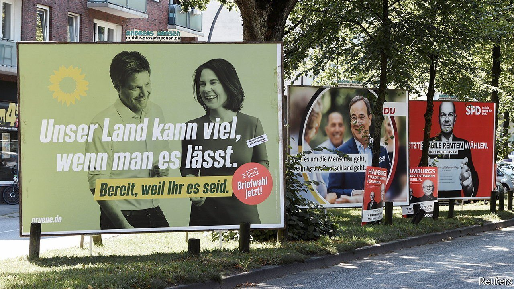
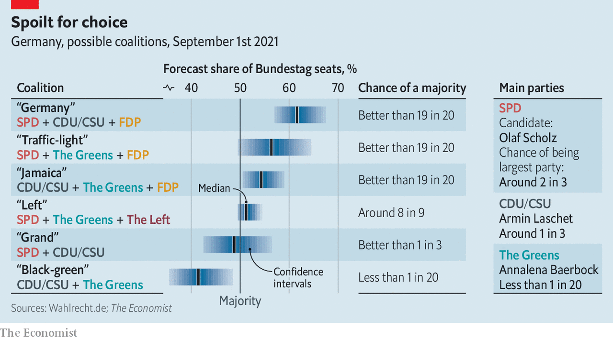

###### It’s complicated

# German voters face a bewildering array of possible coalitions 

##### And they get two votes each 

 

> Sep 4th 2021 

HER FRIENDS would kill her if they knew she had considered voting for the Free Democrats (FDP), says Marijana, a 39-year-old arts PR consultant. A lifelong supporter of the left-leaning Social Democrats (SPD), she had always dismissed the FDP, a small, liberal outfit, as a party for the wealthy few. But Germany’s wide-open election on September 26th is forcing voters to contemplate strange choices. Marijana fears the SPD may join the hard-left Die Linke, which she reckons is unprepared for government, as well as the Greens in a left-wing coalition. Hence the idea of lending one of her votes to the FDP, to bolster the chances of an SPD-Green-FDP “traffic-light” coalition. (Germans get two votes: one for a local MP, and one for a party, apportioned proportionally based on lists.)

If Germany’s election campaign has hardly been fizzing with ideas, the volatility of the polls has provided tremendous sport. Three different parties have led in the past four months. Having long languished in the polls, the SPD has recently surged. The Economist’s  now puts its chances of coming first at around two-thirds. A big lump of undecided voters, and what may be the largest-ever postal vote, add to the uncertainty. Yet in Germany’s proportional voting system the horse race is only half the story. The coalition wrangles that follow election day will be at least as important, and twice as complex, as the voting that happens on it.


A record 27% of Germans split their votes between two parties at the last election, in 2017. Such “strategic” voting is often done to help lift a smaller party, such as the FDP, over the 5% threshold to enter the Bundestag, or to boost its chances of playing kingmaker in coalition talks. This year the mind-boggling intricacies of the election make the coalition calculus tricky for even the best-informed voter.

This is explained partly by the decline of the Lagerkampf, or “camp struggle”. There was a time when the centre-right Christian Democrats (CDU), their Bavarian ally the Christian Social Union (CSU) and the FDP made up a broad “conservative camp”, and the SPD and Greens a “progressive” one. Many Germans voted accordingly, even if the result was a muddy “grand coalition” of the CDU/CSU and the SPD.

But the big parties have declined, and new ones have emerged. Some of them, like the hard-right Alternative for Germany, are unwelcome in any coalition. With the old camps unable to win majorities, parties are forced into political cross-dressing. (The 16 states have led the way: there are 14 flavours of coalition in them.)

If the first of three televised debates between the CDU/CSU, SPD and Green candidates on August 29th lacked spark, it is partly because at least two of the three parties represented are likely to find themselves yoked together in government. The Economist’s model finds a 60% chance that no two-way government will be possible after election day. And because a continuation of the current CDU/CSU-SPD “grand coalition” seems improbable, Germany seems highly likely to get its first three-party coalition since the 1950s. Four such potential configurations may well emerge from the election result (see table).

 


The pre-coalition jostling itself influences campaign tactics. The liveliest moment of the debate came when Armin Laschet, the struggling CDU/CSU candidate, lambasted Olaf Scholz, his SPD rival, for failing to rule out a left-wing coalition. Angela Merkel, the outgoing CDU/CSU chancellor, repeated the charge two days later. It is barely conceivable that the moderate-minded Mr Scholz, Germany’s finance minister, would invite Die Linke, which seeks rapprochement with Russia and the dissolution of NATO, into government. But parties are loth to reject potential coalitions ex ante for fear of reducing their post-election leverage and sparking a domino effect of exclusions.

In the end, the choice may boil down to two plausible coalitions: the left-leaning SPD-led “traffic-light”, or a more conservative “Jamaica” government of the CDU/CSU, Greens and FDP (the names derive from the parties’ respective colours). If so, says an insider, that will trigger a “bazaar” of negotiations in which the CDU/CSU and FDP will try to seduce the Greens, who meanwhile will be working with the SPD to pull over the FDP. Ministerial jobs, government policy and even the identity of Germany’s next president, who must be chosen by next February, would all be thrown into the mix. Some party bigwigs expect it could take six months to put a government together. “It’s like ‘Game of Thrones’,” says Constantin Wurthmann of the University of Düsseldorf. “No one knows anything.”

All the confusion may have the paradoxical effect of forcing a simpler choice on voters. With the final outcome impossible to predict, the wiser option may be simply to strengthen the hand of one’s favoured party and hope for the best. Marijana is drifting in that direction. Now that the SPD has a real chance of nabbing the chancellery, she will probably give the party both of her votes. It might not feel as smart as splitting the vote, but at least her friendships will remain intact. ■

