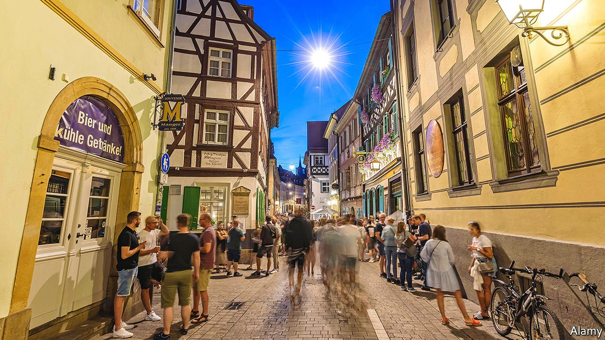

###### A tale of two pubs

# Germany’s election, seen through the bottom of a glass 

##### Conservative Bavarians and left-wing Berliners agree on beer but little else 

 

> Sep 2nd 2021 

IN THE NARROW medieval alley outside the half-timbered Schlenkerla, raucous crowds drink the 600-year-old local speciality, dark smoked beer tapped from ancient oak barrels. The meaty menu is not for the faint-hearted. The pork comes as knuckle, stomach or shoulder. Voting patterns are just as traditional. Bamberg is a conservative heartland.

The drinkers are gregarious. But if you want to kill the mood, just mention the Greens. “They’re a joke. They’re crazy. I can’t even talk about them,” rages one drinker. He works for Bosch, an engineering company. It is Bamberg’s largest employer, supplying parts for diesel cars, and has cut jobs of late. “The Greens just want to ban everything.”


The conservative CSU, the Bavarian sister party to Angela Merkel’s CDU, wins around 40% in federal elections in Bamberg. The CSU exists only in Bavaria, so regional patriotism is part of its success. “We have the copyright on fighting for Bavaria’s interests,” says the party’s leader, Markus Söder, who grew up near Bamberg, in a new election video.

During the refugee crisis of 2015 Mr Söder saw the hard-right AfD as his main opponent, so he talked tough on migration. With the Green Party surging in the polls, he has been discovering his cuddly environmental side. In the video Mr Söder is portrayed cycling through Bavarian countryside, before wandering dreamily through a flowered meadow.

Some 400km to the north, in the Berlin district of Kreuzberg, the beer at Südblock is also Bavarian. But the sausage is vegan, the toilets “all-gender” and at the entrance a trans woman reminds guests of covid-19 regulations. Posters advertise an LGBTQ film night and a pro-refugee demo.

Alex, who works for an NGO, says he’ll vote Green because it’s the only party fielding a female candidate for chancellor. “I’m sick of seeing one old white man after another.” His three friends favour the radical left-wing Die Linke, mainly because of the party’s anti-military stance. “The Greens have become too conservative for me,” says one. But somehow, the MPs that these two Germanies are about to elect will have to find a way to run the country.

