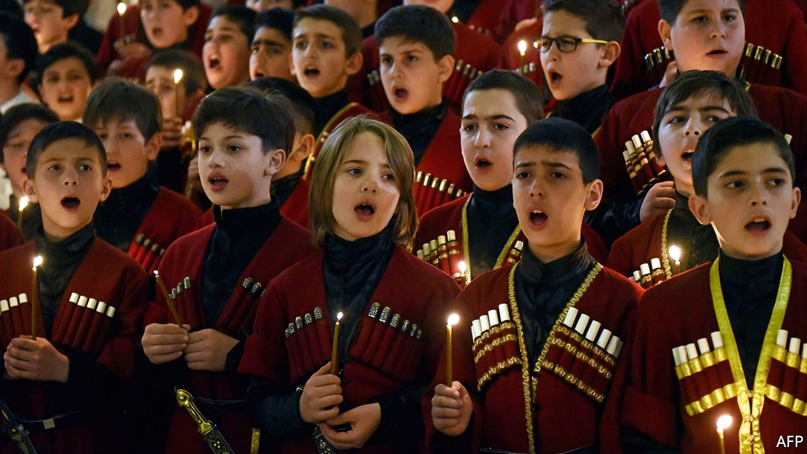

###### Too many boys

# The rise and fall of sex-selective abortion in Georgia 

##### How parents in a post-Soviet state shunned girls, then changed their minds 

 

> Sep 4th 2021 

WHEN NILUFER KURBANOVA’S doctor told her she was going to have a boy, he expected a tip for delivering the good news. He did not get one.

Ms Kurbanova does not believe, as many older Georgians do, that sons are better than daughters. Some families feel they need a male child to carry on the bloodline; Ms Kurbanova thinks this is hokum. Traditional families expect sons to look after their parents in their old age, whereas a daughter would look after her husband’s parents. Ms Kurbanova does not see why it has to be that way.


For centuries Georgians strongly preferred boys. When Georgia was part of the Soviet Union, from 1921 to 1991, its communist rulers suppressed some old sexist customs (such as kidnapping brides) and declared that women were equal, even if they did not always uphold the ideal. In any case, practically no one had access to sex-detecting ultrasound machines in those days. This was partly because they could not afford them, and partly because the West restricted exports since some of the machines’ parts had military uses.

That changed when the Soviet Union imploded. Ultrasound became widely available. And patriarchal values made a comeback, perhaps because the collapse of a bossy state prompted Georgians to seek guidance elsewhere. Many turned to the church and to their families. Traditional values, combined with modern technology, led to a surge in the abortion of girl babies. Georgia’s sex ratio swung wildly. In 1991 there were roughly 105 boys born for every 100 girls. (This is the natural rate, since more boys die in childhood and the numbers even out by the time they reach reproductive age.) By 2004 there were 115 boys born for every 100 girls.

But since then the sex ratio at birth has returned closer to normal. For the past five years it has hovered around 107 (though in 2020 it reached 109). In neighbouring Azerbaijan, where sex-selective abortion is still rife, it is 114. In China, it is 112.

Several factors may explain why Georgians started valuing girl babies again. After the initial post-communist turmoil, women’s wages rose, giving them more bargaining power at home. This made it easier for them to overrule husbands who wanted to abort a girl (son preference is more common among Georgian men than women). It also planted the idea in parental heads that a daughter may grow up to earn serious money, and therefore be able to support them in their old age.

Changes in the fertility rate made a difference, too. In 1990 the average Georgian woman had 2.2 children. That plummeted to 1.6 in 2001, as economic turbulence made couples nervous about the future. The patriarch of Georgia’s Orthodox Church was so alarmed that in 2007 he vowed personally to baptise any couple’s third or subsequent child. Whether that helped or not, the fertility rate rebounded to 2.1 in 2019, as the country grew more prosperous. If a family is going to have only one child, a father who passionately wants a son is more likely to insist that the child is a boy.

Even if attitudes grow less sexist, however, Georgians must still face the consequences of the biases of a generation ago. Some regions are already facing a shortage of brides. And next year, Georgians born in the most skewed birth cohort will turn 18. Men who wish to get married may find they need to emigrate. ■

