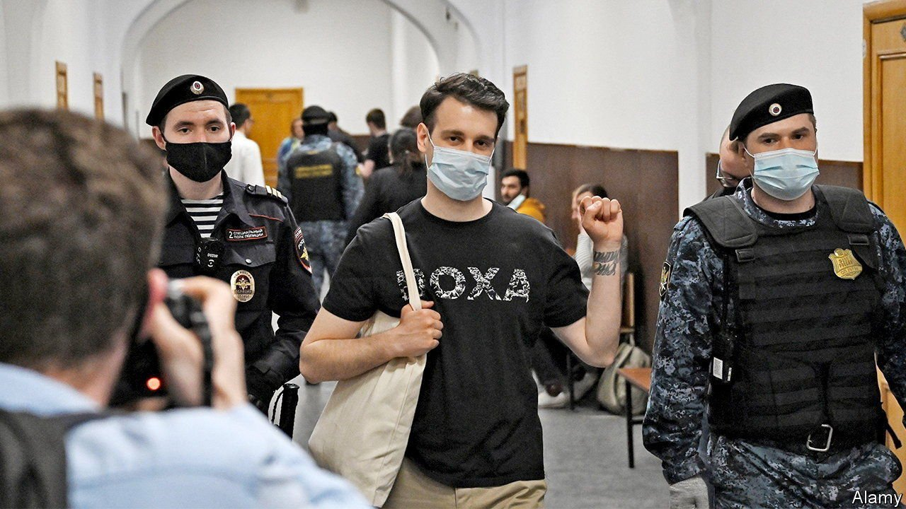

###### Get them while they’re young

# Vladimir Putin’s henchmen target Russia’s universities and students 

##### There’s an election coming 

 

> Sep 2nd 2021 

AS ALEXEI NAVALNY, Russia’s leading opposition politician, was being hauled off to jail in January, four editors of “Doxa”, an online student magazine, posted a YouTube video. The two men and two women were students at the Higher School of Economics in Moscow, generally considered to be Russia’s best liberal university. They spoke out about the intimidation being deployed by the staff of schools and universities in order to dissuade young people from joining a planned protest against Mr Navalny’s mistreatment.

The four appealed to universities across the country. “Expelling students for taking part in peaceful action is illegal. All you will achieve is to destroy science and education in Russia,” said Armen Aramyan, one of the four. But they also appealed to fellow students. “Don’t be scared and don’t abstain. It is our lawful right to express protest by any peaceful means. The state has declared war on youth, but the youth is us and we will certainly prevail,” said another of the quartet.


On April 14th, as part of that war, Russian prosecutors arrested Mr Aramyan and the three other “Doxa”editors and charged them with “encouraging minors to take part in illegal action”, by which they meant the protest in January. Their video has been taken down and they have been under house arrest ever since. The case has brought them recognition beyond anything they could have imagined when they recorded their video.

The unsuccessful attempt to kill Mr Navalny with poison on a plane a year ago marked the start of a new wave of repression in Russia. Other opposition politicians have been barred from public appearances, chased out of the country or even arrested. The few remaining independent media outlets have been barred as “undesirable” or stigmatised as “foreign agents”. The latest such “foreign agent” is TV Rain, an independent online channel that extensively covered the protests; the designation means that advertising will dry up, and the station may end up having to close.

But going after politicians and the media, and arresting students and activists, is no longer sufficient. The Kremlin is now trying to get a grip over schools and universities in a more systematic way. In the past nine months some 20 universities and institutes across Russia have had their deans replaced. In July the Kremlin “accepted” the resignation of Yaroslav Kuzminov, the head of the Higher School of Economics, better known as HSE, Russia’s first and most successful post-Soviet university.

In a parting note on social media Mr Kuzminov claimed he was stepping down to concentrate on his work as an economist. Few took this at face value. “He would never have left of his own volition. This was the Kremlin’s decision,” wrote Kirill Rogov, a political analyst.

Mr Kuzminov had long navigated his way around the Kremlin to carve out some space for his university while also providing advice to the government. That space has now shrunk and the advice is no longer needed. His departure marks the end of an era. He helped set up the HSE in the early 1990s, as Russians newly liberated from Soviet controls sought ways to connect with the West. At around the same time St Petersburg University, Russia’s oldest, teamed up with Bard College from America to set up Smolny College, Russia’s first liberal arts and science college. It was backed by Alexei Kudrin, a former finance minister who is a rare liberal voice in Mr Putin’s entourage.

These institutions survived Russia’s turn towards authoritarianism in the 2000s. The Kremlin did not fear them, not least because young Russians in the 2000s and early 2010s were among Mr Putin’s most loyal supporters. It was also partly due to a centuries-long tradition in which autocratic rulers allowed a degree of freedom to a few exclusive institutions, says Andrei Zorin, a professor of Russian at Oxford University. The aim was to nurture a sophisticated cadre familiar with Western ideas and technology, who might then modernise and strengthen the state.

But now any Western influence is seen as a threat. Nikolai Patrushev, the secretary of the Security Council of Russia and a key ideologue of Russia’s new isolationism, said in a recent interview that “the destructive liberal political forces [of the West] are paying particular attention to the educated and successful young people in prestigious universities.”

Less than a fortnight before Mr Kuzminov’s departure, prosecutors banned Bard College from Russia, designating it an “undesirable foreign organisation”. And a recently passed law put all educational activity in Russia, from popular science lectures to public discussion clubs, under tight state control.

Russian students and young people, once lauded by the Kremlin as part of Mr Putin’s base, are now seen as one of the biggest dangers to its power. The shift in young people’s sentiment first became visible in 2017, when Mr Navalny’s anti-corruption videos triggered protests that were dominated by students and high-school graduates. They were also angered by the Kremlin’s infringement of their personal freedoms and attempts to impose “patriotic” and “traditional” values on them. At around the same time, Mr Aramyan and his friends started publishing “Doxa”.

Over the past few years, Mr Putin and his circle have gradually become alienated from the young and the economically active. “In fact it is not the young cohort that is an outlier, but Putin’s own generation that is increasingly at odds with the rest of the population,” says Ekaterina Schulmann, a prominent political scientist. Surveys show that young people rarely watch television (the main vehicle for government propaganda). Instead they rely on social media and the internet, which the Kremlin is now targeting. They have a more positive view of the West, particularly Europe, and care more about human rights than they do about the greatness of the state or past victories, the staples of Mr Putin’s ideology.

With parliamentary elections due later this month, on September 19th, and a presidential one in 2024, Mr Aramyan says a crunch is approaching. “Either they will purge and suppress everything in sight, or we will deprive them of their majority.” Mr Putin, who will turn 70 next year, has plenty of repressive tools at his disposal. But the young have one crucial advantage. Time is on their side, not his. ■

An early version of this article was published online on September 1st 2021

