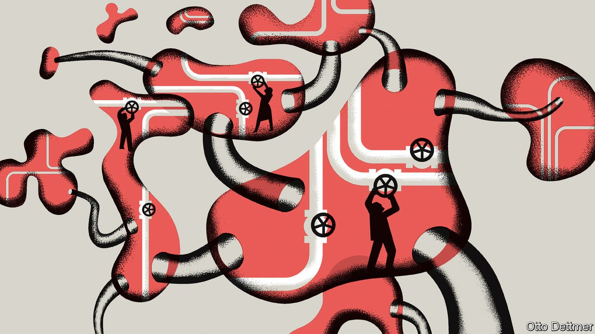

###### Free exchange

# At the Jackson Hole meeting, the Fed ponders an uneven recovery 

##### Research presented at the monetary policymakers’ virtual pow-wow offers guidance 

 

> Sep 2nd 2021 

BUSINESS CYCLES are never perfectly symmetric across time and space. Yet they have rarely been as uneven as the rebound from covid-19. Some parts of the global economy are straining to meet roaring demand even as others limp along, battered by the spread of the virus. It is enough to take the fun out of monetary policy. Indeed, the Delta variant kept attendees of an annual symposium for central bankers from meeting in Jackson Hole, Wyoming, in the shadow of the majestic Teton mountains, on August 27th. Instead, they peered at their computer screens as they discussed how to shepherd an unbalanced economy through uncertain times.

A pressing question loomed over the proceedings: just how and when to tighten policy given high inflation and lingering unemployment. Tweaks to the Federal Reserve’s framework in recent years are meant to give it room to manage such difficult circumstances. It now aims to hit its 2% inflation target on average and will court high inflation to make up for past shortfalls. But surging prices are testing this approach. Data released as the conference began showed that the Fed’s preferred measure of inflation had risen to 4.2% in July, the highest in 30 years. Jerome Powell, the Fed’s chairman, made no suggestion to his fellow participants that he would drastically change course, and confirmed that the Fed might begin to taper asset purchases later in the year. But policy, he cautioned, would have to change as new data come in.


Research presented at the symposium offered guidance on how to cope with a lopsided recovery. Veronica Guerrieri of the University of Chicago and her co-authors, for instance, considered how policymakers should respond when demand surges in some sectors and lags in others. If there is little scope for workers to shift from unfavoured industries to the up-and-comers, they write, then the shift in demand acts like a “cost-push shock” (similar to a spike in oil prices). In such cases, central banks typically accept some pain in the form of above-normal inflation and some in above-normal unemployment. But if workers can move, then there are benefits to central banks’ facilitating this shift.

Easy money is not obviously the right answer. If loose monetary policy raises demand for both booming and busting sectors, then it might slow reallocation by propping up firms that ought really to close. But the authors argue that, in a world in which it is easy to adjust wages upward but tricky to cut them, inflation may in fact hasten reallocation. Because nominal wages in lagging industries cannot easily fall, workers face little incentive to move to promising sectors. Inflation, though, enables the real wage in lagging sectors to fall relative to that in booming ones, encouraging workers to move. Thus it makes sense, in theory, for monetary policy to have an inflationary bias during an uneven recovery.

Mr Powell would probably welcome that argument. But if American firms continue to hire at the recent pace, the unemployment rate may fall back to its pre-pandemic level of 3.5% by the end of 2022. That presents the Fed with a new dilemma. While the unemployment rate has recovered quickly, labour-force participation has not: of the drop experienced in early 2020, just under half has been clawed back; the unemployment rate, by contrast, is more than 80% of the way back. Part of Mr Powell’s justification for the change in framework was the beneficial effects of tight labour markets, which he reckoned would eventually draw workers from disadvantaged groups back into the labour force. But the patience needed to allow such effects to unfold could vanish amid high inflation and low unemployment.

Work presented by Bart Hobijn of Arizona State University and Aysegul Sahin of the University of Texas at Austin on the “participation cycle” affirms the benefits of patience. It is not the case that workers from disadvantaged groups are more likely to drop out of the labour force during downturns and are only enticed back after sufficiently long recoveries. Rather, the probability that a worker drops out is much higher for unemployed workers than employed ones, whatever their background. It is thus the higher unemployment rates that disadvantaged groups tend to face that are responsible for their leaving the labour force. And this effect begins reversing as soon as labour markets begin to recover. Greater job stability—that is, a higher chance of finding work and a lower chance of losing a job—reduces the flow of workers into unemployment and out of the labour force, raising the participation rate.

The effect is powerful; the authors estimate that a one-percentage-point decline in the unemployment rate tends to raise the participation rate by 0.65 percentage points, other things equal. The beneficial effect continues even after unemployment reaches a trough, with the participation rate typically reaching a peak nine months later. The upshot for policy is therefore broadly similar to where Mr Powell has ended up: a low unemployment rate need not imply that labour-market slack has run out, or that patience on the part of the central bank will not eventually be rewarded.

When the odds are against you

Other research reinforced the doveish mood, pointing out the adverse effects on emerging markets of premature monetary tightening in the rich world. But outside the conference, Mr Powell has been bombarded by criticism of loose money. Inflation has now more than made up its shortfall since 2015, let alone the start of the pandemic. Some heads of regional Fed banks, such as Raphael Bostic of Atlanta, are eager to reverse quantitative easing soon. Prominent economists, such as Raghuram Rajan of the University of Chicago and Larry Summers of Harvard, have highlighted the dangers of prolonging asset purchases.

Academia lags reality, and there is little doubt that during the recovery from the global financial crisis the Fed overestimated the danger of inflation and undercounted the long-term benefits of driving unemployment lower. The critics’ worry is that the central bank may now be overcompensating for that error. ■

Dig deeper

For more expert analysis of the biggest stories in economics, business and markets, , our weekly newsletter. All our stories relating to the pandemic and the vaccines can be found on our . You can also find trackers showing ,  and the virus’s spread across  and .

An early version of this article was published online on August 27th 2021

