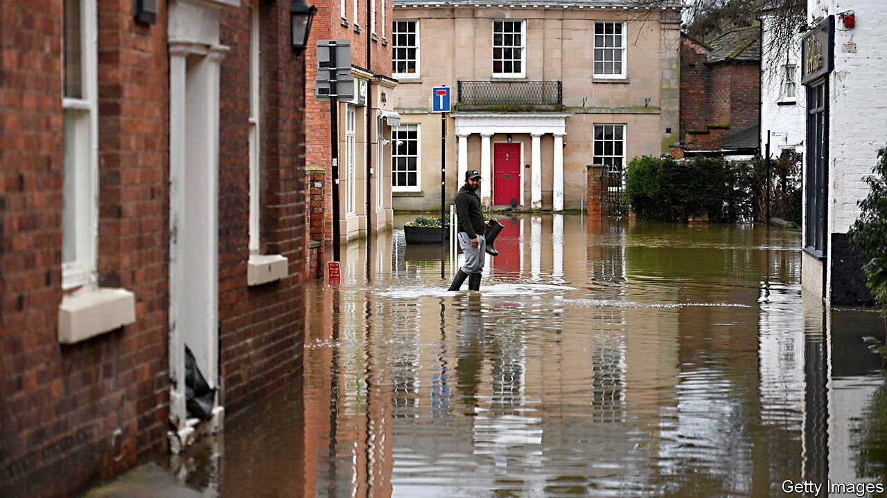

###### Hot take

# Could climate change trigger a financial crisis? 

##### The clearer governments are about emissions reduction, the less likely financial turbulence becomes 

 

> Sep 4th 2021 

IN RECENT YEARS regulators have begun warning about the threat that climate change poses to the stability of the financial system. Following its strategy review in July, the European Central Bank (ECB) will assemble a “climate change action plan”. Mark Carney, the former governor of the Bank of England, warned of financial risks from climate change as long ago as 2015. In America the Commodity Futures Trading Commission last year published a 200-page report beginning “Climate change poses a major risk to the stability of the US financial system.” But progressive Democratic politicians are calling on President Joe Biden not to reappoint Jerome Powell as the chairman of the Federal Reserve, partly because they think he has done too little to eliminate climate risk.

Just how damaging does climate risk stand to be, though? Early stress tests by central banks and disclosures of companies are starting to shed light on the question. For the most part, the evidence that it could bring down the financial system is underwhelming. But a lot hangs on whether governments set out a clear path for reducing emissions, such as through carbon taxes and energy-efficiency standards, giving banks enough time to prepare.


Climate change can affect the financial system in three ways. The first is through what regulators describe as “transition risks”. These are most likely to arise if governments pursue tougher climate policies. If they do, the economy restructures: capital moves away from dirty sectors and towards cleaner ones. Companies in polluting industries may default on loans or bonds; their share prices may collapse.

The second channel is financial firms’ exposure to the hazards of rising temperatures. Attributing individual natural disasters to climate change is tricky, but the Financial Stability Board, a group of regulators, estimates that global economic losses resulting from weather-related catastrophes went from $214bn in the 1980s, in 2019 prices, to $1.62trn in the 2010s, roughly trebling as a share of global GDP. These losses are often borne by insurers (though over time the costs should be passed on to customers through higher premiums).

The financial system could also be exposed to any wider economic damage caused by climate change, say if it triggered swings in asset prices. This third channel is harder to quantify. Academic estimates of the effect of 3°C of warming (relative to pre-industrial temperatures) veer from financial losses of around 2% to 25% of world GDP, according to the Network for Greening the Financial System, a group of supervisors. Even the gloomiest estimate might prove too rosy if climate change triggers conflicts or mass migrations.

Perhaps the worst-case scenario for the financial system is where transition risks crystallise very suddenly and cause wider economic damage. In 2015 Mr Carney described a possible “Minsky moment”, named after Hyman Minsky, an economist, in which investors’ expectations about future climate policies adjust sharply, causing fire sales of assets and a widespread repricing of risk. That could spill over into higher borrowing costs.

The value of financial assets exposed to transition risk is potentially very large. According to Carbon Tracker, a climate think-tank, around $18trn of global equities, $8trn of bonds and perhaps $30trn of unlisted debt are linked to high-emitting sectors of the economy. That compares with the $1trn market for collateralised debt obligations (CDOs) in 2007, which were at the heart of the global financial crisis. The impact of losses, however, would depend on who owns the assets. Regulators might be especially concerned about the exposures of large, “systemically important” banks and insurers, for instance.

Preliminary stress tests conducted by central banks suggest that the impact of climate change on these sorts of institutions might be manageable. In April the Banque de France (BdF) released the results from such an exercise. It found that French banks’ exposures to transition risks were low. Claims on insurers, though, did rise as a result of worse droughts and flooding, by more than five times in some regions.

In a recent paper the ECB and the European Systemic Risk Board found similar results. The exposures of euro-area banks and insurers to the highest-emitting sectors were “limited”, although losses in a “hot-house world” scenario where temperatures rise by 3.5°C compared with pre-industrial times were more severe. Still, in both cases, banks’ losses on their corporate loan books were only around half the level of those in the regular stress tests of euro-area lenders, which they were deemed to be well-capitalised enough to pass.

Those findings are consistent with an exercise by the Dutch central bank (DNB) in 2018, which found that the impact on Dutch financial firms from transition risks was “manageable”. In its most severe scenario there was a sudden change in climate policy alongside rapid progress in renewable energy development, causing a “double shock” for companies and a severe recession. Even then, banks’ capital ratios fell by about four percentage points. That is sizeable, but still less than what the banks experienced in this year’s regular stress tests by the European Banking Authority, which they were deemed to pass.

To what extent are these stress tests realistic? Mark Campanale of Carbon Tracker is sceptical, pointing out that most firms are using out-of-date models. If auditors were ever to stress companies’ assets against a much lower oil price, the associated write-downs could trigger a collapse in investor sentiment of the sort regulators fear, he claims. Nor do the stress tests include a full-blown Minsky crisis.

Yet in other respects they are conservative. Most of the tests used an accelerated time frame—five years in the DNB and BdF cases—in effect assuming that firms are stuck with the balance-sheets they have today. But it seems reasonable to think that banks and insurers will change their business models as the climate transition progresses, curbing the impact on the financial system. The BdF ran a second exercise where firms were allowed to make realistic changes to their business models over 30 years. Unsurprisingly, that allowed banks to sharply reduce lending to fossil-fuel sectors, and insurers to raise premiums.

Nonetheless, the stress tests reveal the importance of giving firms time to adapt. And that makes a predictable path for government policy important. The BdF found that credit losses were highest when policy was delayed and there was a sudden transition. Perhaps the most plausible scenario in which climate change affects financial stability is one in which governments dawdle, and then have no choice but to take drastic action in the future. ■

For more expert analysis of the biggest stories in economics, business and markets, , our weekly newsletter.

