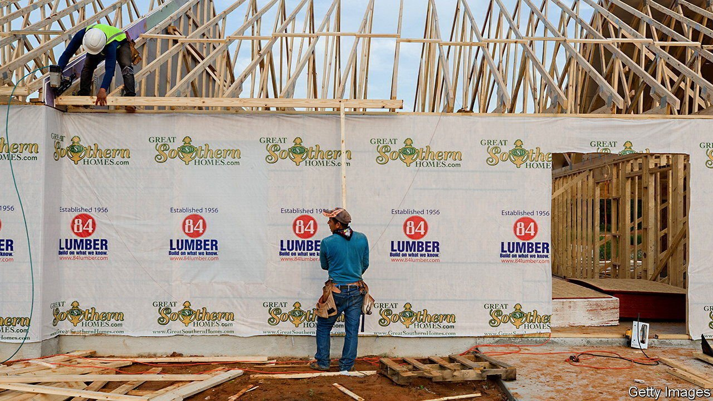
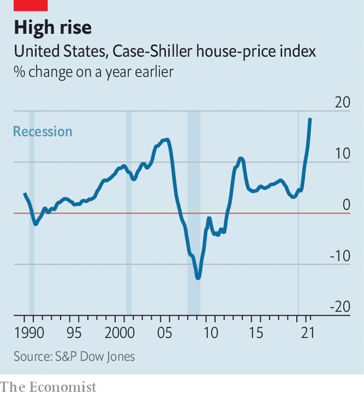

###### Can they build it?

# Labour shortages threaten housing supply 

##### There is more demand than ever for new homes. But there are too few people to build them 

 

> Sep 2nd 2021 

DON HORTON, founder of America’s largest housebuilder, never thought he would have to turn away business in Texas. Until recently he could not build homes in the state fast enough. Now his firm is restricting sales as industry-wide shortages of labour and building materials such as timber slow construction and inflate costs. The combination of these constraints and surging demand for housing has led to staggering rises in house prices. According to figures published on August 31st the Case-Shiller national house-price index was 18.6% higher in June than a year earlier—the third record-breaking rise in as many months (see chart). But although the shortages of materials are expected to ease next year, skilled labour will be harder to find.

 


As covid-19 spread and countries locked down, the construction workforce took a big hit. In America it shrank by nearly 15% in 2020, wiping out four years of job gains. But it has yet to recover fully, even as demand for housing has been turbo-charged by low interest rates and enthusiasm for bigger homes. Around 88% of American contractors say they are struggling to find workers, leaving nearly 300,000 roles vacant. Having decelerated in 2020, wage growth is now picking up. Britain has the most vacancies in two decades, with two-thirds of construction firms finding it difficult to hire bricklayers and carpenters. Half of all French construction firms report facing difficulties with recruitment, making it the country’s worst-affected sector, and a fifth of German building and civil-engineering companies say they lack skilled workers.


The industry’s hiring struggles in part mirror the wider labour shortages affecting much of the rich world. As in other sectors, a fear of the virus and an ability to fall back on benefits and savings might explain why the unemployed have been slow to return to work. Travel restrictions across national and provincial borders to curb the pandemic have hit the construction sector, which relies heavily on migrants, especially hard. (That has been starkest in China and India, where migrants account for four-fifths and one-third of construction workers, respectively.)

Long-standing factors are also contributing to the construction labour shortages. Homebuilders have struggled to maintain a consistent labour force since the global financial crisis of 2007-09. That in part reflects deeper changes to immigration laws, which have stemmed a once-steady stream of labour. Inflows of foreign workers into America, for instance, have been in decline since the introduction of anti-immigration policies by President Donald Trump. Just over 44,000 foreign-born workers entered the construction industry in 2017, a sharp drop compared with nearer 70,000 in the previous year. Similarly, the Office for National Statistics reckons that Britain has lost 42% of its European construction workers since its vote to leave the European Union, which signalled an end to the free movement of migrants from the EU into the country.

Skills shortages are also compounded by an ageing workforce. Around 41% of construction workers in America are expected to retire within the next decade. One in five British workers is over the age of 55. Recruiters seeking talent, meanwhile, find slim pickings. High-school graduates of all income backgrounds avoid construction jobs, perceiving them to be dirty, dangerous and difficult. Less than one in ten young people in Britain would consider a career in construction, shunning even white-collar jobs in areas such as engineering, quantity surveying and town planning.

Automation might have been one way to avert shortages of workers. But the industry has been slow to embrace it. Around half of construction businesses use robots, compared with 84% of automotive firms and 79% of manufacturing companies.

Meanwhile, the shortages seem set only to intensify. Demand for workers looks likely to rise further, as governments promise both to build more houses and to help prepare the existing stock for a changing climate. Britain already requires 217,000 extra workers by 2025 to meet the government’s target of 300,000 new homes per year. Even more labour will be needed to retrofit 29m existing homes to meet net-zero carbon targets by 2050. Governments’ plans to spend on infrastructure in America and Europe could suck in workers and leave fewer to build houses. Job vacancies, construction delays, bosses’ headaches—all may go through the roof. ■

For more expert analysis of the biggest stories in economics, business and markets, , our weekly newsletter.

An early version of this article was published online on September 1st 2021

