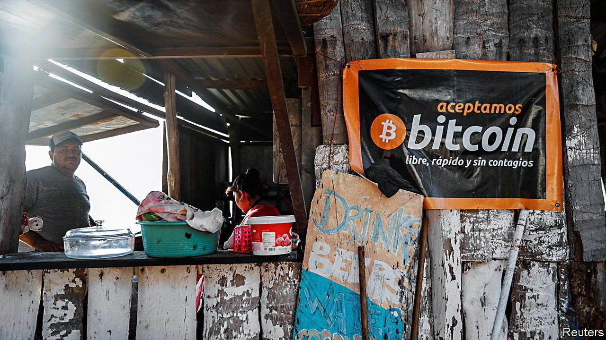

###### Satoshis for cervezas

# Using bitcoin as legal tender 

##### Is El Salvador’s move a costly gimmick or an attempt to lower transaction fees? 

 

> Sep 4th 2021 

WHEN ASKED if anyone has tried to use bitcoin to pay her, a woman selling coffee and pastries in San Salvador, the capital city of El Salvador, replies “thank God, no”, and rebuffs an attempt to do so. A man selling soup for lunch brushes off the idea with laughter. By dinnertime, low on phone battery and morale, your correspondent is pointed to a bar called Leyendas where the logo for Strike, a digital bitcoin wallet, adorns the walls. But the attempt to pay with bitcoin is met with confusion. The bar’s owner, who controls the wallet, is missing. A few frantic texts later he sends his wallet address. At last, 26,618 Satoshis (one hundred millionth of a bitcoin), $12.50-worth, are swapped for beers.

On September 7th bitcoin will become legal tender in El Salvador, alongside the dollar. The Central American country of 6.5m people is the first to attempt such a feat. A week before the big day those who had put plans in place to use bitcoin were the exception, rather than the norm. Three-quarters of Salvadoreans surveyed in July by Disruptiva, a polling firm, were sceptical of the plan to adopt bitcoin. Two-thirds were not willing to be paid in it and just under half knew nothing about it. Both the World Bank and the IMF have warned against adoption, citing the potential impact on macroeconomic stability and bitcoin’s environmental costs.


Legal tender is ordinarily defined as the money that courts of law must accept to settle debts. But El Salvador’s bitcoin law goes further, saying that businesses must accept the cryptocurrency as payment for goods or services. It has also come into effect very quickly. Nayib Bukele, the country’s president, who controls a large majority in the legislative assembly, announced his plan to make bitcoin legal tender at a cryptocurrency conference on June 5th. The law was approved just three days later.

Sceptics have posited that the move is just a stunt: a sop to Ibrajim and Yusef Bukele, the president’s brothers, who are crypto-enthusiasts. But the president claims the move will help El Salvador win foreign investment and reduce the cost of remittances. He may not be entirely wrong. The gambit might lure in deep-pocketed crypto-investors (though it may deter more conventional ones). And its experience may provide a case study in whether one of the long-touted benefits of bitcoin works for regular people. A diaspora of some 2m Salvadoreans sends remittances worth 20% of GDP home each year. But cross-border bank and wire transfers are slow and expensive. Wallet-to-wallet bitcoin transfers are quick and free.

The attempt will probably reveal bitcoin’s limitations, too. Many locals understandably fear its volatility, which makes it ill-suited for payments and debt. Those accepting it, like Leyendas, do not quote prices in it, but convert from dollars at the point of sale. And there can be unexpected fees, which might stymie its use. There are 200 bitcoin cash machines being installed across the country to enable cash dollars to be converted into bitcoin in digital wallets. The one used by The Economist took a 5% fee. “I am not going to use it,” says Irma Gómez, who runs a diner near one such ATM in Santa Tecla, a town just outside San Salvador. But she is also intrigued. “Let the people try it.” ■

For more expert analysis of the biggest stories in economics, business and markets, , our weekly newsletter.

