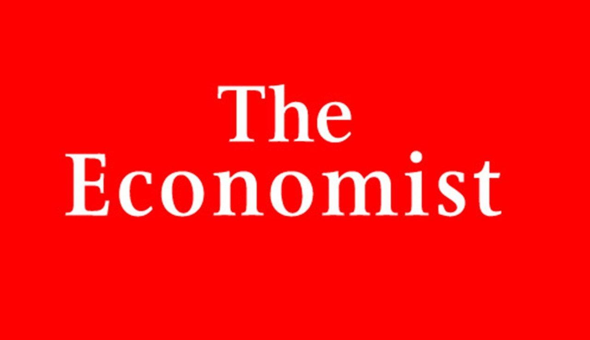

###### We're hiring

# Wanted: a new economics writer 

##### An opportunity to join the staff of The Economist 

 

> Sep 1st 2021 

The Economist is looking to hire a writer to join its economics team. Journalistic experience is not necessary. The ability to write clearly and entertainingly is, however, crucial, as is a thorough understanding of economics and the ability to work with data. At first the writer will cover Europe. We would prefer the job to be based in London at least at first, but the successful candidate need not be British.


Applicants should send a CV and a sample article, suitable for publication in The Economist, to: economicsjob@economist.com. Your article could be on macro- or microeconomics, or on political economy; it need not be about Europe. It should be unpublished and no longer than 700 words. Some examples of our economics coverage are listed below. The deadline is October 17th.

Example economics coverage


