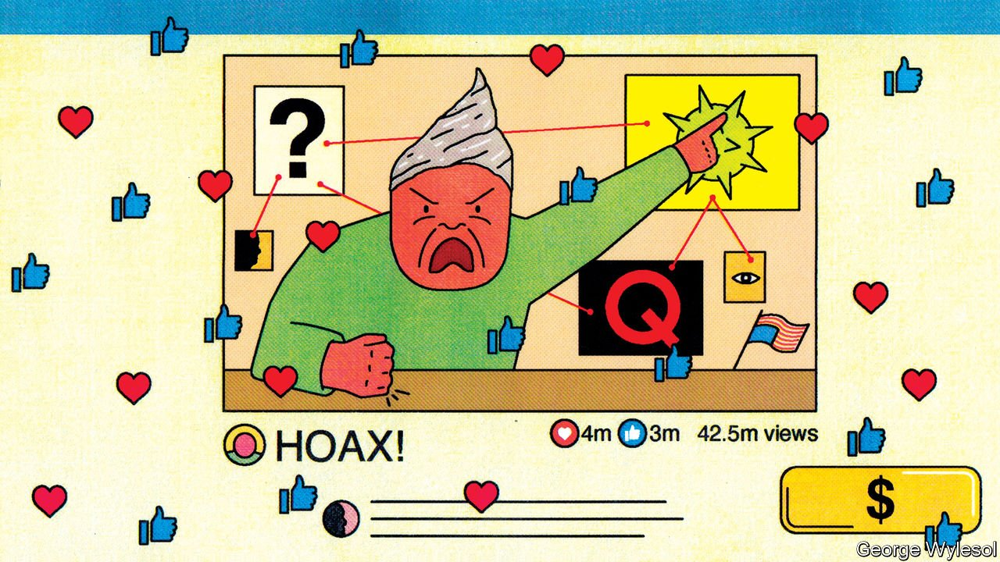
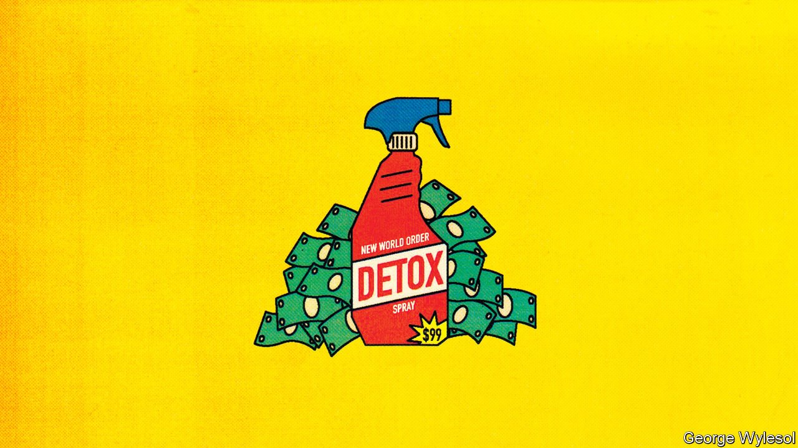

###### It’s all connected, man

# From Congo to the Capitol, conspiracy theories are surging 

##### Covid and the internet are fuelling a global boom in bonkers beliefs 

 

> Sep 4th 2021 

IN LATE JULY, less than a week after the British government lifted most of its remaining covid-19 restrictions, several thousand people nonetheless gathered in London’s Trafalgar Square to protest against “lockdowns”. Among the speakers were Piers Corbyn (brother of a former Labour Party leader), a climate-change denier who thinks that covid-19 is a “hoax”; David Icke, an author who believes that the world’s most powerful people are secretly lizards; and Gillian McKeith, an advocate of colonic irrigation who argues that a good diet is enough to stop the virus. A former nurse (struck off for spreading misinformation) compared medical staff who have been distributing vaccines to Nazis, and suggested they be hanged.

Such demonstrations have become common not just in Britain, but all over the world. The pandemic has produced a tsunami of misinformation. In France a documentary alleging that covid-19 was invented by political elites as part of a conspiracy to bring about a “new world order” was watched 2.5m times in three days. In America the notion that covid is a hoax has spread alongside a collection of feverish theories known as “QAnon”, which hold that the government is run by a secret cabal of paedophiles and that Donald Trump is a saviour destined to defeat them.


This is, in short, a golden age of conspiracy theories. The internet makes it easier than ever to spread them. They are at least as common in poor countries as in rich ones. In Nigeria many people believe that Muhammadu Buhari, the president since 2015, actually died in a hospital in London in 2017, and has ever since been impersonated by a Sudanese body double called “Jibril”. In India Narendra Modi’s government has alleged that Greta Thunberg, a teenage Swedish climate activist, is part of a global plot to defame his country’s tea. The idea is widely held across the Middle East that the attacks of September 11th 2001 were “false-flag” operations plotted by Israel (or just some Jews).

Of course, many people hold beliefs that are ludicrous yet harmless, such as the idea that Elvis Presley is alive and living in Kalamazoo, Michigan. A conspiracy theory, however, is something more specific: a belief in a secret plan by a small number of powerful people to harm a larger group of ordinary folk. Such theories are, according to Quassim Cassam of Warwick University in Britain, “first and foremost forms of political propaganda”. Their power lies in giving people an explanation of the world that blames their misfortunes on their enemies. But they are usually nonsense, and they tend to make rational politics impossible. Their ability to motivate people is what makes them dangerous.

Conspiracy theories have existed throughout history. Tinfoil-hatted Romans concocted the myth that emperor Nero had started the great fire of 64AD. After the printing press was invented in the 15th century, one of the first bestsellers was a guide to the evil plots of witches. For centuries Jews have been accused of scheming to murder Christian children; the “Protocols of the Elders of Zion”, published in the 1900s by tsarist propagandists, broadened the charge to world domination. Freemasons, communists, the CIA and the European Union have all played starring roles in conspiracy theories.

To get a sense of how they infect politics today, a good place to start is the Democratic Republic of Congo. In few countries is creating and spreading conspiracy theories so deeply ingrained. Almost all politicians, including the president, have espoused them at one time or another. They “contribute to a narrative to mobilise people”, says Kris Berwouts, a Belgian academic. By using a conspiracy theory to whip up a mob in the streets (or, in the countryside, to attack a neighbouring tribe), a politician generates pressure he can use in negotiations with other leaders.

At his home in Kinshasa, the capital, Valentin Mubake, an ageing politician, lays out the country’s most common conspiracy theory. In his telling, Congo’s current problems began in the mid-1990s when Paul Kagame, now president of neighbouring Rwanda, organised a fake genocide of his own people, the Rwandan Tutsis. That gave him the political cover to take over Rwanda and then to invade Congo at its weakest moment. “A mafia was created for the balkanisation of Congo,” he says. “Tony Blair and Bill Clinton, they worked with Kagame. The West prepared their war...and Kagame did the job.” Everything, he says, was “organised by the United States”. The UN, he alleges, commits massacres and spreads diseases such as Ebola to keep the plot going.

Mr Mubake’s alternative history of Congo is widely believed. At a meeting of young middle-class poets in Goma, a big city in the east, your correspondent asked how many knew people who believed the theory. Everyone in the room raised a hand. Such ideas do tremendous damage. Hatred of Rwanda fuels ethnic violence, particularly against Congolese Tutsis. The belief that Ebola is a foreign plot has led militias to storm clinics and “liberate” patients, thus spreading the disease. People refuse to take covid-19 vaccines for fear they are part of the plan. Conspiracy theories “literally kill”, says Rodriguez Katsuva, a Congolese journalist who co-founded Congo Check, a fact-checking website.

Why do people believe them? One reason is that some conspiracies turn out to be real. In Congo Patrice Lumumba, the country’s first prime minister after independence from Belgium in 1960, was murdered by separatists with the support of the CIA and Belgium. Mr Kagame obviously did not fake the Rwandan genocide, but he did invade Congo using a local rebel boss as a front man. Nazi Germany staged a false-flag attack before invading Poland in 1939; in the 1960s the American government planned one as an excuse to invade Cuba.

Other conspiracy theories, while false, feed on real-world anxieties. There is no paedophile deep state, as QAnon adherents believe. But Jeffrey Epstein and Jimmy Savile, two paedophiles in America and Britain respectively with ties to politicians, lived untroubled by the law for years.

Such fears are tapped into by clever salesmen. William Coleshill, a young political entrepreneur, travels around London with a camera live-streaming footage from (usually tiny) protests to a YouTube channel called “Resistance GB”. He argues that covid-19 is a plot to justify “communist” government. His channel has 48,000 subscribers and is growing fast. It gives him a modicum of fame and has a button for donations. Other political entrepreneurs sell crank goods. An online anti-vaccine network probed by the Bureau of Investigative Journalism, a watchdog, directs users to websites selling “heavy metal detox” spray for $95 and “marine plasma drinkable sea water” for $49.95.

The appeal of conspiracy theories is partly rooted in human psychology. Studies show that people consistently overestimate their ability to understand complicated systems. They think that “they can explain the world they live in fairly well” when in fact their information is quite limited, found Leonid Rozenblit and Frank Keil, two psychologists, in a paper published in 2002. Conspiracy theories help people to find meaning in a disturbingly random world, reassuring them that bad things result from the machinations of bad people rather than just bad luck (or their own mistakes).

To the extent that liberal democracies avoid the conspiratorial discourse that dominates places like Congo, it is because of social norms and institutions. Ideally, those who spread conspiracy theories lose the support of the media, parties and ultimately voters. In France Jean-Luc Mélenchon, a hard-left candidate for president, has been denounced by almost every major political figure for his belief that a global oligarchy is conspiring to keep Emmanuel Macron in power. In America Marjorie Taylor Greene, a QAnon supporter in Congress, was stripped of her committee appointments for claiming that several mass shootings were staged.

 


But these mechanisms seem not to be working very well of late. Poland’s Law and Justice party won power in 2015 while propounding the baseless theory that Russia was behind a plane crash that killed the country’s president in 2010. Donald Trump won the American presidency after peddling the false accusation that Barack Obama’s birth certificate was fake. Long before Mr Trump claimed that the 2020 election had been rigged, he made the same claim about primary elections he lost in 2016, winning the loyalty of Republicans who felt ignored by party power-brokers.

Indeed, Republican institutional elites are conspicuously failing to enforce norms against nuttiness. In February Mitch McConnell, the leader of the Republicans in the Senate, called conspiracy theories a “cancer” on his party. But he still voted to acquit Mr Trump of using them to incite the riot at the Capitol on January 6th. In 2016 Ted Cruz, a Republican senator, denounced Mr Trump for baselessly claiming that he was born abroad; in 2020 he backed Mr Trump’s false accusation that the presidential election was stolen. That is probably because so many rank-and-file Republicans believe Mr Trump’s version rather than reality. There are 45 believers in QAnon running for Congress in 2022.

You can’t mandate the truth

How can conspiracy theories be discouraged? Many look to technology firms. Starting in 2019 Facebook limited to five the number of people to whom a user may simultaneously forward a message on Whatsapp (which it owns). The aim was to slow the spread of conspiracy theories on the platform—a big problem in India. On Facebook itself, 15,000 moderators work to take down disinformation. In January Twitter suspended 70,000 accounts linked to QAnon. Both platforms attempt to suspend posters who repeatedly disseminate harmful falsehoods, or at least to prevent them from profiting. In 2019 YouTube blocked people spreading misinformation about vaccines from being paid for adverts.

Another method is to debunk the theories, the approach taken by Mr Katsuva at Congo Check. He founded the organisation in 2018 with two other local journalists, at a time when massacres were being committed in north-eastern Congo amid widespread misinformation about an Ebola outbreak. The number of such fact-checking websites worldwide grew from 145 in 2016 to 341 this year, according to Duke University’s Reporters’ Lab, a journalism centre. Yet fact-checking sites tend to win fewer readers than the conspiracy bugs.

Ultimately, conspiracy theories are believed when authorities are not trusted. To combat them, politicians have few options other than to govern transparently and well. Three centuries ago Jonathan Swift wrote that “falsehood flies, and the truth comes limping after it; so that when men come to be undeceived, it is too late; the jest is over, and the tale has had its effect.” Even the best of governments may not beat conspiracy theories. But they can give them a run for their money. ■

