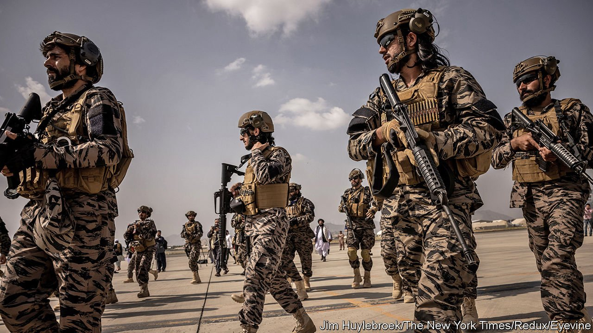

###### Do not move on, move forwards

# America should engage with the Taliban, very cautiously 

##### The aim should be to help ordinary Afghans, not to compete with China and Iran 

 

> Sep 4th 2021 

NOW WHAT? The debate about who is to blame for the chaos at Kabul airport over the past few weeks, as well as all the mistakes that went before it, has raged so intensely that what the West should do next has seemed a secondary question. But it has become a pressing one. The last American soldiers left Kabul on August 30th, ending the 20-year effort to shape events in Afghanistan directly. America and its allies must now decide how best to influence the country from a distance.

For some, the answer is simple. The Taliban are so odious, so violent, repressive and untrustworthy, that America should have as little as possible to do with them. Handing out aid or initiating formal diplomatic ties would only strengthen the new regime, the argument runs; better to leave it to stew. Others make the opposite case. It is no use lamenting the outcome of the war, they say: if America wants to retain any influence in Afghanistan, it had better start engaging now, before China, Iran and Russia turn the country into their client.


Both arguments are wrong. America’s adversaries will indeed  the Taliban, but that does not matter. Afghanistan is a backwater, with little geopolitical or economic significance. America owes it to ordinary Afghans to try to make the situation it has bequeathed them less awful, but otherwise its most pressing interest is to prevent Afghanistan from again becoming a breeding ground for terrorism.

It will be impossible to achieve either of those goals, however, without some sort of dealings with the Taliban. That is not as big a reversal as it sounds: after all, American diplomats have been negotiating with the insurgents for several years now. Those talks were a sham, unfortunately. America was too obviously on its way out for the Taliban to take them seriously.

Now America and its allies have genuine, if limited, leverage. The Taliban regime is broke. Foreign aid, most of which has been suspended, accounted for three-quarters of the government’s budget and almost half of GDP. The government’s foreign reserves are sitting in frozen accounts in the West, and America’s blessing is needed to get access to IMF loans. China is unlikely to bankroll the new regime on anything like the scale America and its allies did the old one. Iran or Russia certainly won’t.

Engagement, one transaction at a time

The Taliban, of course, may prefer pious penury to growth and development. But to the extent that Western help is wanted, it should be dished out in small doses, tied to specific concessions. The main goals should be to allow access for aid agencies, and to keep schools, clinics and borders open (for women and girls as well as men). The more reasonable the Taliban are, the more money the West should hand over. But everything should be reversible, especially if there is any hint that the new regime is abetting terrorism.

The Taliban appear unsure how repressive and isolationist to be. They are clearly capable of feigning moderation. But some of their leaders may really want less hostile relations with America. And the rest may respond to pressure—especially now that the West has so little left inside Afghanistan to lose. ■

