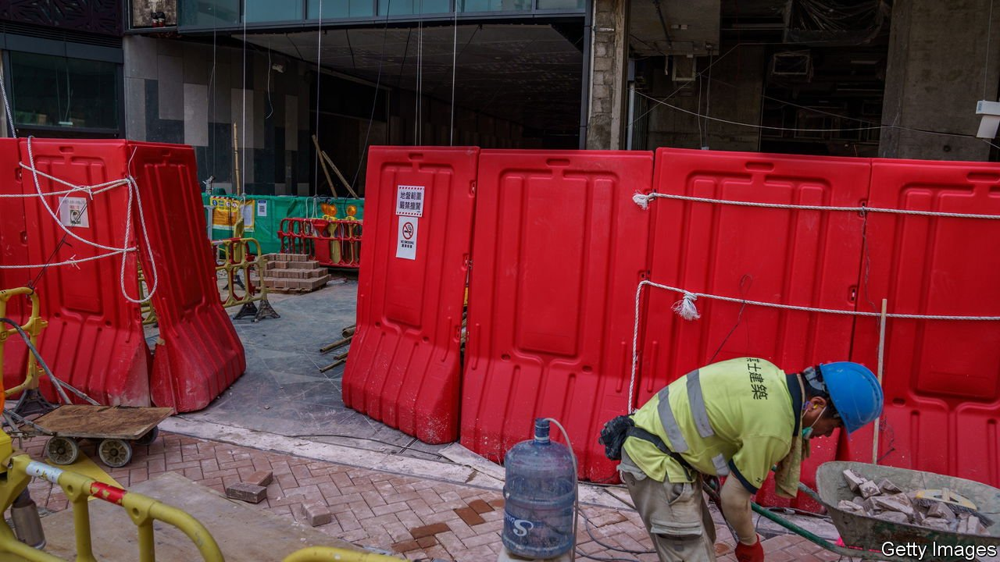

###### China’s bad debts

# China’s dodgy-debt double act 

##### The agonies of Huarong and Evergrande 

 

> Sep 4th 2021 

CHINA HAS been trying to clean up its bad corporate debts for years. Although it made some progress before the pandemic, the task often seems interminable, it remains crucial for the country’s long-run economic development—and for the growing ranks of global investors with exposure to Chinese stocks and bonds. The government insists it wants more market discipline and a transparent process for letting firms default without blowing up the financial system.

Now these claims are being tested by crises at Huarong, a state-run financial conglomerate, and Evergrande, the country’s largest property firm. Together they have some $540bn of liabilities, which they will . Their contrasting fates show that China’s approach is still driven by politics and improvisation not market forces and the rule of law.


The level of debt is jaw-dropping. The private non-financial sector owed the equivalent of 222% of GDP at the end of 2020. Most of that sits with companies. By comparison, private non-financial debt in America is 164% of GDP. Stress in the property and interbank markets often flares up.

The government has been urging the courts to play more of a role in restructuring debt, as they do in America, with its Chapter 11 procedure. Yet in China the culture of “extend and pretend” runs deep. The default rate on bonds is artificially low and expected to be no more than 1% this year, far below the global corporate-default rate of around 2.7% last year. China’s state-owned banks may be willing to express their admiration for Xi Jinping Thought, but they hesitate to confess to their dud loans.

The inadequacies of all this are being exposed by two debt monsters. Huarong was set up in 1999 as a bad bank for soured loans, but became a conglomerate. On August 29th it reported delayed results indicating liabilities of $238bn in June, a $16bn loss last year, and a leverage ratio of 1,333 times. Two days later Evergrande, with property projects in over 280 cities, reported liabilities of $304bn and sustained a profit by selling subsidiaries. The companies have the second- and fourth-largest debt piles of any listed Chinese firms (excluding banks) and together account for 3.9% of the total. As the duo have tottered, so their bond prices have oscillated. Investors are trying to work out whether the firms will default, be bailed out or stagger on as zombies.

They now have an answer for Huarong. After a fraught negotiation at the top of the Communist Party, it will be rescued by other state-owned firms because it is judged too big to fail. The company buys 30-40% of the banking system’s non-performing loans, according to PineBridge Investments, an asset manager, and its bonds were used as high-quality collateral in Chinese markets until earlier this year. A collapse would run the risk of destabilising the banking system.

What about Evergrande? The government may let the mainly foreign owners of its $21bn in foreign-currency debts go to the wall. But a majority of its liabilities are owned by other creditors, including suppliers and homebuyers who pay for properties before they are built. Rather than risk disrupting supply chains and enraging homebuyers, the government will probably find white knights to ensure Evergrande’s core business survives.

Both episodes show that the hierarchy of creditors in China is based on politics and the priorities of the state. It is hard to know in advance which instruments enjoy a state guarantee, and even harder to second-guess the opaque process by which this is decided. The recognition of bad debts is grossly inconsistent. This year Ping An, a successful insurance firm with many foreign shareholders, has recognised bad property investments of $5.6bn, and faced government probes, even as state-run banks loaded with bad debts stayed quiet.

A better system for dealing with bad debts would let China improve the efficiency of capital allocation in its economy and reduce moral hazard and corruption. But when bankruptcy threatens, China’s rulers often play for time. Global investors have been increasing their exposure to Chinese debt, and the country’s weight in global indices is rising. A rosy view has developed among some that China is making great strides in modernising its giant debt markets. Huarong and Evergrande are a reminder that there is still a long way to go. ■

