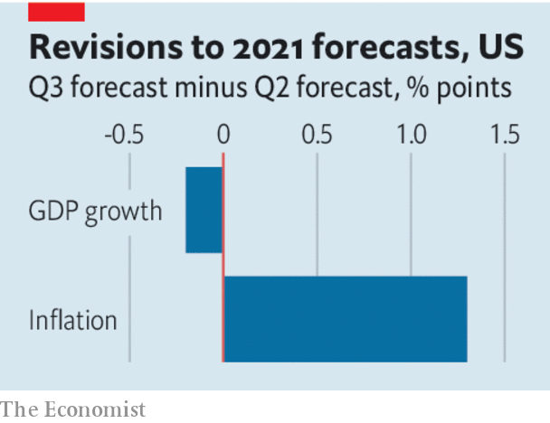

###### Delta and the world economy

# How the pandemic became stagflationary 

##### As the virus has changed, so has its relationship to the economy 

 

> Sep 2nd 2021 

IT HAS BEEN a summer of unpleasant surprises for the world economy. America, Europe and China are growing more slowly than investors had hoped. Consumer prices are rising uncomfortably fast, especially in America. Even in the euro area, used to tepid inflation, prices in August were 3% higher than a year earlier, the most in a decade. Economies are troubled by shortages of parts and labour, slow and expensive shipping and the bewildering variation of lockdown measures.

The spread of the Delta variant is to blame, but the way the pandemic is affecting the economy is shifting. The world had become accustomed to the virus battering growth, as waves of infection caused a sudden stop in activity, and prices moderated or even fell. Delta, by contrast, looks like a stagflationary force that is sapping growth less dramatically but firing up inflation.


Delta is weighing on consumer spending in the rich world but not causing a collapse. In countries with lots of vaccine, cases are no longer doing as much to  from moving around. Europe’s service sector has reopened amid its Delta wave.

Consumers seem less scared of the disease even if there are enough unvaccinated people to fill up hospitals. A year ago the number of diners in American restaurants was nearly half the level in 2019. Now service is about 10% down, even though hospitals are three times fuller. In Japan a state of emergency covering Tokyo does not seem to be keeping consumers away from the shops. Only in countries with draconian policies aimed at eliminating the virus are people stuck at home. Australia and New Zealand face new recessions as a result of their lockdowns and China’s service sector appears to be shrinking.

Meanwhile, the spread of Delta continues to interfere with the global supply of goods just as consumers, especially Americans, are intent on buying more cars, devices and sporting gear than ever. Outbreaks in South-East Asian countries with low rates of vaccination are causing production plants and logistics networks to shut down temporarily, prolonging the disruption to supply chains. In America retailers, including Gap and Nike, have lobbied the White House to donate more vaccines to , so crucial have its factories become to their businesses. Shortages are driving up prices.

 


The changing relationship between the virus and the economy has implications for policymakers. They will not be able to repeat the trick from earlier in the pandemic of restricting people’s movement as a way to contain the spread of the virus, while at the same time unleashing stimulus to create a compensating boom in demand for goods.

A service-sector revival is now the only quick route to fast growth because that is where the slack is. In the second quarter of the year spending on services by American households was about 3% below its level in 2019 in real terms. Should the spread of Delta interfere with service industries such as leisure and hospitality, more stimulus will only create more inflation.

It is also harder to argue that fear of the virus scares consumers off spending, and that government restrictions to slow the spread of disease therefore have little extra economic cost. A weaker link between cases and people’s movement, and the necessity of service-sector growth, raise the cost of lockdowns. If pressure on hospitals causes even highly vaccinated countries like Britain to restrict services over the winter, the economic damage will be large and the benefits smaller. The Delta wave may subside soon, easing the pressure on the world economy. If it does not or another variant takes its place, the trade-offs involved in fighting the virus will become harder to justify. ■

Dig deeper

All our stories relating to the pandemic and the vaccines can be found on our . You can also find trackers showing ,  and the virus’s spread across  and .

An early version of this article was published online on September 1st 2021

