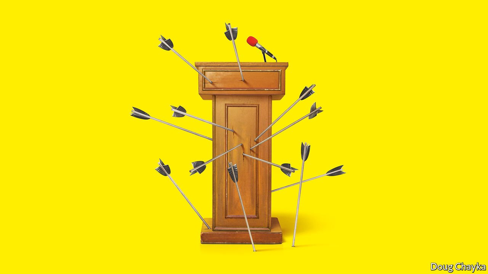

###### Political thought

# The threat from the illiberal left 

##### Don’t underestimate the danger of left-leaning identity politics 

 

> Sep 4th 2021 

SOMETHING HAS gone very wrong with Western liberalism. At its heart classical liberalism believes human progress is brought about by debate and reform. The best way to navigate disruptive change in a divided world is through a universal commitment to individual dignity, open markets and limited government. Yet a resurgent China sneers at liberalism for being selfish, decadent and unstable. At home, populists on the right and left rage at liberalism for its supposed elitism and privilege.

Over the past 250 years classical liberalism has helped bring about unparalleled progress. It will not vanish in a puff of smoke. But it is undergoing a severe test, just as it did a century ago when the cancers of Bolshevism and fascism began to eat away at liberal Europe from within. It is time for liberals to understand what they are up against and to fight back.


Nowhere is the fight fiercer than in America, where this week the Supreme Court chose  a draconian and bizarre anti-abortion law. The most dangerous threat in liberalism’s spiritual home comes from the Trumpian right. Populists denigrate liberal edifices such as science and the rule of law as façades for a plot by the deep state against the people. They subordinate facts and reason to tribal emotion. The enduring falsehood that the presidential election in 2020 was stolen points to where such impulses lead. If people cannot settle their differences using debate and trusted institutions, they resort to force.

The attack from the left is harder to grasp, partly because in America “liberal” has come to include an illiberal left. We describe this week how a new style of politics has recently spread from elite university departments. As young graduates have taken jobs in the upmarket media and in politics, business and education, they have brought with them a horror of feeling “unsafe” and an agenda obsessed with a narrow vision of obtaining justice for oppressed identity groups. They have also brought along tactics to enforce ideological purity, by no-platforming their enemies and cancelling allies who have transgressed—with echoes of the  that dominated Europe before classical liberalism took root at the end of the 18th century.

Superficially, the illiberal left and classical liberals like The Economist want many of the same things. Both believe that people should be able to flourish whatever their sexuality or race. They share a suspicion of authority and entrenched interests. They believe in the desirability of change.

However, classical liberals and illiberal progressives could hardly disagree more over how to bring these things about. For classical liberals, the precise direction of progress is unknowable. It must be spontaneous and from the bottom up—and it depends on the separation of powers, so that nobody nor any group is able to exert lasting control. By contrast the illiberal left put their own power at the centre of things, because they are sure real progress is possible only after they have first seen to it that racial, sexual and other hierarchies are dismantled.

This difference in method has profound implications. Classical liberals believe in setting fair initial conditions and letting events unfold through competition—by, say, eliminating corporate monopolies, opening up guilds, radically reforming taxation and making education accessible with vouchers. Progressives see laissez-faire as a pretence which powerful vested interests use to preserve the status quo. Instead, they believe in imposing “equity”—the outcomes that they deem just. For example, Ibram X. Kendi, a scholar-activist, asserts that any colour-blind policy, including the standardised testing of children, is racist if it ends up increasing average racial differentials, however enlightened the intentions behind it.

Mr Kendi is right to want an anti-racist policy that works. But his blunderbuss approach risks denying some disadvantaged children the help they need and others the chance to realise their talents. Individuals, not just groups, must be treated fairly for society to flourish. Besides, society has many goals. People worry about economic growth, welfare, crime, the environment and national security, and policies cannot be judged simply on whether they advance a particular group. Classical liberals use debate to hash out priorities and trade-offs in a pluralist society and then use elections to settle on a course. The illiberal left believe that the marketplace of ideas is rigged just like all the others. What masquerades as evidence and argument, they say, is really yet another assertion of raw power by the elite.

Progressives of the old school remain champions of free speech. But illiberal progressives think that equity requires the field to be tilted against those who are privileged and reactionary. That means restricting their freedom of speech, using a caste system of victimhood in which those on top must defer to those with a greater claim to restorative justice. It also involves making an example of supposed reactionaries, by punishing them when they say something that is taken to make someone who is less privileged feel unsafe. The results are calling-out, cancellation and no-platforming.

Milton Friedman once said that the “society that puts equality before freedom will end up with neither”. He was right. Illiberal progressives think they have a blueprint for freeing oppressed groups. In reality theirs is a formula for the oppression of individuals—and, in that, it is not so very different from the plans of the populist right. In their different ways both extremes put power before process, ends before means and the interests of the group before the freedom of the individual.

Countries run by the strongmen whom populists admire, such as Hungary under Viktor Orban and Russia under Vladimir Putin, show that unchecked power is a bad foundation for good government. Utopias like Cuba and Venezuela show that ends do not justify means. And nowhere at all do individuals willingly conform to state-imposed racial and economic stereotypes.

When populists put partisanship before truth, they sabotage good government. When progressives divide people into competing castes, they turn the nation against itself. Both diminish institutions that resolve social conflict. Hence they often resort to coercion, however much they like to talk about justice.

If classical liberalism is so much better than the alternatives, why is it struggling around the world? One reason is that populists and progressives feed off each other pathologically. The hatred each camp feels for the other inflames its own supporters—to the benefit of both. Criticising your own tribe’s excesses seems like treachery. Under these conditions, liberal debate is starved of oxygen. Just look at Britain, where politics in the past few years was consumed by the rows between uncompromising Tory Brexiteers and the Labour Party under Jeremy Corbyn.

Aspects of liberalism go against the grain of human nature. It requires you to defend your opponents’ right to speak, even when you know they are wrong. You must be willing to question your deepest beliefs. Businesses must not be sheltered from the gales of creative destruction. Your loved ones must advance on merit alone, even if all your instincts are to bend the rules for them. You must accept the victory of your enemies at the ballot box, even if you think they will bring the country to ruin.

In short, it is hard work to be a genuine liberal. After the collapse of the Soviet Union, when their last ideological challenger seemed to crumble, arrogant elites lost touch with liberalism’s humility and self-doubt. They fell into the habit of believing they were always right. They engineered America’s meritocracy to favour people like them. After the financial crisis, they oversaw an economy that grew too slowly for people to feel prosperous. Far from treating white working-class critics with dignity, they sneered at their supposed lack of sophistication.

This complacency has let opponents blame lasting imperfections on liberalism—and, because of the treatment of race in America, to insist the whole country was rotten from the start. In the face of persistent inequality and racism, classical liberals can remind people that change takes time. But Washington is broken, China is storming ahead and people are restless.

A liberal lack of conviction

The ultimate complacency would be for classical liberals to underestimate the threat. Too many right-leaning liberals are inclined to choose a shameless marriage of convenience with populists. Too many left-leaning liberals focus on how they, too, want social justice. They comfort themselves with the thought that the most intolerant illiberalism belongs to a fringe. Don’t worry, they say, intolerance is part of the mechanism of change: by focusing on injustice, they shift the centre ground.

Yet it is precisely by countering the forces propelling people to the extremes that classical liberals prevent the extremes from strengthening. By applying liberal principles, they help solve society’s many problems without anyone resorting to coercion. Only liberals appreciate diversity in all its forms and understand how to make it a strength. Only they can deal fairly with everything from education to planning and foreign policy so as to release people’s creative energies. Classical liberals must rediscover their fighting spirit. They should take on the bullies and cancellers. Liberalism is still the best engine for equitable progress. Liberals must have the courage to say so. ■

