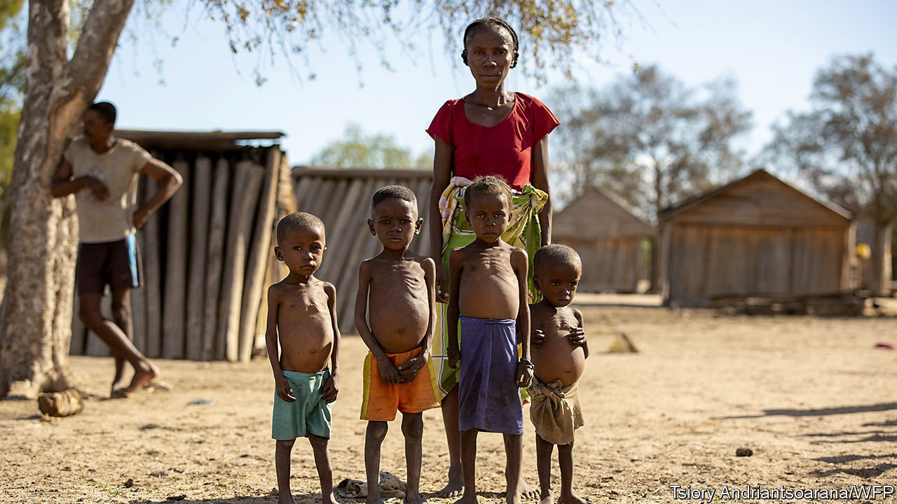

###### Poor and parched

# Why Madagascar is going hungry 

##### Climate change, covid-19 and bad governance all play a role 

 

> Sep 4th 2021 

THE PEOPLE of southern Madagascar are in peril. More than 1.1m of them are going hungry, according to the UN. More than 500,000 children under the age of five are at risk of being acutely malnourished. Many families are eking out their meagre diets with cactus. And the suffering is  with the start of the “lean season”, the hungry months before the next harvest (see Middle East &amp; Africa section).

This calamity has several causes. The UN emphasises climate change. “This is an area of the world that has contributed nothing to climate change, but now, they’re the ones paying the highest price,” said David Beasley, the boss of the UN’s World Food Programme, in a television interview. Headlines have called it the world’s first “climate famine”.


Man-made climate change has certainly affected the world’s fourth-largest island. Southern Madagascar has long suffered from erratic rains. Droughts are common, and famines were recorded in 1903, 1910, 1916, 1921 and 1943 among other years. Yet of late the rains have become even less regular; today’s drought is the worst in 40 years. The harvest of cassava, a staple, is expected to be 60-90% less than in normal years. The price of rice is soaring.

In addition, covid-19 has made people poorer. Madagascar’s economy shrank by 4.2% last year, despite a fast-growing population. The island has all but shut itself off from the outside world, causing its main source of hard currency, tourism, to collapse. The well-heeled foreigners who used to trek through its rainforests in search of lemurs stayed at home. The 1.5m people who depend on them lost their livelihoods.

Donors should pitch in to prevent people from starving. Children, especially, need enough nutrients if they are to avoid growing up with stunted bodies and minds. At the same time, the disaster should be a wake-up call for Madagascar’s government. If successive regimes had not mismanaged the economy so badly for so long, the Malagasy would be prosperous enough to cope better with shocks.

The nearby tourism-dependent island of Mauritius has also been hammered by extreme weather and covid-19. Its economy shrank even more in 2020 than Madagascar’s, and torrential rains in April washed away roads and crops. Yet Mauritians are not starving. This is because they are about 17 times richer than their Malagasy neighbours.

Half a century ago Mauritians were barely twice as rich. But since then Mauritius has been politically stable, sensibly run and attractive to investors. Madagascar, by contrast, has suffered two decades of communism and a succession of coups (including one in 2009 by Andry Rajoelina, the current president, who later came to power through the ballot box). Because of bad government, Madagascar’s 28m people are about as poor today as they were at independence in 1960. Mr Rajoelina is better than some of his predecessors, but hardly inspiring. He promoted a herbal “treatment” for covid-19, and has been dismally slow to roll out vaccines.

Madagascar’s woes are a reminder that the world should cut greenhouse gases; and also that economic growth makes other problems easier to deal with. Just now, Madagascar’s people need help. In the long run, they need better government. ■

