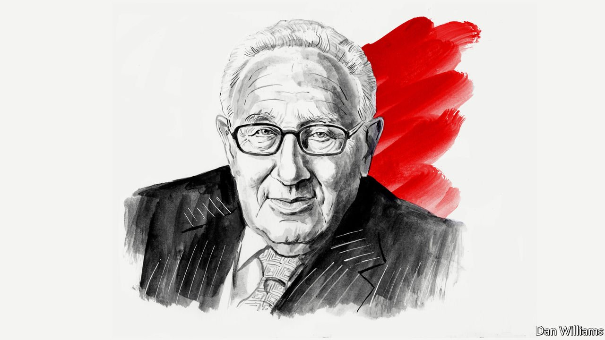

###### On Afghanistan, vaccinations, chewing-gum, Berlin, corporate jargon

# Letters to the editor 

##### A selection of correspondence 

 

> Sep 4th 2021 


A failure of Western thinking

To hang the Afghanistan fiasco on Joe Biden is worse than unfair, it is unintelligent (“”, August 21st). Unfair, because it was foreseen by so many that the Afghanistan issue would end in a mess. Unintelligent, because the true sources of this disaster are neither political nor military, they are philosophical. Western thinking, shared by Europeans and Americans, is conditioned on Enlightenment thinking, which is centred on the improvement of the individual. Contrary to what was and is still thought by many of its doyens, this hardly helps one understand societies.


The consequent Western penchant for social tinkering, besides being arrogant, has not only failed to achieve its goals but has also resulted in a long list of social and political tragedies, such as communism in Russia and elsewhere, or the American state-building initiatives, in Vietnam, Iraq and now Afghanistan.

PROFESSOR EVYATAR FRIESEL

Hebrew University of Jerusalem

 


Regarding Henry Kissinger’s article on America’s diplomatic failures in Afghanistan (, August 25th), it has been well documented how America and Britain were involved in creating a powerful group of mujahideen from a rag-tag cluster of vicious fundamentalists, the core of whom were not Afghans, well before the Soviet invasion of that country. The apparent reason for this was to draw the Soviet Union into a prolonged war. Both Ronald Reagan and Margaret Thatcher had openly expressed their admiration for the mujahideen, and arguably achieved their goal of defeating communism by providing substantial support for them.

Christopher Davidson’s “Shadow Wars”, published in 2016, contains a treasure trove of citations on declassified documents, interviews with retired CIA and MI6 agents, as well as references to many other excellent books on the subject. Pitched against this knowledge, it is not surprising that Mr Kissinger chose to make some rather whimsical observations on diplomatic failures, rather than take a deeper look at the history of American involvement in the region.

By stating that “We entered Afghanistan amid wide support in response to the al-Qaeda attack on America” and making some lightweight criticism on diplomatic efforts, Mr Kissinger tried to whitewash a shameful chapter in American history that started back in the late 1970s, well before he claimed it did.

PETER BASHFORD

Dubai

Mr Biden is famously fond of W.B. Yeats. I wonder if he should have heeded the warning in one of the poet’s most famous works, “The Second Coming”: Things fall apart; the centre cannot hold. Mere anarchy is loosed upon the world…The best lack all conviction, while the worst are full of passionate intensity.

AUGUSTUS HANEY

New York

 


Proceed with care

A cautionary tale regarding your statement that one day, people could be vaccinated pre-emptively (“”, August 7th). In March 1976, at the behest of the director of the Centres for Disease Control, the US president announced the mass vaccination of every American, within a short period, against a speculated epidemic or pandemic of swine flu, akin to the one in 1918. The president wanted to protect public health.

The first swine-flu shots were given on October 1st 1976. They were hastily suspended just over two months later. The reason was that the incidence of Guillain-Barré syndrome in the vaccinated group was about four times greater than normal. The deadly swine-flu epidemic never came.

The process of decision-making at the highest political level, regarding the perils of “pre-emptive mass vaccination'', is described in detail in a report from June 1978 prepared for the Department of Health, Education and Welfare by Richard Neustadt and Harvey Fineberg, later entitled “The epidemic that never was”.

PRIMO ARAMBULO

Rockville, Maryland

 


Wrigley’s gum

While we enjoyed seeing an article on chewing-gum products, there was a slight misquote in your piece, “” (1843, July 26th). William Wrigley junior was a marketing genius whose pioneering tactics are studied to this day. His zest for advertising earned him the sobriquet “maestro of sales”. So he never really considered selling gum to be a “problem”, as you claimed, but rather a fun challenge at which he excelled.

He would quip that “The sale’s the thing!” and riffed on another marketer’s famous dictum that any fool can make soap; it takes a clever man to sell it. What he actually said was, “Anybody can make chewing gum. The trick is to sell it.” But a trick does not a problem make. As Wrigley knew, and your piece outlined, great marketing is about capturing the moment. In the past, that was an athlete popping a piece of gum before a spectacular feat, or a teen blowing jaunty bubbles in a wilful moment. Every generation has its challenge to confront and gum can help by delivering better moments and more smiles.

ANDREW CLARKE

Global president

Mars Wrigley

McLean, Virginia

Your piece claims that “few products are as pointless as chewing gum”. I and a great many other dental clinicians around the world would strongly disagree. Alongside regular brushing, visiting the dentist and maintaining a healthy diet, chewing sugar-free gum is an important weapon in the armoury of preventative measures against tooth decay and disease. You would be hard pushed to find a dentist in favour of gum that contains sugar, but sugar-free gum is a different proposition. It helps to clean the mouth and protect teeth and gums against plaque and harmful acids. It also stimulates the production of saliva, the mouth's natural defence system.

Chewing gum may well have lost its cachet as a symbol of rebellion accounting for falling sales however; I hope that marketeers can highlight its oral health benefits instead, to the benefit of the nation’s teeth but also the NHS and the public purse which will otherwise bear the cost.

LIZ KAY

President Elect of the British Dental Association

London

 


Kennedy and Berlin

It is not quite right to say, as a book review did, that John F. Kennedy became “obsessed” with divided Berlin (“”, August 7th). In fact, Kennedy was worried that using American troops to prevent the building of the Wall, as many Germans had demanded in August 1961, including Willy Brandt, West Berlin’s mayor, might have triggered an armed conflict with Moscow. Belatedly, almost two years after the Wall was built, Kennedy at last decided to visit the city. It was then that he gave his “Ich bin ein Berliner” speech.

I happened to have lived in Berlin in 1961 as a young reporter and helped my future wife to escape from East to West Berlin. Ironically, one of my stringer jobs was with NBC, which helped finance “Tunnel 29”, so skilfully described by Helena Merriman in her book.

LESLIE COLITT

Berlin

 


Core competencies

I enjoyed column on the proliferation of corporate jargon (July 31st). I for one am going to take a proactive approach to ensure that I positively impact the exponential abuse of jargon.

ERIC EVANS

Brookline, Massachusetts

In 1956, C.S. Lewis told a young, aspiring writer:


Good advice for children, managers, politicians, preachers, and so on.

REVEREND DAVID GLADE

Alexandria, Virginia

Bartleby made his point well about corporate jargon. The best use of the term I have ever encountered is the name of the firm Global Closure Solutions. It makes bottle tops.

PAUL HARRISON

London

