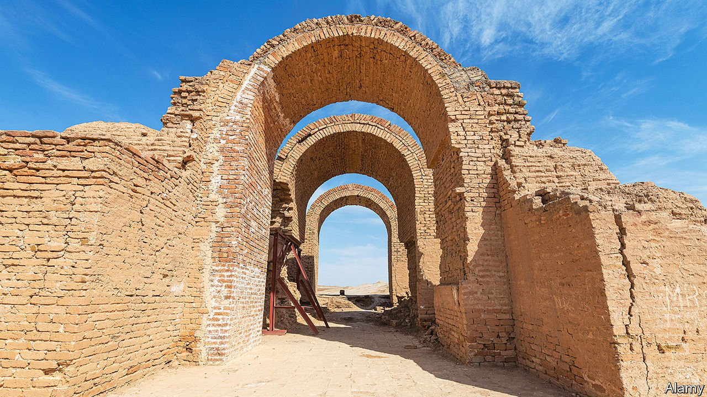

###### Bulldozing history

# Arab states are wrecking old treasures 

##### One dam can flood hundreds of ancient sites 

 

> Sep 4th 2021 

THE FIGHTERS of Islamic State turned sledgehammers and drills on ancient temples after conquering north-western Iraq and north-eastern Syria in 2014. They raided the tombs of Assyrian kings in Nineveh, blew up Roman colonnades in Palmyra and sold priceless relics to smugglers. But their vandalism was on a modest scale compared with some of the megaprojects that are habitually undertaken by many Middle Eastern governments. A few months ago, a short distance downriver from the archway toppled by the jihadists in Ashur, the religious capital of the Assyrian empire, Iraq’s government began to build the Makhoul dam. Once complete, it is likely to flood Ashur—and another 200 historical sites.

Similar archaeological tragedies have occurred across the region, mainly thanks to the appetite of governments for gigantism in the name of modernisation. Some want to stamp a new identity on an old land. Corruption often plays a part: the bigger the project, the bigger the contractors’ bribes. Human tragedies often ensue. The re-landscaping displaces people as well as erasing their heritage, sometimes as a kind of social engineering.


Governments the world over mould landscapes with grand schemes. But in the Middle East they interfere more than most, says Jala Makhzoumi of the American University of Beirut. In part this is because large and growing populations are packed into such small habitable areas. With a megaproject or two, governments argue that they can overcome poverty and decrepit services by bringing electricity and infrastructure. By providing irrigation to make deserts bloom, they can feed people.

Such, at least, was the reasoning behind the Makhoul dam, a few hours’ drive north of Baghdad. Back in 2002, when Saddam Hussein first broached its construction, UNESCO, the UN’s heritage body, warned that “an essential element of human civilisation would disappear for ever”.

Appeals to Saddam’s successors to stop the diggers have fallen on deaf ears. “This government cares nothing for the history of Iraq and the tens of thousands of sites in the cradle of civilisation,” says Azzam Alwash, an Iraqi environmentalist.

At least since the time of Pharaoh Zoser, Middle Eastern rulers have tried to express the grandeur of their vision in stone, and today’s lot are no exception. “They want something impressive but too often they ruin the landscape and displace and alienate people,” laments Ms Makhzoumi. Egypt’s dictator, Abdel Fattah al-Sisi, has bulldozed swathes of Cairo, the old capital, to make way for motorways, flyovers and shiny skyscrapers that line the road to the new administrative capital he is building.

To ease congestion he has scythed a thoroughfare named Paradise through the City of the Dead, a 1,000-year-old necropolis that is a UN-designated world heritage site. Hundreds of tombs were destroyed. He has turfed out tens of thousands of people from their homes in Boulaq, along the Nile, calling it slum clearance. This was where Cairo’s old port prospered in Ottoman times. Instead of rehabilitating it, Mr Sisi is letting property magnates carpet the area with high-rise apartment buildings.

Look on my works, ye mighty

Mr Sisi has allowed investors from the United Arab Emirates to build a mini-Dubai on Cairo’s largest green space, a nature reserve on al-Warraq island. Its 90,000 residents will be shunted off, mainly to estates on the city’s edge. Protesters have been condemned as Islamist terrorists and sent to prison, many for 15 years.

Mr Sisi is not the first modern Egyptian ruler with pharaonic ambitions. Gamal Abdel Nasser put up Aswan’s High Dam in the 1960s to regulate seasonal floods and provide electricity, while also submerging the cradle of ancient Nubian civilisation. Western archaeologists rushed to save as many temples, tombs and cities as they could along 550km of the Nile. Some of the rescued antiquities still adorn Western museums. To this day displaced Nubians campaign to be allowed to return to the water’s edge. Tens of thousands of them should be compensated for their lost land and homes, activists argue. Sudan’s recently ousted Islamist regime, deeming Nubian and Pharaonic relics heretical, extended the damage southwards up the Nile in 2009 by completing the Merowe dam, flooding another 170km of Nubia’s past.

Some rulers have security in mind when they bulldoze history. Mr Sisi can send in the tanks faster on wider roads. Removing Egypt’s poor from city centres may curb the risk of revolution. “They know that poor areas revolted in 2011,” says Abdelrahman Hegazy, a Cairene city planner. “They’re afraid of population density.” During Syria’s current civil war, President Bashar al-Assad and his Russian patrons ruined parts of the old cities of Homs and Aleppo, treasure troves of antiquity that were also rebel strongholds, with relentless barrel-bombing.

Israel also has a tendency to obliterate the past, in its case to discourage the return of Palestinian former inhabitants or their descendants. The names of their villages, now often hidden beneath forests planted on once-terraced hills, have been expunged from modern maps. A recent exhibition at Israel’s national art museum in Tel Aviv recorded the villages’ vanished contours using drone photography. “We want to put the villages back on the map,” says Miki Kratsman, a photographer involved in the show. Even that would be futile in Libya, where Muammar Qaddafi, its former dictator, obliterated much of his country’s Jewish past by building its poshest hotel, the Corinthia, on the Jewish quarter in Tripoli, the capital.

Occasionally the damage is partially reversible. America is returning more than 17,000 old artefacts smuggled out of Iraq since its invasion in 2003. And the UN is helping to rebuild medieval mosques, churches and souks in the Iraqi city of Mosul that America and its allies flattened while destroying Islamic State’s caliphate in 2017. Bassel Hariri, a Syrian exile in London, is rebuilding Aleppo—as a virtual city. His 150,000 followers on Facebook share their testimonies of the city they lost.

Governments sometimes have second thoughts. After long decrying ancient Nabataean rock tombs as pagan idolatry, Saudi Arabia’s rulers now promote them as tourist attractions. Saudi officials even speak of reopening ancient churches, whose very existence they used to deny, not just to tourists but also to worshippers. ■

