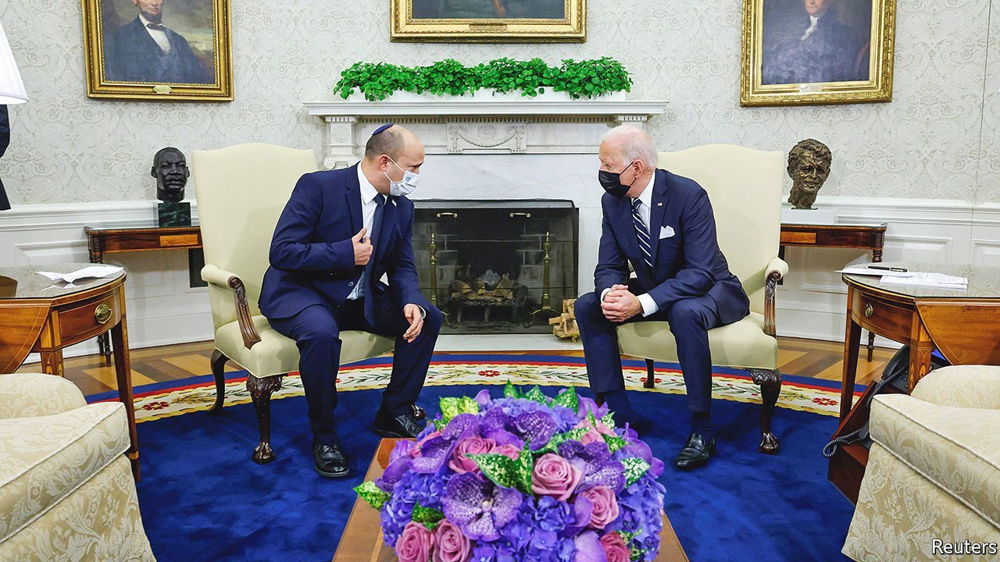

###### Managing the conflict

# Israel’s foreign policy has changed in tone but not in substance 

##### It is unlikely to engage with the Palestinians 

 

> Sep 2nd 2021 

EVEN THOUGH Ramallah and Jerusalem are but a few minutes’ drive apart, no Israeli minister had met the Palestinian president for seven years. The taboo was broken on August 29th when Israel’s defence minister, Benny Gantz, visited Mahmoud Abbas in Ramallah, the Palestinians’ administrative capital. The Israelis were at pains to emphasise that they had discussed only “routine security matters” and that “there is no diplomatic process with the Palestinians and will not be.” Mr Gantz touched on nothing of substance, least of all the long-moribund peace process.

The new Israeli government, which came to office on June 13th, is too fragile to make any serious moves on this front. Its prime minister, Naftali Bennett, and three of the eight parties in his coalition, are adamantly opposed to territorial concessions to the Palestinians. Mr Bennett is flatly against the creation of a Palestinian state.


The new government also includes centrists and left-wingers and, for the first time, an Arab-Israeli party. Most of them support establishing a Palestinian state. Unlike the previous government, led by Binyamin Netanyahu, it will not seek to build new Jewish settlements on the Palestinians’ West Bank, nor will it annex bits of it. But nor will it try to solve the enduring conflict between Israel and Palestine.

Like its predecessor, Israel’s government will make sure that America remains its most stalwart guarantor. Five days before Mr Gantz’s handshake with the Palestinian leader, Mr Bennett arrived in Washington on his first major foreign trip, to meet President Joe Biden (pictured), whose administration was relieved to see the back of Mr Netanyahu, a close ally of Donald Trump. Mr Biden delighted the Israelis with tough talk on Iran. However, they exchanged only the blandest of bromides on peace between Israelis and Palestinians.

Israel’s new government is enjoying a honeymoon in its relations with other Western governments, too. Unless another big wave of violence breaks out, like the 11-day war over Gaza in May and the accompanying ructions in Israel, Mr Bennett’s government is unlikely to come under renewed diplomatic pressure soon. It has already improved strained relations with Israel’s neighbours, Jordan and Egypt.

Its new foreign minister, Yair Lapid, who is due to replace Mr Bennett as prime minister in two years, is a centrist who intends to shift the emphasis of Israel’s diplomatic alliances. Mr Netanyahu loved to hobnob with like-minded populists, such as India’s Narendra Modi and Brazil’s Jair Bolsonaro. In Europe he applauded the leaders of Hungary and Poland.

Mr Lapid has distanced himself from such associations. And he has vigorously tackled Poland’s government over a law that restricts survivors of the Holocaust and their heirs from claiming property they owned before the second world war.

But on the biggest issue confronting any Israeli government—relations with the Palestinians—the fundamentals remain the same. The new Israeli leaders may be harking back to the old if rebranded concept of “shrinking the conflict” rather than solving it. Their hope is that the Palestinians will be content with increased “self-governance” and more economic aid within the West Bank. At a later stage, the blockade imposed by Israel and Egypt on Gaza for the past 14 years may be eased.

Meanwhile, the core issues of Palestinian statehood, demarcating the borders and granting rights to Palestinian refugees will be deferred indefinitely. “The important thing is not to cause any unnecessary problems and try to make life easier for the Palestinians,” says an aide to Mr Bennett.

For their part, the Palestinians are making it easier for Israel to push their cause to the margins. Mr Abbas, now in the 17th year of what was supposed to be a four-year term, has refused to hold elections either for the presidency or for the Palestinian parliament. His administration is widely seen as corrupt and ineffectual. Like the previous Israeli government, the new one seems indifferent to the Palestinians’ fate. There may be bouts of violence for years to come. Meanwhile it is betting on “managing the conflict”. ■

