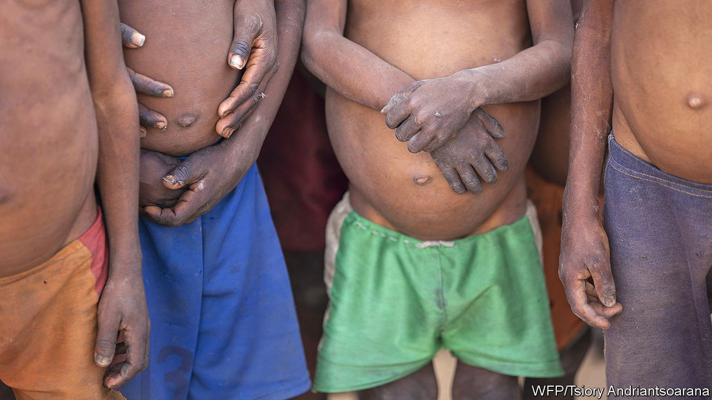
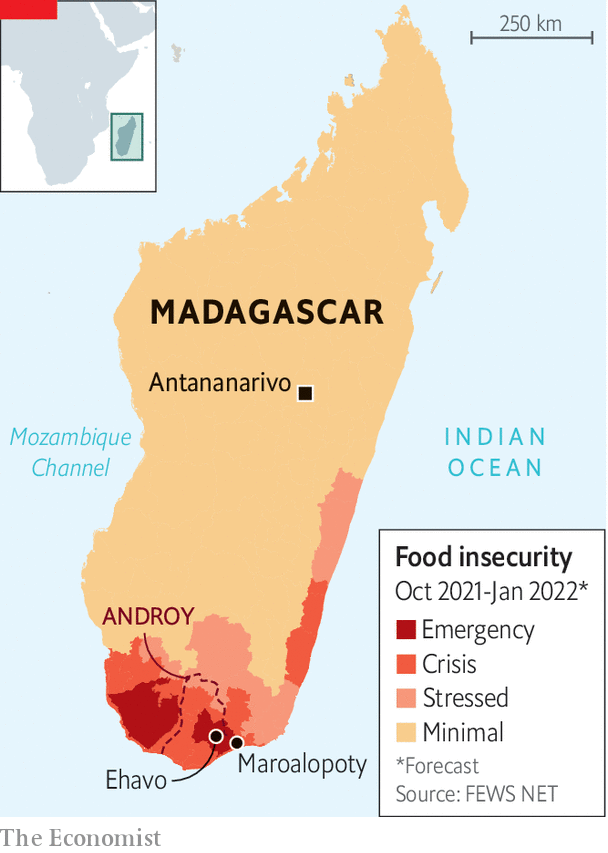

###### Hunger island

# Madagascar is on the brink of famine 

##### Donors are trying to help people hit by climate change, pandemic and bad governance 

 

> Sep 2nd 2021 

MASY, A LISTLESS three-year-old, has just sucked up a packet of Plumpy’Nut, a peanut-butter paste that donors give to malnourished children. It may save her life. Yet her grandmother, Zemele, is still gloomy. Sitting on the ground outside a clinic in Maroalopoty, a village in southern Madagascar, she describes how hard life has become. Her land has had almost no rain for three years. Sandstorms have made the soil less fertile. Masy’s parents have gone away to find work. To make ends meet, Zemele has had to sell three of her four fields. “Before, it was bad,” she says, “but not so bad.”

Madagascar, the world’s fourth-largest island, has long been prone to droughts, cyclones and floods. Now it is reeling from a double catastrophe: crop failure in the south, partly due to climate change, and a covid-19-induced economic crunch.


On August 19th UN agencies appealed for $155m to help feed 1.3m people in southern Madagascar, where some areas are dangerously close to full-blown famine. Some families are so desperate they are selling their daughters, frets Mialy Radrianasolo of Unicef, the UN’s agency for children. “Because of hunger,” she says, the poorest families “want to get rid” of their daughters, so a “man of 60” who may already have four or five wives “can get a 12-year-old in marriage.”

Many children are dropping out of school to work or forage for food. Jean-Chrysostome Gege, the deputy head of a primary school in a village called Ehavo, says it had 250 pupils in 2018 but only 110 last year. Education may yield rich rewards eventually, but hungry households need food today.

The emergency has many causes. Climate change has made the rains less reliable, say UN officials. In Madagascar’s deep south people have long been used to the keré (a drought that brings hunger). But in some places of late the keré has lasted for years instead of months. The UN says this one is the worst in 40 years.

 


Covid-19, meanwhile, has clobbered the economy. Before the pandemic the World Bank expected GDP to grow by a healthy 5.2% in 2020; instead it shrank by 4.2%. This is even worse than it sounds, since the population is rising by 2.7% a year.

Tourist contraction

Moreover, GDP is expected to rebound slowly, with the IMF forecasting economic growth this year of just 3.2%. To defend Madagascar from the pandemic, the government has sealed it off, admitting only a handful of foreigners and allowing only a few flights to land. Tourists, who used to flock to see Madagascar’s lemur-filled rainforests or wild and unspoilt coast, cannot come. The estimated 1.5m people who depend on them are struggling. Noeline, who sells colourful wooden trucks by a road near Antananarivo, the capital, sold a dozen a day before the pandemic. Now she sells only one, she says.

Malnutrition, though always a scourge, was until recently becoming rarer. The proportion of Malagasy children under five who are stunted fell from around 61% in 1992 to 42% in 2018, according to the World Bank. But it has jumped back up to 47%, says Unicef, and the rate of stunting is higher in the south.

Small-bore solutions

With 28m people in an area bigger than metropolitan France, Madagascar is not densely populated. But it is very poor. In the south, goods and people must move along rutted tracks rather than tarmac roads. The chopping down of trees for fuel has led to soil erosion. Some people are trying to reverse this. In Maroalopoty, a car that arrives from the UN Development Programme is rapidly surrounded by hundreds of villagers. The UN is recruiting them for a couple of dollars a day to plant lines of drought-resistant sisal to tamp down the earth and nearby sand dunes. For some, it will be too little, too late.

Michel Saint-Lot of Unicef complains of decades of poor governance. “You cannot just drill small boreholes equipped with a hand pump for drinking water,” he says. The country needs long-term fixes, he argues, such as water pipelines for drinking water, cattle and irrigation.

Soja Lahimaro, the governor of Androy, one of the worst-affected regions, says he used to think that governments in the far-away capital kept the south poor to show to foreigners, so they would dish out aid. Now he says that President Andry Rajoelina, who appointed him, is doing his best.

Others have doubts. Mr Rajoelina has built costly stadiums and a Roman-style colosseum next to a historic palace in Antananarivo. He also wants to found a new city to relieve the capital of overcrowding. But education and health care remain woeful. When covid-19 struck Mr Rajoelina touted a herbal treatment called “Covid-Organics”, made from local plants. There is no evidence it works. He also initially spurned COVAX, the big global programme that gives free vaccines to poor countries. So far, less than 1% of the population has had even one dose.

Juvence Ramasy, an analyst, says Mr Rajoelina is a populist who makes promises but does not follow through. His grandly titled Initiative for the Emergence of Madagascar, which aims to promote mining and infrastructure, is still just a draft. Some public money has been spent in the south, says Mr Ramasy, but much of it has been stolen by politicians. The region is known as the “graveyard of projects”.

Last week Mr Rajoelina went to Paris to woo foreign investors. It would help if his government quarrelled less with existing investors: for example, over a new airport terminal and two hydroelectric plants built by French companies. Reports after Mr Rajoelina met France’s president, Emmanuel Macron, on August 27th, suggest that these disputes may soon be settled.

But some investors worry about Madagascar’s stability. Two decades ago it came close to civil war, and the army has intervened regularly in politics. Mr Rajoelina’s first term as president, from 2009 to 2014, was the result of a coup. He then won a reasonably fair election in 2018, but politics is far from calm. Recently the government arrested 27 people, including several military officers and two French citizens, who, it said, were planning to assassinate Mr Rajoelina. Details are unclear but police say one of the plotters asked a local oil company for $10m to overthrow the president, and promised oil concessions in return.

The economy is riven with cronyism. Most media are controlled by pro-Rajoelina politicians. The opposition is weak. In May the Global Initiative on Transnational Organised Crime, an NGO based in Geneva, said that Madagascar was becoming a hub for heroin and cocaine trafficking. Local media ignored the story, complains Riana Raymonde Randrianarisoa, an investigative reporter. She believes the traffickers have high-level protection.

Madagascar’s lean season starts in September. Without short-term aid many children will grow up with stunted bodies and stunted minds. To help families feed themselves in the long run, Madagascar needs to develop. Except for a few commercial farms, agriculture has barely begun to be mechanised. Only 15% of Malagasy have electricity; in the countryside, far fewer. At night villages like Zemele’s are almost pitch black. Worse, says Mr Ramasy, “nothing much is changing.” ■

An early version of this article was published online on August 31st 2021

