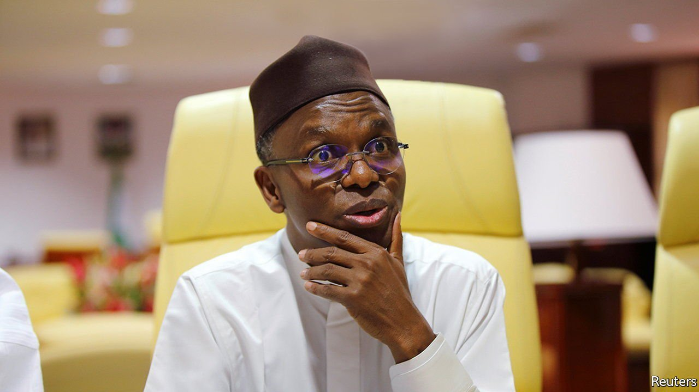

###### Reform, and its malcontents

# What the travails of a reformist governor say about Nigeria 

##### Nasir El-Rufai is cutting the workforce to modernise, but faces a backlash from unions 

 

> Sep 4th 2021 

STANDING AT ABOUT five-foot-four, Nasir El-Rufai, governor of Nigeria’s northern state of Kaduna, says he models himself on Deng Xiaoping, who put China on a path to growth after the misery of rule by Mao Zedong. Mr El-Rufai sees a new path for Kaduna and, some say, for Nigeria itself.

Mr El-Rufai prizes education: he has a law degree from London, a master’s in public administration from Harvard and is writing a doctorate at Maastricht university. He is usually addressed by the title “Mallam”, out of respect for his erudition, particularly in Koranic studies. So it may seem odd that one of his early acts as governor was to fire almost 22,000 primary-school teachers. Yet he had cause. Those he booted out had failed a test designed for nine-year-olds. Some couldn’t complete a comprehension test. Others couldn’t name a rectangle. Mr El-Rufai has sacked thousands more workers. And he is not done.


With two years left of his second term, the governor is determined to balance the state’s budget by reducing the number of people working for the government. This is something of a rarity in Nigeria, where the governor of another state recently boasted he had hired 38,000 aides, ostensibly to reduce poverty, arguing it was better to spend money on employing people than to invest in roads or ports.

When Nigeria locked down last year to slow the spread of covid-19, it quickly became clear that Kaduna’s administration was not noticeably worse with most of the state’s employees not working than when they were supposedly toiling in the service of taxpayers. Since then Mr El-Rufai has proposed to sack a further 7,000 government workers.

His latest move has provoked the trade unions, whose members went on strike under banners reading “Hell-Rufai”. Once seen as a liberal, he now has a reputation as a harsh disciplinarian. Yet the governor is undaunted. He has dared disgruntled workers to challenge him in court.

Though his means may be unpopular and his critics accuse him of riding roughshod over opponents, his case for streamlining the civil service is strong. Of the 50bn naira ($121m) that Kaduna will receive this year from the federal government (its main source of funds), it will spend about 80% on staff salaries. This is an improvement on last year, when personnel costs outstripped the federal allocation.

Mr El-Rufai argues that unless he can slim the payroll, he will not have the cash to invest in good things like hospitals and bridges. It could also free up funds to fight insecurity, a persistent scourge in Nigeria’s northern states, bedevilled by gangs of kidnappers and by fighting between crop farmers and cattle herders. Sectarian tension in the north between the Muslim majority and the Christian minority is another frequent source of violence. Since Mr El-Rufai was elected governor in 2015 the number of ethnic clashes has fallen.

The governor, who is thought to have presidential ambitions, has had little support for his reforms from the federal government or ruling party, of which he is a member. Yet he is pushing on regardless. He believes that just like Deng, who revoked many of Mao’s stifling economic policies, he may have to defy his party in order to force through his plans.

But Mr El-Rufai would do well to remember that he must worry about more than just his party. Unlike leaders of China, who can lock up critics and never face voters, he operates in a raucous democracy. In June his party lost a by-election in Kaduna, perhaps an early sign of a backlash against his policies. If he does not keep an eye on his dwindling popularity, he may soon have little chance to reform anything. ■

