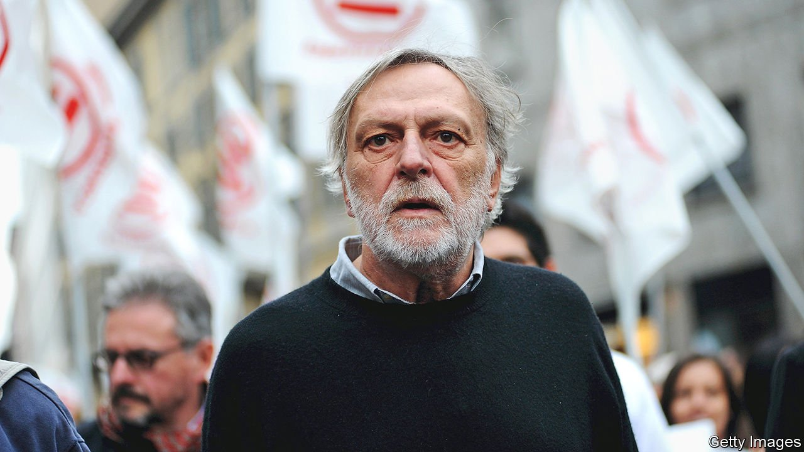

###### Blood and roses

# Obituary: Gino Strada believed health care was a human right 

##### The war surgeon and hospital-builder died on August 13th, aged 73 

 

> Sep 4th 2021 

PEOPLE OFTEN wondered why Gino Strada led the life he did. With his skills as a heart-and-lung surgeon, trained not only in his native Milan but at Stanford and Groote Schuur, in South Africa, he could have settled in a pleasant villa somewhere beyond the city, working at an easy pace and growing the roses he loved. Instead he seemed to live in operating theatres in desperate places, draining, cleaning, cutting and suturing the worst wounds imaginable. They were vast wounds, the result of landmines and bomb blasts that tore bodies to rags. Between patients he would stand outside in his bloodied scrubs, a raddled-looking man with a messy beard, chain-smoking.

The worst of it was that his patients were rarely combatants. If they had been he would have treated them all alike, as human beings whose faith or affiliation made no difference to him. But wherever he worked, in Iraq, Pakistan, Rwanda, Yemen and especially Afghanistan, where he spent seven years, the war-wounded were almost all civilians. They were women fetching water, farmers digging, shoppers in the market. What had they to do with war? Almost half the injured, quite young enough to cry and yet stoically not crying, were children. In Afghanistan many had picked up one of the little “green parrots”, dropped from Soviet helicopters, strange pretty things, which then burst in their hands.


The reality of war for ordinary people, the fact that they bore the brunt of it, shocked him deeply. So did the fact that health care in war-prone places scarcely existed. Yet this was surely a basic human right, an extension of the right to live. It was also, he believed, an equal right: not a matter of sophisticated high-tech treatment for the few, and a couple of aspirins and shots for the rest. The poor, as well as the rich, should get the best medical care the world could provide. And, for the poor, it should be free.

He had worked after his training for the International Red Cross, but soon wanted to forge his own path. His charity Emergency, set up with his wife Teresa Sarti and about 20 friends in 1994, had equality of care as its first principle. So while its job was often to replace the Red Cross as it pulled back from combat zones, it also provided free centres of medical excellence in benighted and unexpected places. In Sudan he built a centre for heart surgery, one of the best in Africa, where he often worked himself. Paediatric centres were set up in the Central African Republic and in Uganda, where his friend Renzo Piano designed it. In Iraq 300 craft co-operatives were set up for amputees in his trauma hospital, so that they could start businesses when they left. These hospitals were spotless, filled with the latest equipment and staffed by international and local teams. They were also oases of calm, surrounded by orchards and gardens. In Italy, where Teresa raised most of their funds, some folk grumbled about palaces in deserts. This made him all the more determined. His hospital in Sudan, in a mango grove on the Blue Nile, would, he promised, be “scandalously beautiful”. It was.

In Afghanistan, where his heart lay, a trauma hospital was built in the Panjshir Valley, as well as the best maternity centre in the country; in 2018 more than 7,500 babies were born there. In Kabul in 2001 he opened another emergency hospital, the first in the city, as well as a network of first-aid posts. It was a struggle. To build in the Panjshir Valley he had to soften up the Tajik leader, Ahmed Shah Masoud, over much late-night tea-drinking, but in Kabul he had to talk to Mullah Omar, then-leader of the Taliban, to get permission and a site. He persuaded both men that he was neutral in the war, as he truly was, seeing the American invasion as a disaster and knowing all too clearly how it would end. At least as the Westerners left Emergency was still there, though pleading in Lashkar-Gah to be left alone, moving patients away from the windows and displaying a “hospital” banner prominently on its roof: doing what it could to provide the only health-care system Afghanistan had, or has.

Not everywhere was receptive to him. In Somalia and Chechnya there was nothing doing; the insurgents put up walls. In Libya he closed Emergency’s hospital because the wounded were just local criminals shooting at each other. Meanwhile, the sheer persistence of conflict seemed to mock his efforts. Rather than constantly treating the wounded, he wanted the wounding itself to stop. No more landmines or green parrots and, decidedly, no more war. It had to be abolished, for humanity’s sake.

Was this just another crazy Utopian dream, a Gino fantasy? He refused to think so. Emergency had already managed, in 1997, to get the production of anti-personnel landmines banned in Italy, once the world’s third-largest manufacturer. Negotiation worked; it had worked for him even with the Taliban, when NATO thought it was impossible. He could foresee a time when talking would replace fighting, and when war would seem as unthinkable as slavery. He might not live to see it, but then people believed in all manner of things they couldn’t see. Talking of which, he thought Pope Francis might give his views on war a sympathetic ear.

Meanwhile, he laboured on. His work seemed a drop in the ocean, but he was a surgical animal, interested as well as horrified when some new atrocity confronted him. He felt weary, and his voice rasped with all those cigarettes, but in theatre he was alert and calm, fixing what had to be fixed. Compensations came in a damaged heart starting to pump again, or a smile returning to the face of a child; or in a visit from Soran, a boy whose leg he had removed in Iraq, now a confident lawyer.

The landmines remained, many lurking millions of them. Men continued to fight each other. But in the midst of it all he was determined to establish beauty, not just for itself, but because it showed respect for the patients he cared for. Their lives had been reckoned as worthless by enemies they barely knew; now they were given value. In his hospital garden in Kabul there were 200 varieties of roses. One day they might fill his wards, where the war-wounded used to be. ■

