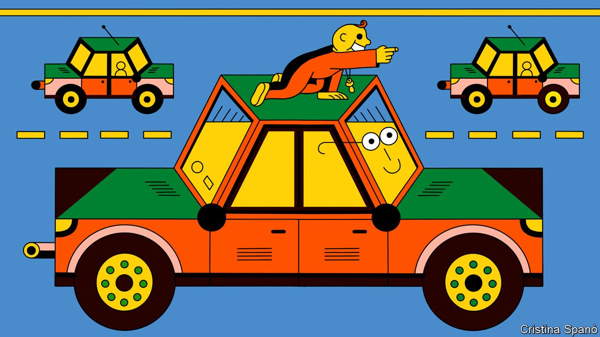

###### AI for vehicles

# Is it smarter than a seven-month-old? 

##### How to improve the intelligence of self-driving cars 

 

> Sep 2nd 2021 

BY THE AGE of seven months, most children have learned that objects still exist even when they are out of sight. Put a toy under a blanket and a child that old will know it is still there, and that he can reach underneath the blanket to get it back. This understanding, of “object permanence”, is a normal developmental milestone, as well as a basic tenet of reality.

It is also something that self-driving cars do not have. And that is a problem. Autonomous vehicles are getting better, but they still don’t understand the world in the way that a human being does. For a self-driving car, a bicycle that is momentarily hidden by a passing van is a bicycle that has ceased to exist.


This failing is basic to the now-widespread computing discipline that has arrogated to itself the slightly misleading moniker of artificial intelligence (AI). Current AI works by building up complex statistical models of the world, but it lacks a deeper understanding of reality. How to give AI at least some semblance of that understanding—the reasoning ability of a seven-month-old child, perhaps—is now a matter of active research.

Modern AI is based on the idea of machine learning. If an engineer wants a computer to recognise a stop sign, he does not try to write thousands of lines of code that describe every pattern of pixels which could possibly indicate such a sign. Instead, he writes a program that can learn for itself, and then shows that program thousands of pictures of stop signs. Over many repetitions, the program gradually works out what features all of these pictures have in common.

Similar techniques are used to train self-driving cars to operate in traffic. Cars thus learn how to obey lane markings, avoid other vehicles, hit the brakes at a red light and so on. But they do not understand many things a human driver takes for granted—that other cars on the road have engines and four wheels, or that they obey traffic regulations (usually) and the laws of physics (always). And they do not understand object permanence.

In a recent paper in Artificial Intelligence, Mehul Bhatt of Orebro University, in Sweden, who is also the founder of a firm called CoDesign Lab which is developing his ideas commercially, describes a different approach. He and his colleagues took some existing AI programs which are used by self-driving cars and bolted onto them a piece of software called a symbolic-reasoning engine.

The heart has its reasons...

Instead of approaching the world probabilistically, as machine learning does, this software was programmed to apply basic physical concepts to the output of the programs that process signals from an autonomous vehicle’s sensors. This modified output was then fed to the software which drives the vehicle. The concepts involved included the ideas that discrete objects continue to exist over time, that they have spatial relationships with one another—such as “in-front-of” and “behind”—and that they can be fully or partly visible, or completely hidden by another object.

And it worked. In tests, if one car momentarily blocked the sight of another, the reasoning-enhanced software could keep track of the blocked car, predict where and when it would reappear, and take steps to avoid it if necessary. The improvement was not huge. On standard tests Dr Bhatt’s system scored about 5% better than existing software. But it proved the principle. And it also yielded something else. For, unlike a machine-learning algorithm, a reasoning engine can tell you the reason why it did what it did.

You could, for instance, ask a car fitted with a reasoning engine why it had hit the brakes, and it would be able to tell you that it thought a bicycle hidden by a van was about to enter the intersection ahead. A machine-learning program cannot do that. Besides helping improve program design, such information will, Dr Bhatt reckons, help regulators and insurance companies. It may thus speed up public acceptance of autonomous vehicles.

Dr Bhatt’s work is part of a long-standing debate in the field of artificial intelligence. Early AI researchers, working in the 1950s, chalked up some successes using this sort of preprogrammed reasoning. But, beginning in the 1990s, machine learning improved dramatically, thanks to better programming techniques combined with more powerful computers and the availability of more data. Today almost all AI is based on it.

Dr Bhatt is not, though, alone in his scepticism. Gary Marcus, who studies psychology and neural science at New York University and is also the boss of an AI and robotics company called Robust.AI, agrees. To support his point of view, Dr Marcus cites a much-publicised result, albeit from eight years ago. This was when engineers at DeepMind (then an independent company, now part of Google) wrote a program that could learn, without being given any hints about the rules, how to play Breakout, a video game which involves hitting a moving virtual ball with a virtual paddle.

DeepMind’s program was a great player. But when another group of researchers tinkered with Breakout’s code—shifting the location of the paddles by just a few pixels—its abilities plummeted. It was not able to generalise what it had learned from a specific situation even to a situation that was only slightly different.

Back to the future

For Dr Marcus, this example highlights the fragility of machine-learning. But others think it is symbolic reasoning which is brittle, and that machine learning still has a lot of mileage left in it. Among them is Jeff Hawke, vice-president of technology at Wayve, a self-driving-car firm in London. Wayve’s approach is to train the software elements running a car’s various components simultaneously, rather than separately. In demonstrations, Wayve’s cars make good decisions while navigating narrow, heavily trafficked London streets—a task that challenges many humans.

As Dr Hawke puts it, “the complexity of most real-world tasks is greater than is possible to solve with handcrafted rules, and it’s well known that expert systems built with rules tend to struggle with complexity. This is true regardless of how well thought out or structured the formal logic is.” Such a system might, for instance, craft a rule that a car should stop at a red light. But lights are designed differently in different countries, and some are intended for pedestrians rather than cars. There are also situations in which you might need to jump a red light, such as to make way for a fire engine. “The beauty of machine learning”, Dr Hawke says, “is that all these factors and concepts can be automatically uncovered and learned from data. And with more data, it continues to learn and become more intelligent.”

Nicholas Rhinehart, who studies robotics and AI at the University of California, Berkeley, also backs machine learning. He says Dr Bhatt’s approach does indeed show you can combine the two approaches. But he is not sure it is necessary. In his work, and also that of others, machine-learning systems alone can already predict probabilities a few seconds into the future—such as whether another car is likely to give way or not—and make contingency plans based on those predictions.

Dr Bhatt responds that you can train a car with data accumulated over millions of kilometres of driving, and still not be sure you have covered all the necessary situations. In many cases, it might be simpler and more effective to program some of the rules in from the start.

For champions of both strategies, the question goes beyond self-driving cars to the future of AI itself. “I don't think we're taking the right approach right now,” Dr Marcus says. “[Machine learning] has proven useful for some things like speech recognition, but it's not actually the answer to AI. We haven't really solved the intelligence problem.” One way or another, then, it seems seven-month-olds still have a lot to teach machines. ■

An early version of this article was published online on September 1st 2021

