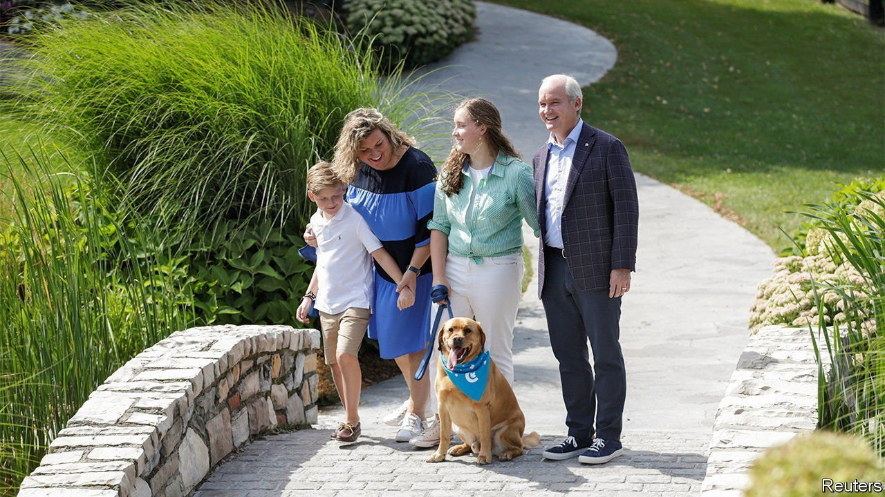
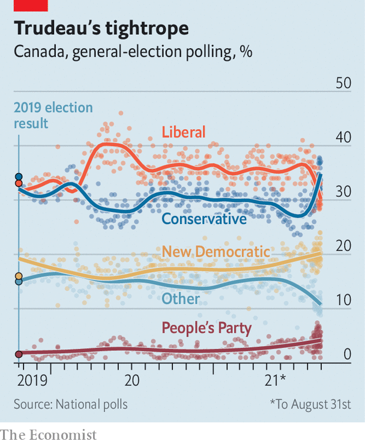

###### A cuddlier Conservatism

# Could Canada’s Conservative Party win back power? 

##### Erin O’Toole wants to win over centrist voters on September 20th 

 

> Sep 4th 2021 

WHEN JUSTIN TRUDEAU called a snap election last month, to be held on September 20th, he wagered that a grateful electorate emerging from lockdown would reward his minority Liberal government with a whopping majority. The prime minister has done a decent job of dealing with the pandemic (notwithstanding a recent spike in cases). As a share of the population, Canada’s 26,900 confirmed deaths are just over a third of those of the United States. Three in four Canadians aged 12 and older are fully vaccinated. Yet a flurry of recent polls puts Canada’s Conservatives, led by Erin O’Toole, an indefatigable if uncharismatic campaigner, within striking distance of unseating Mr Trudeau (see chart).

 


Many Canadians detect some opportunism behind the timing of the election call. Two-thirds of voters say now is the wrong time for a federal election, as it is less than two years since the previous one. But the rise in Conservative fortunes is also partly due to Mr O’Toole, a former helicopter navigator. He is rebranding his party to make it more palatable to centrist voters. A pair of televised debates for party leaders on September 8th and 9th may be more important than in any recent campaign.


Mr O’Toole’s strategy is simple. He is convinced that if his party is to win again, it must become a bit cuddlier. Elections in Canada are won and lost in the comfortable, moderate suburbs of Toronto and Vancouver. The more divisive views of Mr O’Toole’s predecessors, Stephen Harper and Andrew Scheer, such as their narrow interpretation of “Canadian values” and, more recently, their doubts about whether refugees could fit in, went down badly in such places. This contributed to the party’s electoral defeats in 2015 and 2019.

Mr O’Toole sounds less hawkish on public spending than his predecessors. Canada’s net debt as a share of GDP stayed flat at around 31% under Mr Harper, who was prime minister from 2006 to 2015. Covid-19 and Mr Trudeau have pushed it higher, to 50%. Mr O’Toole says that Mr Trudeau’s pandemic largesse, such as cash grants of C$500 ($396) a week to laid-off workers, was necessary. He would extend the government’s income-subsidy scheme by agreeing to cover for employers up to 50% of a new hire’s salary for six additional months. As for eliminating the budget deficit, which soared to C$314bn (14% of GDP) last fiscal year, Mr O’Toole says he will do it in ten years, which is three elections away.

On social issues, Mr O’Toole is a moderate. He says he will “address the gender pay gap”. The leader of the Tories proposes paying C$200 per month to any Canadian who is living with and taking care of a parent over the age of 70. Most beneficiaries will be women. Whereas Mr Scheer said he was against abortion (though he would not seek to change the law), Mr O’Toole is pro-choice. He is also less hostile to trade unions, pledging to “level the playing field” between them and big businesses.

Mr O’Toole is also keen to parade his green credentials. For a start, he has vowed to expel climate-change sceptics from his caucus. He supports a price on carbon of C$50 a tonne but no more. That is far less ambitious than what Mr Trudeau has proposed: a national floor that would eventually rise to C$170 a tonne. Yet Mr O’Toole faced an enormous backlash from party members. Any kind of carbon tax is unpopular in Canada’s oil-producing west, the heartland of Canadian conservatism. The Tories would also require 30% of light vehicles sold in the country to be emissions-free by 2030.

The Conservative leader has displayed keen political instincts on the campaign trail. He avoids broaching topics which, though they may animate his base, risk alienating the broader public. Party stalwarts, for example, routinely complain about what they see as the left-wing bias of the CBC, the country’s public broadcaster. But Mr O’Toole has refrained from attacking it, possibly because the CBC remains popular in much of Canada.

The risk of adopting a more moderate stance, however, is that disaffected voters on the right may cast their lot instead with the People’s Party, a populist outfit which has endeared itself to anti-vaxxers. Mr O’Toole has reason to worry. The People’s Party is polling at a record 6% in some polls. A divided vote on the right could yet help the Liberals secure a third term.■

