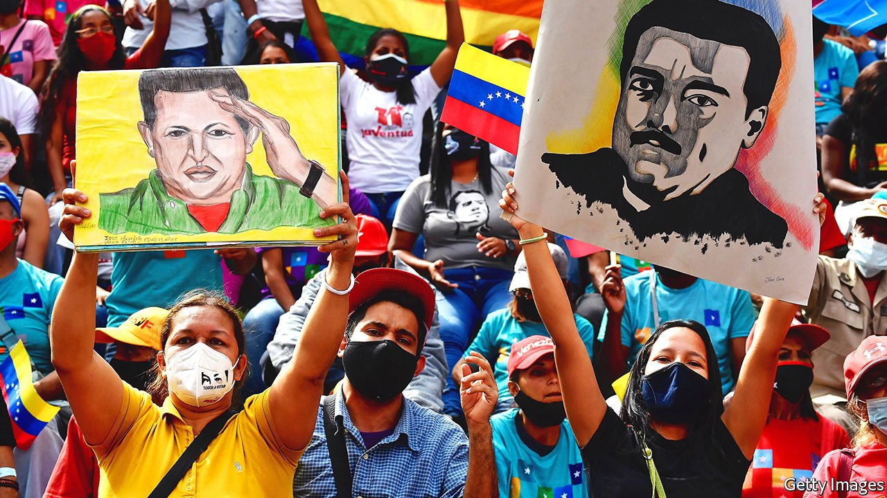

###### Machiavellian manoeuvres

# Nicolás Maduro’s regime and the Venezuelan opposition meet in Mexico 

##### The autocrat wants America to lift sanctions 

 

> Sep 4th 2021 

THE DARKENED rooms of Mexico’s Museum of Anthropology contain countless relics of civilisations that rose and fell long ago. So it was an eerily suitable setting for the latest round of talks designed to move Venezuela beyond its current, wretched era. With a Norwegian mediator and Mexico’s foreign minister looking on, representatives of Nicolás Maduro’s dictatorial regime and the opposition signed a memorandum of understanding on August 13th, laying out a framework for further talks. The stated goal is to hold fair elections in return for the lifting of international sanctions.

The new negotiations were due to begin on September 3rd (after The Economist went to press). They may go on for months or even years. In Venezuela many people are sceptical. “It’s the same ‘blah blah’ we’ve heard before,” says Nordelys, a teacher in the city of Maracay. It will be the fifth time the government and the opposition have held formal negotiations since Mr Maduro took over from the late Hugo Chávez in 2013. Previous efforts have come to naught. Instead Mr Maduro has consolidated his authoritarian rule, and further impoverished his country. Since 2013 GDP has shrunk by over 75%.


Those behind the negotiations insist that this time is different. “A lot of hard work—on many fronts—has gone on to get us this far,” says a European diplomat in Caracas. Unlike previous talks in Barbados in 2019 and the Dominican Republic in 2017, which were low-key affairs, the meetings in Mexico have international backers. Russia, which has close ties with the Venezuelan military, will attend as one of a “group of friends” of the regime. The Netherlands will assist the opposition.

Optimists note that Donald Trump is no longer in the White House. His policy towards Venezuela was one of “maximum pressure”. That meant ramping up sanctions and vaguely threatening military action. His administration was also instrumental in forming an international coalition of almost 60 nations which recognised Juan Guaidó, an opposition leader, as Venezuela’s legitimate president, on the basis that Mr Maduro had stolen elections in 2018 and was ruling as a dictator. The ambition then was to topple Mr Maduro, not to talk to him.

That policy failed. Although Mr Maduro is supported by only 16% of Venezuelans, according to Datanalisis, a pollster in Caracas, he has all the guns and is prepared to use them. The opposition are exhausted, hungry and scared. Mr Guaidó, who in 2019 was able to bring a million supporters out onto the streets, is no longer a threat. The number of countries that still refer to him as president has dwindled to eight. The army remains solidly behind Mr Maduro, not least because he gives officers golden opportunities to enrich themselves. Nearly 6m people—a fifth of Venezuelans—have emigrated in despair.

That raises the question of why Mr Maduro would bother to send a delegation of negotiators to Mexico. The most basic motive is Machiavellian: a desire to divide his enemies and end the declared “interim presidency” of Mr Guaidó. Perhaps it is no accident that the lead negotiator on the regime side is Jorge Rodríguez, a former vice-president and a trained psychiatrist. Some suggest Mr Rodríguez enjoys playing mind games with an opposition which, for months, agonised over whether it should take part in the talks.

Mr Guaidó and Leopoldo López, an exiled politician who is his mentor, were especially wary. Both have previously argued that Mr Maduro, whom they call a “usurper”, should stand down before serious negotiations about the future of Venezuela can begin. Other members of the opposition, notably Henrique Capriles, a former presidential candidate, have taken a more nuanced stance, arguing that engagement, including participation in far-from-perfect elections, should continue, to avoid becoming politically irrelevant. Mr Guaidó finally agreed to be part of the talks in May. That decision was influenced by the conclusion of President Joe Biden’s administration that there is no quick fix to Venezuela’s disaster. “It’s been an enjoyable spectator sport for us,” admitted a regime ally, referring to the opposition’s dithering.

But beyond taunting a weakened opposition, Mr Maduro also has plenty to gain from successful talks. The main advantage would be at least a partial lifting of sanctions, which have been progressively stacked up against his regime since 2015. Those imposed by the United States target the oil industry, access to capital markets, and on an individual level almost all of the regime’s top brass. The economy has little hope of recovery so long as the sanctions remain in place.

The Biden administration has said it is prepared to offer some relief. It will do so once Mr Maduro’s regime, which has spent the past eight years hijacking all democratic institutions, shows it has changed its ways. The first test of that will come on November 21st, when regional elections are scheduled to choose the country’s 23 governors and 335 mayors.

Most of the opposition stopped participating in elections after those in 2017, in protest at rampant rigging. However on August 31st Unity Platform, an umbrella group of all the main opposition parties, declared it would take part in the vote, while also conceding that the process would probably not be “fair or conventional”. The decision appears to be a show of goodwill towards the talks.

Similarly, earlier that day Freddy Guevara, a prominent politician in Mr Guaidó’s party, unexpectedly called for an end to the combative strategy against Mr Maduro’s regime. “For years, one of the sides has felt strong and has believed it could smash or completely displace the other,” he said. “This dynamic, this vicious circle, has to stop. We need a process of coexistence.” Days earlier he had been released from prison, after being arbitrarily arrested by state security forces in Caracas in July. He may now form part of the opposition’s negotiation team.

Few ordinary Venezuelans expect the Mexico talks to achieve much. But the participants seem strangely confident that change is possible.■

