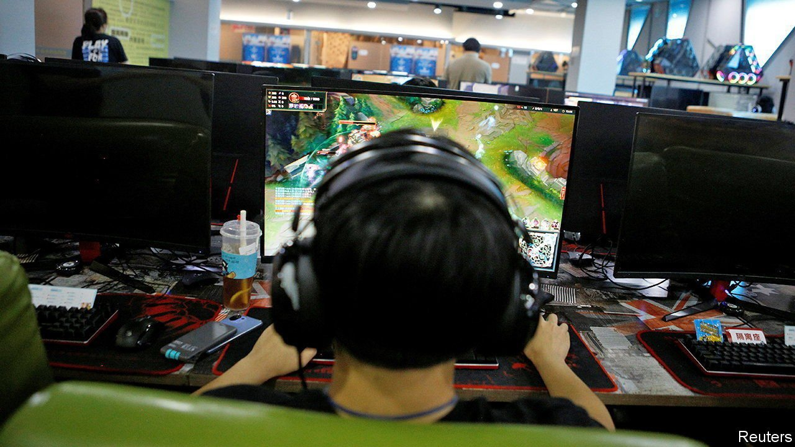
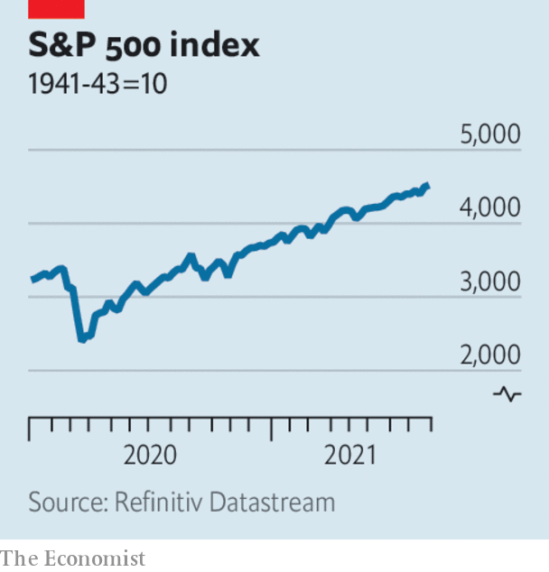

###### 

# Business this week 

#####  

 

> Sep 4th 2021 

The Chinese government published an edict limiting children’s playing of video games to just one hour on only Fridays, Saturdays and Sundays. It is the authorities’ latest attempt to rein in what they view as the troublesome power of tech companies, though the government has long expressed . Unlike previous decrees this one probably won’t hurt profits. Tencent, the biggest gaming company, generates only 2.6% of its total player spend from under-16s.

Working for the people


Wang Xing became the latest tech boss in China to adopt the government’s line that the industry must do more to promote “common prosperity”. The chief executive of Meituan said that the shopping platform would “conduct in-depth self reviews and actively rectify any issues” with new requirements. In May Mr Wang ran into trouble when lines he posted from an ancient poem on social media were seen as an attack on Xi Jinping, China’s president.

As China’s government clamped down on its digital companies, India’s tech industry chalked up another big deal, with the acquisition of BillDesk by Prosus for $4.7bn. Founded in 2000, BillDesk is India’s oldest online-payments platform. Prosus, the investment arm of Naspers, a South African internet group, wants to combine BillDesk with its PayU fintech business, creating one of the world’s biggest payment systems.

Tech regulators in various countries pondered the ramifications of the passage of a bill in South Korea that curtails the power of app-store providers such as Apple and Google, by . The legislation also stops the inappropriate removal of apps from online stores. The head of Epic Games, which is fighting Apple’s and Google’s stranglehold on the market, described the bill as a milestone in personal computing.

In San Jose the trial got under way of Elizabeth Holmes for , which she founded. The startup was a darling of Silicon Valley until 2015, when investigative journalists found that the revolutionary technology it used for blood testing didn’t work. Ms Holmes has pleaded not guilty to defrauding investors.

The share price of Just Eat Takeaway recovered from the drubbing it received when New York City’s council extended a cap on the amount that food-delivery apps can charge restaurants to use their services. Just Eat owns Grubhub, which has a 35% share of the market in the Big Apple. Many American cities imposed temporary caps on food-delivery charges at the start of the pandemic, as lockdowned diners got an appetite for the service, but some now want to make the caps permanent.

 reported $1bn in quarterly revenue for the first time. Net profit rose sharply, to $317m. But its share price plunged amid concerns about growth prospects for the video-conference company as more workers return to the office. Zoom is taking steps to diversify by moving into the virtual customer-contact business.

Breaking records

 


The S&amp;P 500 notched up its seventh consecutive month of gains in August. The American stockmarket index has risen by a fifth since the start of the year and more than doubled since the outbreak of covid-19 in March 2020, as investors shrug off concerns about inflation, labour shortages and supply-chain issues. In Europe the STOXX 600 also recorded its seventh straight month of gains, its best run since 2013.

The euro zone’s annual rate of inflation jumped to 3% in August, from 2.2% in July. In Germany inflation hit 3.9%, according to the country’s statistics office, the highest since December 1993. Like its counterparts in America, Britain and elsewhere, the European Central Bank thinks the pressure on prices from the reopening of economies will ease next year.

Brazil’s GDP contracted by 0.1% in the second quarter compared with the first. The decline was unexpected, even though the country underwent another wave of covid-19.

A judge approved a bankruptcy plan that breaks up Purdue Pharma, the maker of OxyContin. The plan largely protects the drug company’s controlling Sackler family from liability claims related to the painkiller’s role in America’s opioid crisis.

, an electric-vehicle startup that is backed by Amazon and specialises in vans, filed for an IPO.

Ryanair’s business is rebounding strongly, according to Michael O’Leary, its ebullient chief executive. Europe’s biggest airline expects its flight capacity to be almost back to normal this October. It is busily expanding its fleet to 600 aircraft, up from 450, over the next few years.

