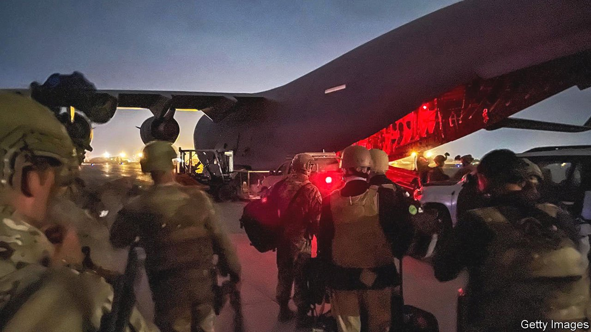
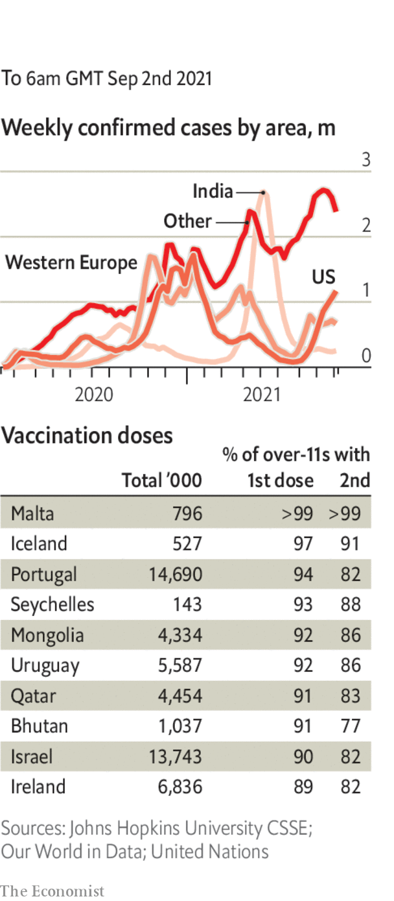

###### 

# Politics this week 

#####  

 

> Sep 2nd 2021 

, bringing an end to their 20-year mission. Taliban fighters celebrated, donning American uniforms and taking selfies with abandoned military equipment. The death toll from a suicide-bombing at Kabul airport passed 170. An American drone strike killed suicide-bombers preparing for another attack; the Taliban said ten civilians also died. Joe Biden described the evacuation as an “extraordinary success”, despite the many Afghans who helped America and have been left behind to face Taliban reprisals.

Hurricane Ida struck Louisiana, leaving 1m people without power. Its remnants brought flooding to New York, shutting down the city’s subway system. Residents were told not to use their cars.


America’s Supreme Court refused to stop  coming into force that in effect bans abortion after the sixth week of pregnancy. It is the strictest such law to be implemented anywhere in the United States since 1973. Unusually, it allows private individuals to sue anyone who helps anyone else get an abortion. The court said the law raised “serious” constitutional questions, and suggested that the plaintiffs pursue those through state courts.

Also in Texas the state legislature passed a bill on election procedures that critics say is intended to deter black people and Hispanics from voting. Democratic lawmakers had delayed the bill by fleeing the state, denying the Republicans a quorum, but some of them returned to work recently.

, was poised on a knife-edge. Polls suggested stronger-than-expected support for the Social Democrats, whose candidate for chancellor, Olaf Scholz, performed well in the first of three televised debates with the candidates of the other two main parties: Annalena Baerbock for the Greens and Armin Laschet for the Christian Democrats, the party of Angela Merkel. Mr Laschet could be leading the party towards one of its worst-ever results.

Scientists in South Africa identified a new variant of covid-19 that seems to have mutated more rapidly than existing variants and spread to seven other countries in Africa, Europe and Asia. The variant appears to have changes associated with increased transmission and greater resistance to antibodies, but it is not clear whether it spreads more rapidly or evades the immune response generated by vaccines.

America’s aid agency said that Tigrayan forces looted its warehouses in Ethiopia’s Amhara region, hampering the distribution of food and medicine. Almost a million Tigrayans are in urgent need of assistance, after their region was blockaded by the federal government in November.

Freeman Mbowe, the leader of Tanzania’s main opposition party, appeared in court on charges of terrorism. His supporters say the charges are trumped up and that he has been tortured in custody.

In the first official  in seven years, Benny Gantz, Israel’s defence minister, met Mahmoud Abbas, the Palestinian president. They discussed security and economic issues.

The main  said they would participate in regional elections in November. This is the first time since 2017 that they will take part in elections, though the Unity Platform, an umbrella opposition group, said the ballot would not be fair. The about-turn happened just before talks were due to start in Mexico City between representatives from both the autocratic socialist regime of Nicolás Maduro, the president, and the opposition.

El Salvador’s parliament, which is controlled by President Nayib Bukele, approved a law requiring judges over 60 or with more than 30 years of service to retire. Mr Bukele will probably replace them with loyalists, as he did after legislators in May dismissed five supreme court judges and the attorney-general.

America’s intelligence agencies released a report on the origins of covid-19. It said they had been unable to determine how the pandemic began, but a “laboratory-associated incident” in the Chinese city of Wuhan was a possible cause. China called the findings “anti-science”.

, said the government should “guide” companies to obey the Communist Party. The party’s discipline agency praised new “heavy-fisted” measures to curb celebrities’ “chaotic” fan clubs. Broadcasters were later told to foster a “patriotic atmosphere” and bar effeminate actors from programmes.

South Korea’s government proposed a budget in which it plans to spend a record 604trn won ($520bn). Most of that will go on welfare programmes to help reduce inequality, as well as job creation. The debt-to-GDP ratio will subsequently hit 50.2%, also a record.

Japan recalled 1.6m doses of the Moderna vaccine after finding stainless-steel particles in vials made in Spain. The drugmaker said that the particles were not “an undue risk” to patient safety. Two people died after receiving the Moderna jab, though the deaths are thought to be unrelated.

Coronavirus briefs

 


The director of the WHO in Europe said that booster jabs were not a luxury and would protect vulnerable people. The comments came amid worries about a slowdown in vaccinations across the EU. They are also somewhat at odds with the WHO’s position that boosters in rich countries may lead to vaccine shortages in poor ones.

Israel reported a record number of daily infections. The country has rolled out a programme of booster jabs. The rate of severe illness from covid-19 is much higher among the unvaccinated than among the vaccinated.

Britain’s health service was told to get ready for vaccinating 12- to 15- year olds, pending official advice on whether it is safe to do so.

The EU removed America from a list of safe countries for travel and recommended that member states reimpose passenger restrictions.

