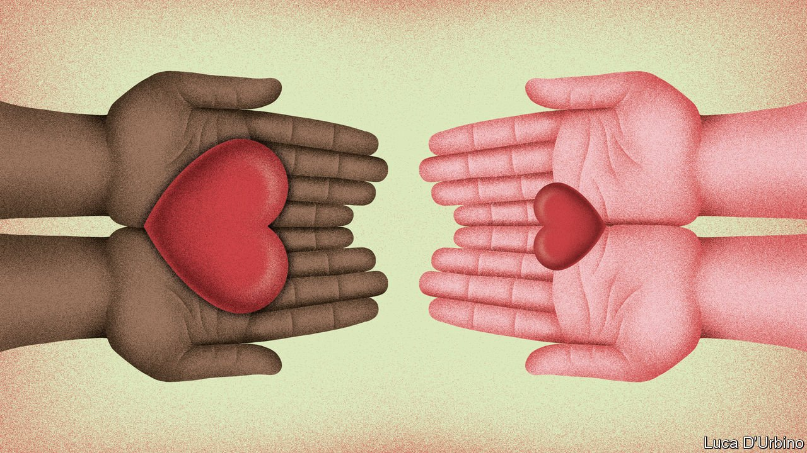

###### The woking class

# American philanthropy turns left 

##### An over-narrow focus on equity is leading grant-makers astray 

 

> Sep 4th 2021 

CHARITABLE GIVING was expected to be walloped by the pandemic. The opposite happened. Fidelity Charitable, America’s largest administrator of grants on behalf of donors, handed out $9.1bn last year, up from $7.3bn in 2019. A study in 2020 of more than 250 American foundations showed that a majority were increasing grants for the year, by an average of 17%.

Amid this welcome rise, philanthropy is veering left. In July the MacArthur Foundation said that it would give $80m to “combat anti-Blackness, uplift Indigenous Peoples” and otherwise advance “ethnic justice”, including through reparations. In April the Ford Foundation announced $1bn in funding for social justice. The month before Goldman Sachs, a bank, trumpeted $100m in grants to curb bias against black women. The Mellon Foundation, traditionally a big arts and humanities supporter, announced last year a “major strategic evolution” to prioritise social justice. PolicyLink, an Oakland think-tank, tallies $1.5bn in grants awarded for racial equity in America last year: nearly half the total for the previous nine years.


Covid-19 has had a hand in this. Reports of higher mortality among black Americans have shocked many. Purse-strings have also been loosened by loud protests against killings of African-Americans—“I’ve doubled down after George Floyd’s murder,” says Don Howard, president of California’s James Irvine Foundation. The grant-maker is pulling an additional $20m out of its endowment to serve black Americans and is now “an anti-racist organisation”, says Mr Howard. The surge in giving is also due, progressive grant-makers quietly say, to Donald Trump’s time in the limelight.

Amid these heady times for liberal philanthropists, many are reaching higher. Racial equity is a big goal. This is commonly defined not as equal opportunity, but rather as equal outcomes. One outfit pushing for racial equity is Northern California Grantmakers, a San Francisco non-profit advising organisations that award $5bn in grants annually. Its CEO, Dwayne Marsh, says “equal access and equal resources” won’t be enough. This view has led many grant-makers, including the Ford and MacArthur foundations, to prefer where possible grant-seekers who are black or brown.

To make this easier, lists of fund-seeking bodies led by people of colour have been drawn up by charities like the San Francisco Foundation and Give Blck. The latter, based in Seattle, drops organisations that hire too many whites, says Christina Lewis, its co-founder, though some exceptions are made for groups that serve black Americans. Give Blck has received funding from Microsoft and the Ford Foundation.

The policy of favouring non-white grant-seekers became “much more explicit” following Mr Trump’s rise, says Richard Tate of the California Wellness Foundation’s Oakland office. Having white skin does not disqualify applicants, but colour plays a role in all decisions, says Mr Tate, who adds that this approach dovetails “with my identity as a biracial gay”. The foundation hands out $45m annually in grants for everything from parks to scholarships to medical school.

Giving in

Some outfits are more blunt. One is the Miami Foundation, which is partly funded by Facebook. Its strategy adviser, Charisse Grant, says applicants of colour are generally better at serving poor communities. If you choose whites, she says, “you’re not necessarily getting the best.” She sees growing political support for this view. The Philanthropic Initiative for Racial Equity, a publisher of grant-making guides based in Washington, DC, writes that mostly-white organisations should be subject to “far more rigorous” vetting than usual.

Such practices have boomed in the past two years. Most big foundations now require detailed reporting on ethnicity, says Debi Ghate of the Philanthropy Roundtable, a non-profit organisation in Washington, DC. She argues that the newfound focus on group identity can divert attention away from scrutinising the charity’s performance. Asking if diversity is always visible (as opposed to things that cannot be seen, like sexuality or religious orientation), she adds, is now “outside the guardrails…you will be called a racist.” The Philanthropy Roundtable, she says, is regularly contacted by charity professionals who say they lost their jobs “because I don’t fit the checklist”.

Despite such criticism, the tide is not turning. The California Wellness Foundation intends to reduce the proportion of whites who invest in its $1bn endowment. As for fundraising, more organisations say they now pay less attention to potential donors’ net worth, focusing instead on their race and gender. Ms Grant of the Miami Foundation calls this “democratising philanthropy”. Edgar Villanueva of the Decolonising Wealth Project, a New York grant-maker, says the extra selectivity also curbs “reputational laundering” by undesirable would-be donors with an eye on philanthropy’s “very selfish benefits”.

Other ambitious goals are cropping up. One relies on a creative argument promoted by Joanne Barkan, an editor of Dissent, a New York magazine. Charitable donations can reduce tax bills. Since this diverts money from public coffers, it’s “almost obscene”, she says, that grants are awarded without some state control. Ms Barkan seeks legally mandated racial and gender quotas for foundation boards.

A different approach to constraining charitable giving is making more headway. By one count, at least 16 states this year alone have mulled limiting donor anonymity (under guises including combating fraud). Such laws would encourage shaming on Twitter. However, activists should note that limiting anonymity will also cut donations to progressive outfits like the San Francisco Foundation, says Fred Blackwell, its CEO. Many people want to give without alerting the world’s fund-raisers, not to mention their adult heirs.

Where is this heading? Naomi Schaefer Riley, a philanthropy expert at the American Enterprise Institute, a conservative think-tank, reckons nowhere good. Ms Ghate gives the example of a charity doing work with ex-prisoners. Though the white woman running the charity, who had herself been to prison, was producing results, the charity’s funder shifted funding to other organisations led by people of colour. “This is no longer about the community: it’s a new issue of what the leadership looks like,” she says.■

