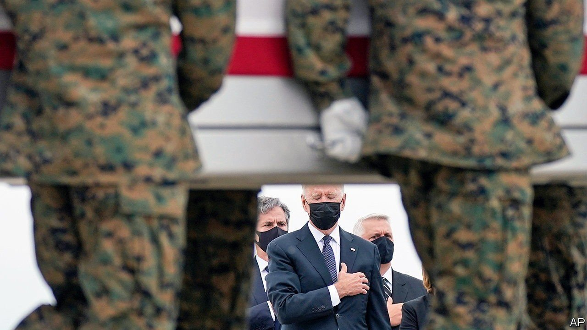
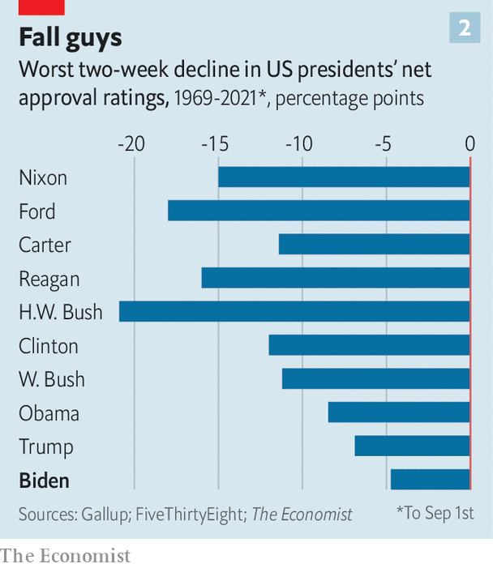

###### Fallout from the flight

# How damaging has the Afghanistan withdrawal been to Joe Biden? 

##### The decline in his approval ratings over two weeks has been worse than 94% of fortnights going back to Nixon’s inauguration 

 

> Sep 2nd 2021 

THE BEGINNING of September marked the end of America’s 20-year campaign in Afghanistan. It also marked the end of President Joe Biden’s worst month in office. The electorate’s mood had soured on the intervention a long time ago: ending the “forever wars” was a campaign promise both of Mr Biden and of Donald Trump. Even so, many Americans were appalled once the immediate consequences of withdrawal became visible. They included the swift collapse of the Afghan government, the scenes of human tragedy during the evacuation at Kabul airport and the Islamic State Khorasan Province (ISKP) suicide-bombing soon afterwards that killed at least 180 people, including 13 American soldiers. As for Mr Biden, he would like to turn to the next chapter of his presidency. It will not be so simple.

In a speech to mark the day, Mr Biden was by turns angry, defiant and unrepentant. He began by lauding the evacuation effort as an “extraordinary success”. “No nation has ever done anything like it in all of history,” he boasted. To critics who argued the extraction could have been better handled, the president said: “I respectfully disagree.” Those who insisted that a low-grade deployment of American soldiers could have remained did not understand that there was no such thing as low-grade war, he countered.


“I made a commitment to the American people that I would end this war,” he said proudly. His speech was steeped in realpolitik, almost Nixonian. Mr Biden argued that America had in essence squandered $2trn in a country that had long ceased to present any clear national-security interest, and in the process had spoiled its own ability to deal with contemporary challenges from China and Russia.

Ending the war in Vietnam did not do much for the presidency of Gerald Ford. Things are not that bad for Mr Biden, but his presidency has taken a blow. On August 1st he had a net approval rating of , according to an average computed by FiveThirtyEight, a data-journalism outfit. By the end of the month, Mr Biden was slightly underwater at -0.6 points. Part of this may be due to what political scientists call “differential partisan non-response”—the tendency for partisan supporters to avoid pollsters when their man is having a bad week, or a bad month. Most presidents face a gradual drop in approval after the honeymoon period of the inauguration, and Mr Biden was no exception. Still, an abrupt slide of 8.7 percentage points cannot be shrugged off. For comparison, after the attack on the Capitol on January 6th, Mr Trump suffered a ratings slide of nine points, albeit from a lower base.

 


Our polling shows a smaller decline (see chart 1). Between August 16th and August 30th, the two weeks after Kabul fell to the Taliban, Mr Biden’s net approval rating among American adults fell by five percentage points in The Economist‘s average of polls—still a worse decline than in 92% of previous fortnights going back to Richard Nixon’s inauguration in 1969. But the drop, though steep, did not beat other records. George H.W. Bush’s net approval sank by 21 points in mid-January 1992 as economic issues dogged him and the end of the Gulf war brought an end to his inflated ratings. Nixon’s numbers fell by 15 points in the spring of 1973 as the depth of his role in the Watergate scandal became apparent (see chart 2). Yet this should offer little comfort to the president; these echoes of history are not enviable ones.

 


Despite Mr Biden’s defiance, Americans are blaming him for the mishandling of Afghanistan. Polling from YouGov (taken before the ISKP attack at the Kabul airport) shows that just 33% of Americans approve of how the president has dealt with Afghanistan. Only 16% of Americans (and, remarkably, just 28% of Democrats) say that the evacuation has been handled well. Such is the pall cast by the chaos, that even the public’s firm anti-interventionism looks shaken. At the start of July, an overwhelming majority of Americans, , supported the planned withdrawal of all troops by September 11th 2021. Now they are evenly divided on whether leaving was a mistake.

Public opinion is shaped by elites, and Mr Biden has taken sustained criticism from all quarters. That from Republicans was expected, even if it was inconsistent with their approval for the agreement struck by the Trump administration with the Taliban. Having previously  Mr Biden for not adhering to Mr Trump’s earlier deadline of complete withdrawal by May 1st, Josh Hawley, an ambitious Republican senator, has now called on Mr Biden to resign. But Democrats in Congress have also condemned the administration’s planning as riven with “”. Their committees intend to investigate the debacle. Mainstream news outlets, which Democrats still trust, have turned against Mr Biden in a way that the conservative media never did against Mr Trump.

If Mr Biden is at the nadir of the Afghan affair, his presidency is salvageable. Slides in approval ratings can be reversed. Americans have relatively little interest in foreign affairs. Even now, they rank national security as only the seventh-most-important issue for the country. The next opportunity for voters to punish Mr Biden will be in the mid-term elections held in November 2022—an aeon away in American politics. Even if his foreign-policy judgment looks much more questionable now, American voters have not decided an election principally on that issue since 2004.

But the Afghan debacle could still linger. Republicans are split over whether to criticise Mr Biden for leaving allies behind or allowing floods of Afghan refugees into America (though, like all refugees entering America, they will be thoroughly vetted). Scenes of women being abused or forced into burqas could also prove politically damaging, as could stories about the killing of Afghans who helped Americans but were unable to leave. The White House  that fewer than 200 Americans who wish to leave remain in the country (for all the criticism of the evacuation, America and its allies got 120,000 people out of Afghanistan after the government collapsed). If any of them were to be harmed, especially by ISKP, that would trigger another harsh round of criticism.

September is supposed to be a different sort of month for the White House. Mr Biden’s proposal to “build back better” after the covid-19 pandemic by spending $4trn on infrastructure and a much-expanded safety-net will be thrashed out in Congress. The slide in the president’s approval ratings will probably not alter the calculus of Democrats in Congress on the wisdom of a spending spree now. Since 1935, only two incumbent presidents have improved their party’s congressional margins in mid-term elections. Unified government is a rare gift in Washington. Democrats are unlikely to let it go to waste. ■

An early version of this article was published online on August 31st 2021

