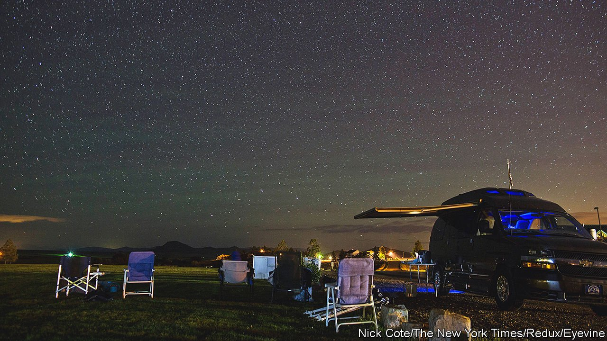

###### Star power

# Rural Colorado hopes to cash in on its dark skies 

##### Campaigns to lessen light pollution reveal how the West is changing 

 

> Sep 4th 2021 

IT IS CALLED Colorado’s last boom town. Ten thousand people stampeded into Creede in the late 1800s in search of the silver hidden within the San Juan Mountains. The town was the epitome of the Wild West, a hangout for outlaws and conmen. But more than the shoot-outs and gamblers, it was the mines that made Creede. For nearly 100 years its prosperity was tied to the price of silver. The town’s last mine closed in 1985 and only about 300 people remain. Ghost towns and the creaky remnants of old mining camps litter the mountains. Now environmentalists and residents are looking to another sparkly resource to revive the economy: the stars.

Headwaters Alliance, a local non-profit organisation, wants to create a “dark-sky reserve” in aptly named Mineral County, which includes Creede. The campaign is not unique to southern Colorado. Dark-sky communities are cropping up around the American West. The International Dark-Sky Association (IDA), based in Tucson, wants towns to curb their light pollution, which harms nocturnal wildlife and obscures the stars. The IDA has certified more than 130 dark-sky places globally since 2001; 14 of them are in Colorado.


Creede may have an easier time dimming the lights than other towns. Around 95% of Mineral County is public land. The Rio Grande National Forest and the jagged cliffs of the San Juans envelop visitors in darkness. Alex Handloff, who is leading the effort to create the reserve, has equipped volunteer “Astro-rangers” with meters to measure the light emitted in different parts of the county.

In addition to the environmental benefits of darkness, Creede residents hope their pristine night skies will draw more tourists to help prop up the town’s post-mining economy. Campers and hikers visit in the summer, but the rest of the year is lonelier, says Jan Crawford, one of the first supporters of the reserve. “There is a joke”, Ms Crawford offers, that “there’s a $50 bill that floats around Creede and just goes from one place to another all winter long.” But floods of people are not wanted either. Mineral County’s population has grown by 22% in the past decade, though locals suggest that is due, in part, to better people-counting. As more Americans move West, small towns are puzzling over how to encourage economic growth without sacrificing their rural charms. Focusing on dark skies, Mr Handloff suggests, is the kind of “low-impact” tourism that might strike the right balance.

Some residents are still wary. Many small-town Coloradans share a libertarian aversion to being told what to do—even with something as small as the kind of porch light they install. More than anything else, though, preserving the night sky means getting comfortable with near-total blackness. “There’s wonders out there,” says Ms Crawford, “so don't be afraid of the dark.”

