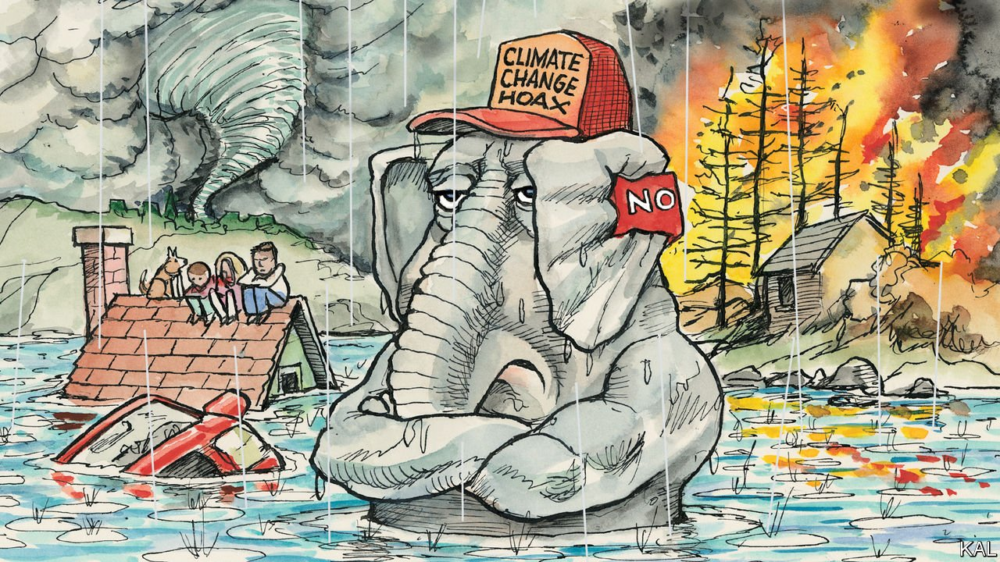

###### Lexington

# Storms and fires will not bring an escape from America’s stuck climate politics 

##### But look hard enough and an exit is visible 

 

> Sep 4th 2021 

READING HIS local newspaper last month, Bruce, a 70-year-old retired executive, could take it no longer. “Almost every article” on Nola.com—website of the Times-Picayune, New Orleans’s paper of record since 1837—had “an element of Wokeism”, he wrote in an email cancelling his subscription. Among those elements, he objected especially to references to climate change, an issue that he considered “had not been empirically established”.

“Case in point: It’s August 23rd and there is no tropical activity presently being monitored in the Atlantic or the Caribbean,” he wrote. “But just a couple of weeks ago Nola.com advised that we should be ready for a higher-than-normal level of tropical activity this season—due to Climate Change.” As Bruce was desperately manning the defences of his home this week against the severe flooding wrought by one of the fiercest tropical storms on record to hit Louisiana, your columnist got in touch to ask whether he had revised his sceptical view.


Not a bit. Louisiana had had bigger hurricanes than Ida, he said. His house on the Bogue Falaya River was flooded in 2016. And though he didn’t claim to understand storms, Bruce (who asked for his surname to be withheld because he feared retribution from the federal flood-insurance agency) felt scientists didn’t either. He did not deny climate change was happening. But he believed it was “on a longer cycle” than that described by scientists and journalists, whom he accused of trying to “divide people”.

It was once hoped that as Americans started to experience global warming’s devastating effects they would become more accepting of climate science. But as Bruce and millions like him illustrate, this is not happening. After four years of warming-related tempests in the south-east and infernos out west, public opinion has hardly budged. Six in ten Americans think global warming is anthropogenic and already manifest, and want drastic cuts in fossil-fuel use. The rest, a group that represents a majority of Republican voters, say the opposite, come fire or high water.

This capacity for motivated reasoning is losing its power to amaze. Every day brings reports of Trump voters denouncing covid-19 vaccines on their covid-19 deathbeds. By comparison, the complacency the same voters show towards the impacts of warming is almost rational. Bruce believes in hurricanes. He just doesn’t believe climate change is making them more frequent or fiercer; so why should a bad storm, or several, make him think differently? Especially—as covid-19 also shows—because people normalise extreme circumstances. In a seminal study of white conservatives in coastal Louisiana, the sociologist Arlie Russell Hochschild asked how they reconciled their loathing of environmental regulation with living in one of the most polluted areas of the country. Part of the explanation was that they grew used to the pollution. Unlike the maligned frog, which will try to flee a dangerously high temperature however gradually it has been raised, humans are liable to wallow and boil.

Another part of the answer is short-term self-interest. Many coastal Louisianans (including formerly Bruce) owe their living to carbon-intensive industries. Evidence from Australia suggests this is an obstacle to climate realism everywhere. Yet America is the world’s leader on climate-change scepticism for additional political and cultural reasons that will be hard to unwind.

Most obvious is how systematically one of the two governing parties has misled its voters on the issue. Until the mid-1990s, Republicans and Democrats worried about climate change equally. Voters on the right were then persuaded to quit worrying by a well-documented misinformation campaign, paid for by industrialists and executed by conservative think-tanks, politicians and media. The parties diverged so sharply on the issue that their respective positions—accepting climate science or rubbishing it—became a mark of political identity. That made them even more entrenched.

There have always been Republicans arguing against the misinformation, including John McCain and in recent years lesser figures, such as the members of the newly formed Conservative Climate Caucus. Yet the sceptics hold sway because of how strongly their message is aligned with the party’s other main currents.

One is a pessimistic strain of evangelical Christianity. On global warming, as on covid-19, white evangelicals are especially anti-science and ready to rationalise the negative fallout of their views as God’s will for a fallen world. Another is mistrust of expertise, cemented by decades of misinformation. Both factors propelled Donald Trump—the most anti-science Republican leader ever. And it is unclear that even he could now redirect his followers on climate change. When he recommended they get vaccinated against covid-19 at a rally last month, Mr Trump was booed.

Shelter from the storm

Yet despite these depressing fundamentals, the situation is not hopeless. The falling cost of renewable energy, and its deployment across Republican states, has created surprisingly broad support for decarbonisation even among those who claim to see no need for it. A recent poll found that Joe Biden’s plan for a zero-carbon electricity grid by 2035 is backed by a majority of voters in every state and all but six congressional districts. The proposed means to pay for that shift—borrowing trillions from the future—also has something approaching bipartisan support among voters. To launch the transition, via the sweeping budget bill the Democrats are now preparing, all that is needed is unanimity among their own senators. And the natural disasters that are now buffeting both coasts have probably made that more likely.

It may be little consolation to the million Louisianans without electricity in 90-degree heat, but storms always bring, as well as destruction, a hope of refuge. Ida is no exception. The front door may be barred; but America is inching towards a possible escape from its dysfunctional climate politics round the back.■

