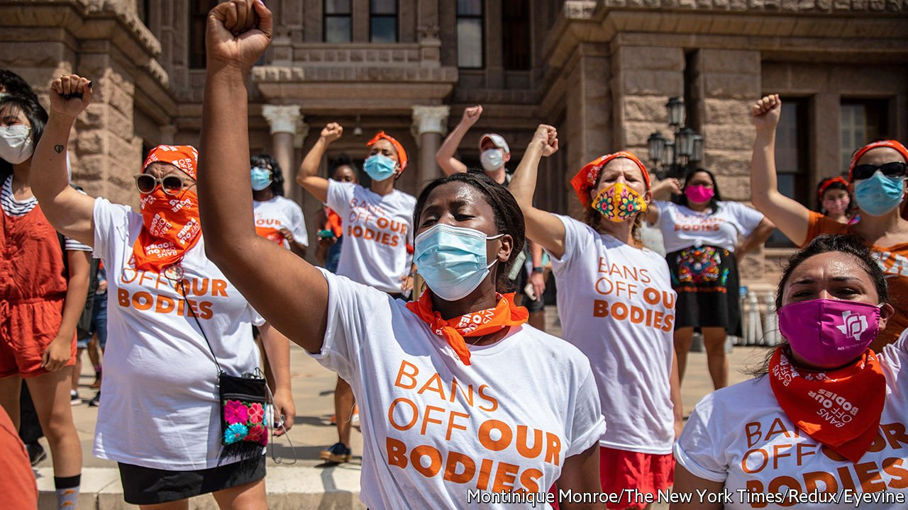

###### Roe on the ropes

# The Supreme Court green-lights a near-total abortion ban in Texas 

##### Senate Bill 8 provides bounties for people to sue anyone who plays even a bit part in aiding an abortion 

 

> Sep 4th 2021 

AT TWO MINUTES to midnight on September 1st, when the Supreme Court quietly let Senate Bill 8 go into effect, Texas became the most inhospitable state for a woman seeking an abortion. Challengers may still press their case. But in the meantime Senate Bill 8 prohibits abortion when a fetal heartbeat begins, at about six weeks’ gestation, and makes no exception for women who were impregnated via incest or rape. The law’s great peculiarity, though, is its enforcement mechanism, which is outsourced to anyone who espies someone “aiding or abetting” an abortion.

Health-care providers, Uber drivers, clergy, family members, friends—anyone who plays even a bit part in facilitating an abortion is subject to a $10,000 fine that becomes a bounty for the accuser and may close the offending clinic. A whistleblower website invites anonymous tips to nab those who are complicit in helping a woman terminate her pregnancy.


This dystopian enterprise has a practical purpose: deflecting legal challenges. If the state is not enforcing the law, defendants are harder to pinpoint. When Planned Parenthood and a coalition of abortion providers and pastors sued in July, they targeted one Mark Lee Dickson, an anti-abortion activist who had threatened to sue under the law, as well as a state judge and a county clerk who would be integral to enforcing the scheme. The legal strategy was novel by necessity.

Before the theory could be tested in district court, a circuit court abruptly cancelled the hearing. This spurred the ill-fated last-ditch plea to the Supreme Court to block the law before it took effect. The lawsuit may raise “serious questions regarding the constitutionality of the Texas law”—as it bans abortion three months earlier than Roe v Wade permits—wrote the majority. But since the state of Texas had argued that neither it nor its employees had the power to enforce the law, the justices declined to step in.

Chief Justice Roberts who, unusually, joined the minority, identified the catch-22 in this reasoning. The “statutory scheme before the Court is not only unusual”, he wrote, “but unprecedented”. As it seems specifically designed to “insulate the state from responsibility”, it would be better to freeze the law and subject it to “at least preliminary judicial consideration” before imposing it on Texas’s 7m women of reproductive age. Some scrutiny is important, he added, since the law may serve “as a model for action in other areas.”

The three liberal justices each penned dissents, too. For Justice Stephen Breyer, casually blessing the law will bring “imminent and serious harm”—indeed on the first day it came into force 50 of 55 women seeking care at a clinic in Fort Worth were turned away. Justice Sonia Sotomayor accused her five conservative colleagues—including the three appointed by Donald Trump—of a “breathtaking” act that rewards cynical lawmaking and undermines nearly half a century of abortion-rights rulings. Justice Elena Kagan added that the order came hastily and with a bare-bones explanation emblematic of recent shadow-docket rulings that are “unreasoned, inconsistent and impossible to defend”.

Senate Bill 8 may eventually run up against judicial resistance, but its impact could inspire other Republican states to take up similar measures. Roe itself is on the line next spring when the justices decide on the constitutionality of a 15-week ban in Mississippi. The court’s dismissiveness in the Texas case does not bode well for the survival of the 1973 precedent.■


