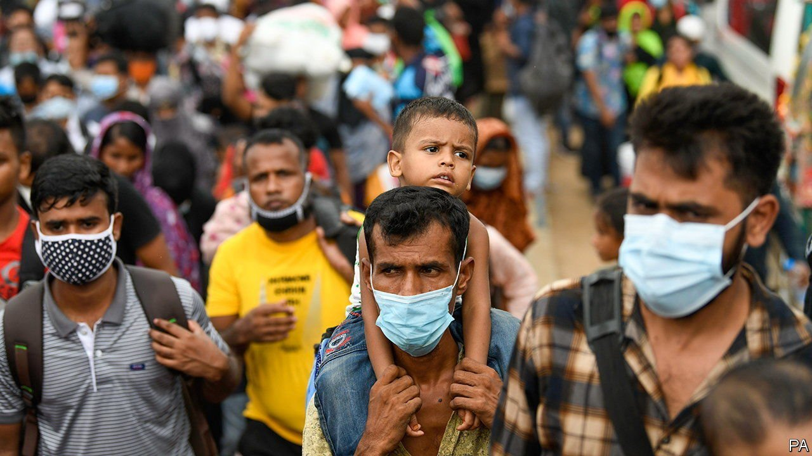

###### Face: the facts

# A big study in Bangladesh finds simple ways to encourage mask use 

##### Symptomatic infections of covid-19 went down as the use of masks went up 

 

> Sep 11th 2021 

IN DHAKA, BANGLADESH’S teeming capital of 18m, face masks are everywhere. They can be seen under the chins of street hawkers, poking out from the pockets of rickshaw-pullers and dangling on the wrists of factory workers. A rarer sight is a mask covering both mouth and nose.

The usual methods for curbing the spread of covid-19 are less effective in South Asia, home to about 1.8bn people. Lockdowns work but devastate families and businesses. The region’s governments cannot afford to pay people to sit at home. Vaccination efforts suffer from supply and distribution problems; less than 15% of over-11s are fully jabbed, compared with more than 60% in the EU. Until that number rises, masks are the best weapon. But habits are hard to change.


A new study—the largest yet—into the efficacy of face masks in preventing transmission of covid suggests that attitudes can indeed be shifted, and cheaply. Researchers from Yale and Stanford universities, and from Innovations for Poverty Action, an American NGO, tracked the mask use of some 342,000 people across 600 Bangladeshi villages for eight weeks late last year. At the start of the study, they gave free masks to half those people and followed up regularly with reminders. The other half they simply observed.

The results are encouraging. Proper mask-wearing among the intervention group tripled over the course of the study, to 42%. The rise was sustained over the two-month period of the study and lingered for another two weeks after reminders had stopped. Moreover, the masks programme reduced symptomatic infections by 9.3%, and by 34% among people over 60 who were given surgical masks rather than cloth ones. Cases probably dropped among their younger family members too, says Mushiq Mobarak, the study’s co-author, but tracking asymptomatic infections—more common among the young—was beyond the researchers’ budget.

The study’s authors found that it is possible to persuade people to wear masks with simple, low-tech measures: by supplying them free of charge, providing information about why wearing them properly is important and by having the message reinforced by role models. In rural Bangladesh a famous cricket player and the local religious leader did the trick. There was also a mechanism to reinforce good behaviour, in the form of someone in the village gently nudging the careless.

Hiring these nudgers is the biggest expense. The rest is cheap. Each surgical mask costs just five cents. Researchers found that although this type of mask is often seen as single-use, it is still effective after many washes, reducing the cost further. The model is “really big bang for your buck”, says Asif Saleh, the head of BRAC, a big Bangladeshi NGO.

The organisation is rolling the scheme out to a whopping 80m Bangladeshis—about half the population—for the bargain-basement price of $6.5m, or $0.42 per person. Non-profits and governments across India, Nepal and Pakistan will take it to another 20m people. “This needs to be an ongoing effort,” says Mr Saleh, since, although highly vaccinated rich countries are getting back to a semblance of normal life, that is a long way off for South Asia. ■

Dig deeper

All our stories relating to the pandemic and the vaccines can be found on our . You can also find trackers showing ,  and the virus’s spread across .

