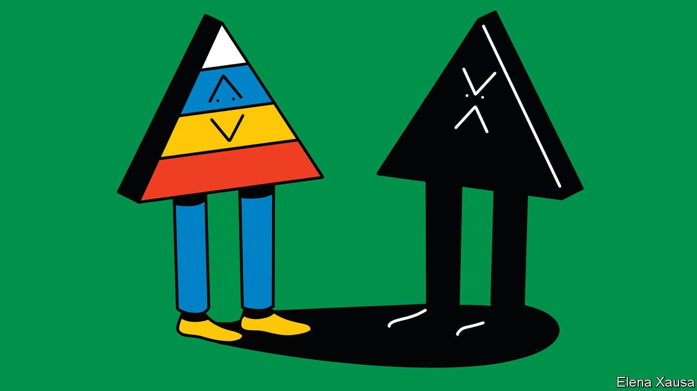

###### Banyan

# India’s caste system remains entrenched, 75 years after independence 

##### The absurdity—and cost—of affirmative action for the majority 

 

> Sep 11th 2021 

THE EVIL of India’s caste practice is almost as old as the gods, and is the most noxious and evolved example today of how humans attempt to impose superiority and suffering on others by virtue of their birth. Hindu texts speak of four tiers, or varnas, making up a broader caste pyramid in society. On top are the Brahmins or priestly caste, the Kshatriyas or warrior class and the Vaisyas or merchant class. At the bottom come the Shudras or labouring castes. The rest do not even count: outcastes.

The British Raj incorporated varnas into its imperial system of rule, perpetuating the caste system, with the outcaste “untouchables”, now known as Dalits, facing immense discrimination for their “polluted” labours, including the removal of human waste. To their credit, the founders of the Indian republic confronted the iniquity. The affirmative action enshrined in India’s constitution, mostly written by a Dalit intellectual, B.R. Ambedkar, was a world first. The “reservation” policy is a prodigious quota system for public jobs, places in publicly funded colleges and many elected assemblies. The purpose is to give a leg-up to Dalits, who account for 232m of India’s 1.4bn population today, as well as to the 120m-odd adivasis, tribal groups who live mainly in remote parts of the country.


These are the “scheduled” castes and tribes. Affirmative action has since expanded. A commission of inquiry in the 1980s deemed 52% of Indians to be members of a new category, “other backward classes”, eligible for reserved places. The Supreme Court subsequently ruled that no more than 50% of public jobs in all could be reserved. But states often breach the limit.

Other castes are lobbying to be classified as backward and so eligible for quotas. They include groups that sociologists describe as “dominant”, such as the landowning Patidars of Gujarat, the Jats of Haryana and the Marathas of Maharashtra. Some of their protests in recent years have been both huge and violent. And just last month a desire for expanded reservations was behind a political delegation to Delhi from the northern state of Bihar that called for a national census on caste.

A motivation for such landed castes, says Himanshu, a development economist at Jawaharlal Nehru University in Delhi, is stagnating farm incomes following relatively prosperous decades. Meanwhile, slowing economic reforms mean that urban opportunities for young people coming from the countryside are limited. Unemployment is high.

Cushy jobs in government become the main hope for advancement. But the absurdity only grows. With unofficial surveys of caste suggesting that over half of the country might count as “backward”, the portion of the population claiming to be eligible for reservation potentially exceeds 80%—implying affirmative action not for a minority but for the majority.

It is not clear how many socio-economic problems reservations have solved—not least because successive governments have been singularly incurious about their efficacy. The measures have fostered a lower-caste bourgeoisie. Yet strong economic growth after 1990 has done much more to reduce poverty. Meanwhile, inequality, both between and within caste groups, has actually grown. Intermarriage between castes remains rare. Housing segregation by caste is rife. You can be lynched for marrying above your caste, refusing to work for the local landed castes or even drinking from the village well.

Meanwhile, the three uppermost varnas have most of the plum public and private jobs. Of the top 89 civil-service posts, only four are not held by high-caste Hindus. The toxicity of caste even extends to other religions. The forebears of nearly two-thirds of India’s Catholics are Dalits who converted to escape stigma. Yet among four cardinals and 31 archbishops, only two are of Dalit origin.

Perhaps India’s quotas programme is better than its absence. But argues Dipankar Gupta, a social scientist, the right response to deep-seated poverty, inequality and discrimination ought to be comprehensive social programmes covering such areas as housing, health and education, not special programmes designed for various minorities. And so the suspicion grows that reservation policies, however well-intentioned, help perpetuate caste iniquities. Even low-caste activists tend to fight for better rights for their caste than for an end to a pernicious system. As for politicians, affirmative action is a far easier option than getting to the root of India’s enduring injustices.

Correction (September 9th 2021): The original version of this article incorrectly said that Dipankar Gupta is affiliated to the Indian School of Public Policy in Delhi. This has been amended above. We apologise for the error.

