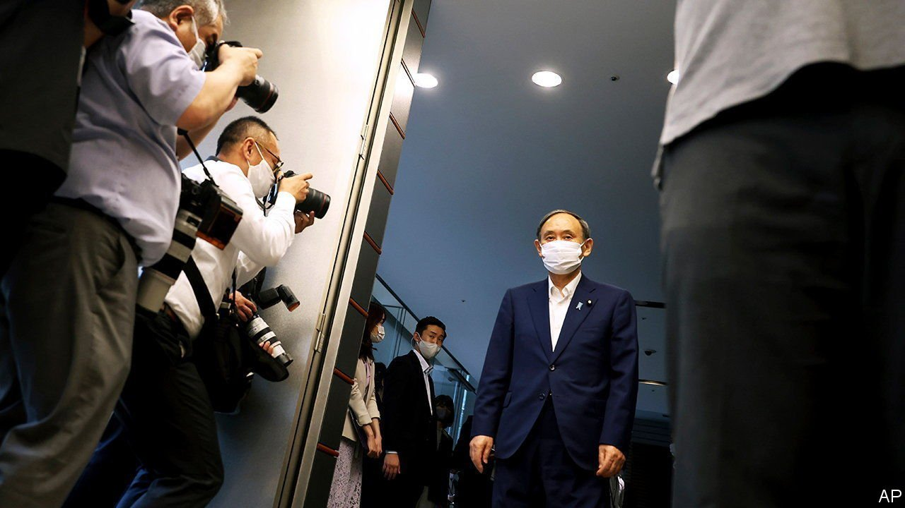

###### September surprise

# Suga Yoshihide’s resignation heralds an era of uncertainty for Japan 

##### The ruling party’s next president will lead it into lower-house elections in November 

 

> Sep 11th 2021 

SUGA YOSHIHIDE, Japan’s prime minister, had been plotting for his re-election as late as September 2nd. The next day, he emerged from a meeting with the other leaders of his Liberal Democratic Party (LDP) looking crestfallen. With his approval ratings wallowing and his support inside the party hollowing, he declared that he would not run in the party’s leadership race after all. Mr Suga’s about-face has left the LDP—and Japan’s political future—in flux. The party will vote for a new president on September 29th. The winner will become prime minister and lead the LDP into lower-house elections that must be held by late November.

Four contenders stand out so far: Kishida Fumio, a former foreign minister, has good relationships within the party, but limited popular support. Kono Taro, a former foreign and defence minister and the current vaccine tsar, is social-media savvy, and, at 58, on the younger side by Japanese standards. Though popular with the public, his reputation as a maverick puts off many in the party. Takaichi Sanae, a former internal-affairs minister, has scant name recognition, but is a budding darling of the LDP’s right wing. Ishiba Shigeru, a former defence minister, may enter the fray as well. He too has sizeable public support but little among colleagues.


None of the four represents radical change in policy terms. All are staunch supporters of the alliance with America, and favour shoring up Japan’s own defences in the face of Chinese expansionism. None will move to reverse the Bank of Japan’s loose monetary policy or to impose fiscal austerity. There are subtle differences emerging over how exactly to handle relations with China, how loose to be with different forms of stimulus, how to shape Japan’s energy policy and how to manage the covid-19 pandemic. But the main faultlines are instead generational and presentational: between a predictable, old-style party man in Mr Kishida; the independent-minded, more charismatic Mr Kono; and a nationalist firebrand in Ms Takaichi.

In public opinion polls Mr Kono comes out on top. Yet the public does not decide LDP elections. The initial ballot combines the party’s 383 members of the Diet and another 383 votes that reflect the choices of the party’s 1.1m members. If no candidate wins a majority, as is often the case, the top two move to a run-off in which Diet members’ votes have far more weight. They tend to vote in blocs along factional lines, but this time around, younger MPs are chafing at the older faction bosses’ control.

The outcome of the race will depend on backroom wheeling and dealing and inter-factional horse-trading, but also on how worried the party’s leadership is about the looming Diet elections and on how much influence younger backbenchers, who prefer Mr Kono, can exert. For the party’s old guard, Mr Kishida may seem a safer bet. Ms Takaichi, a regular visitor to the controversial Yasukuni Shrine, is attractive to those on the right. Mr Ishiba could upend the race further by entering himself or explicitly backing one of the others.

Before the eight-year premiership of Abe Shinzo, Mr Suga’s predecessor, Japan ran through six prime ministers in six years. There is a risk that Mr Suga’s resignation will precipitate a similar spell of turmoil. But it may also open the door to a new era. As Mr Suga’s abrupt resignation suggests, at this stage, uncertainty is the only certainty. ■

