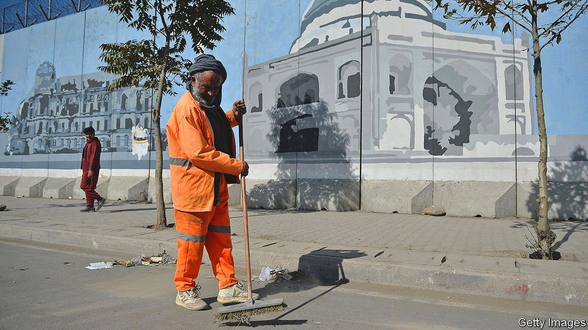

###### Empty clinics, hungry lions

# The Taliban get down to the tedious business of running a country 

##### Governance is much harder and less exciting than insurgency 

 

> Sep 7th 2021 

THE NEW Taliban look a lot like the old Taliban, if the composition of their new government is anything to go by. On September 7th Afghanistan’s new rulers unveiled a 33-man interim administration packed with stalwarts and clerics. Unsurprisingly, the list includes no women. More surprisingly, the group broke its pledges of an inclusive government by cutting out other political groups and mostly excluding non-Pushtuns.

Mullah Mohammad Hassan Akhund will assume the role of acting prime minister. A close aide to Mullah Omar, the Taliban’s founder, he was the foreign minister and then deputy prime minister during the group’s last stint in power. Abdul Ghani Baradar, a co-founder of the group and its chief negotiator on the deal to withdraw American troops, will be his deputy. Sirajuddin Haqqani, who has an American bounty of up to $10m on his head and is the scion of the Haqqani network, an allied militia, will be interior minister.


Deliberations over the composition of the cabinet have delayed decisions essential to running the country. Afghanistan’s banking system is in chaos, its foreign reserves are frozen and the aid that once provided three-quarters of the government’s budget has been put on hold. What is left of the Afghan state is in limbo as bureaucrats from the administration of Ashraf Ghani, the deposed president, rub along awkwardly with the newly arrived mullahs and their wild-looking village fighters.

Hamdullah Nomani, the new acting mayor of Kabul, sits in the same building doing the same job he did 20 years ago, before his administration was chased out of town by American troops. Yet the city is nearly unrecognisable from when he last held the post. He is responsible for some 12,000 municipal workers, and oversees everything from keeping the streets clean to ensuring that the zoo’s lions are fed. “Before, Kabul was like a village. Now it’s developed a lot and lots of businessmen have invested. It is a competitor with cities in neighbouring countries,” he says.

Mr Nomani is full of ideas. He wants to clean the city, plant trees and remove the concrete blast walls that blot the cityscape. But his workers have not been paid for two months, and it is unclear where next month’s wages will come from. His charismatic predecessor as mayor, a former airline pilot called Mohammad Daoud Sultanzoy, has been acting as an adviser. Aides say the two men have excellent relations.

The arrival of thousands of Taliban scholars, clerics and fighters, many from the rural south, has seen strange bedfellows thrown together across the capital. At one court complex a newly appointed Taliban judge explained that his experience included several years running shadow courts. These secret tribunals were key to the insurgency’s grassroots success as they delivered swift and binding rulings free of the delays and bribes that plagued government courts. A member of his staff later quietly confessed to this correspondent that he had previously worked in a British-funded counter-terrorism court that hunted and locked up insurgents.

Wahid Majrooh, Afghanistan’s chief of public health, is the only minister who remained at his post when Kabul fell, staying to steer the health system through the transition. Taliban fighters mill around the ministry compound as he deals with a stream of emails in his office. Dr Majrooh is too tactful to talk about his new bosses, noting only they have a “very different management style”. But he is obviously frustrated by the damage caused by the suspension of foreign aid. International donors have frozen contributions that pay for thousands of clinics and hospitals, he says. He warns that the system will collapse unless donors can be more flexible. Each day he is confronted by staff who say they have not eaten. Clinics are closing for a lack of supplies and medicine.

Outside the government ministries, the streets are quieter than usual and many shops are closed. Some women are still seen, sometimes even wearing make-up or stylish outfits, but their numbers are fewer than before. The strange limbo in Kabul is social as well as political, as residents attempt to navigate unclear new rules. The tables at the Cloud Cafe in downtown Kabul would a month ago have held a mixed young crowd as likely to be discussing startups as sharia. Now they are largely deserted. A patrol of fighters dropped in earlier and told the owner not to let women smoke shisha pipes or cigarettes.

A new government is the first step for the Taliban to deal with their overflowing in-trays. But such a roster of hardliners seems unlikely to appease the donors who could ease the country’s pain. The new leaders have the run of the country. Now they must run it. ■

