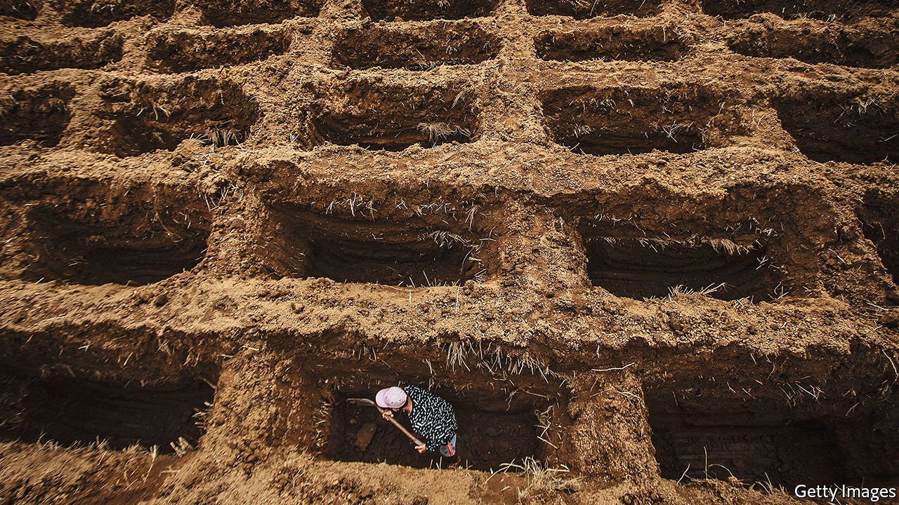
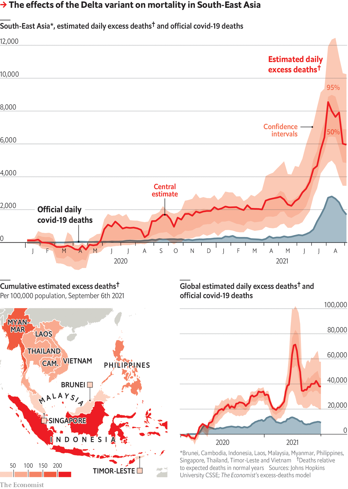

###### The shoe drops

# What the Delta variant did to South-East Asia 

##### The region had escaped the worst of the pandemic. But in just three months, the virus has brought devastation 

 

> Sep 7th 2021 

AS NEWS CIRCULATED of a worrying new virus spreading in the Chinese city of Wuhan in the early days of 2020, experts worried that infections would quickly reach South-East Asia and overwhelm the region’s health-care systems. Thailand was one of the main destinations for Chinese tourists; the first case outside China was reported there on January 13th, 2020. The first known death from covid-19 outside China occurred in the Philippines. A Chinese tourist who had visited Indonesia from Wuhan tested positive on returning home, suggesting he took the virus on holiday with him.

Yet it was Iran and Italy that became the first global hotspots. America, the rest of Europe and Brazil were soon engulfed. India got walloped. All through 2020 and the early part of this year, South-East Asia remained relatively unscathed. By the start of June, the region of 668m people had reported fewer than 77,000 deaths from the disease. Britain, with a tenth as many people, had chalked up more than 128,000. South-East Asia, it seemed, had escaped the worst of the pandemic.


No longer. By the end of August the region had recorded some 217,000 deaths from covid-19, about 2.6 times its total just three months earlier. Yet the real figure is probably much higher: in the range of 520,000 to 1.6m, according to number-crunching by The Economist. What happened? And if the latest numbers understate deaths in so dramatic a fashion, was South-East Asia ever really an exception?

 


The short answer to the first question is that the highly infectious Delta variant happened. When it arrived in the region this year, it encountered a population that lacked immunity, was complacent after a covid-free year and was defended by public-health measures designed for the milder, original form of the virus. The outbreak in Cambodia, where the virus was virtually unknown until April, was set off by just two people. Vietnam recorded almost no cases for much of last year, and mostly single-digit numbers until April, before a surge that saw daily cases rise to over 13,000 by early September.

Tram (not her real name), a doctor at one of the country’s largest quarantine facilities, a 1,000-bed centre in Ho Chi Minh City, believes the much higher contagiousness of the Delta variant surprised Vietnamese authorities. Though Vietnam was prepared for an outbreak, she says, it relied on contact-tracing, which is of limited use once case numbers start rocketing. Delta moved too quickly for the authorities to contain it.

Another reason for the enormous rise in infections and deaths in South-East Asia over the past few months could be a change in strategy, says David Heymann of the London School of Hygiene and Tropical Medicine. As governments come to terms with the fact that the virus will become endemic—and that it is now running rampant within their borders—they are looking for ways to live with it. That means accepting a certain number of infections and deaths as the price of opening up. Thailand, for instance, has eased many restrictions on movement and commerce; other countries are doing the same.

At the same time, governments have shifted focus from elimination to vaccination. This has been slow to get going, but is gathering pace. By June 1st only Singapore and Cambodia had given more than 10% of over-11s one dose or more: now all but Myanmar have crossed 20%. In Cambodia, Malaysia and Singapore, more than 60% of over-11s are fully vaccinated.

Had the virus hit the region harder than the official data suggest, even before the Delta wave? India’s official death toll from covid at the start of November stood at some 124,000, but The Economist’s calculations suggest the true number was something more like 820,000. That raised the question of whether South-East Asia, which like India is a big and diverse region with pockets of severe poverty and creaking health systems, was also failing to count its dead.

The answer, perhaps surprisingly, is no. With the exception of Indonesia, death counts in the region were indeed exceptionally low until June. Mr Heymann, who led the WHO’s response to SARS in 2003, says the region benefited from good policy. He credits South-East Asia with a swift response to the threat in the form of “good contact-tracing and good outbreak investigation”. Many countries in the region had suffered outbreaks of SARS and they had “taken preparedness to heart”, he says.

Other factors may have helped too, such as having relatively few imported cases, partly as a result of the swift shutting of borders and imposition of quarantines, and high levels of mask-wearing. The region also has a lower proportion of old people than the badly hit rich countries of the West. And the prevalence of comorbidities such as obesity, which heighten the risk of death from covid, is also lower.

Whatever natural assistance South-East Asian countries may have had, the policies they put in place to stop outbreaks have now either failed or been abandoned. In Ho Chi Minh City, Dr Tram says, the health-care system is overloaded. Whenever a new quarantine facility opens, it quickly fills up. She is voluntarily staying at the one where she works, because she is afraid that she will get infected at work and bring the disease back to her family. She has not been home for three months. Our model estimates that between 37,000 and 58,000 Vietnamese have died of covid-related causes in the past three months. The official tally pegs the number at 13,000.

The worst may be over for South-East Asia, at least for now. Case numbers are declining sharply in Malaysia, Thailand and Indonesia. (They are still rising in the Philippines and are stable in Vietnam.) Yet more waves are inevitable unless vaccination efforts are speeded up. And the economic effects are likely to linger.

Long Delta

Even before the latest wave, businesses and workers across the region suffered from closures because of lockdown. Those reliant on tourism, which accounts for 12% of the region’s GDP, have been particularly hard hit. A UN report published at the end of June estimated that regional GDP could shrink by as much as 8.4% from the loss of tourism alone. Simon Purwa, who runs a travel agency in Bali, says that business is down by 90-95%. But, he says, “We are still lucky.” Many other agencies have fared worse. Some have had to shut down.

Three out of four households in Indonesia have seen their incomes fall compared with January 2020, according to a UNICEF report released in May. More than 12% of households with children say they are struggling to keep themselves fed, and 27% said they have had to pawn possessions to survive. In Malaysia the proportion of households below the national poverty line jumped from 5.6% to a projected 8.4% in 2020. That was before the current wave. Even as the disease recedes, its effects will long be felt in hunger, unemployment and lost opportunities.■

__________

To estimate the number of lives lost to the covid-19 pandemic, The Economist has since April 2020 collected data on excess deaths: the gap between deaths observed during the pandemic and those expected in normal years. Using a new machine-learning model to estimate excess deaths where total mortality figures are unavailable, we are now able to provide daily updated estimates of excess deaths due to the pandemic for every country and the world. You can view these estimates, as well as details of our methodology, .

