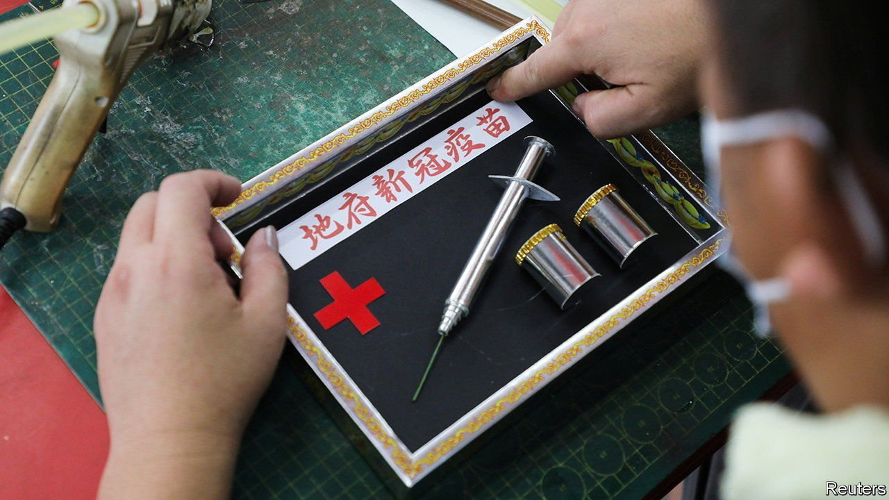

###### Hell-care providers

# What use is a vaccine when you’re dead? Plenty 

##### Funerary rites in South-East Asia, updated for the pandemic 

 

> Sep 11th 2021 

RAYMOND SHIEH’S “hell vaccine kit” includes three vials in green, blue and red, and a large syringe, all made from joss paper. The kit will be burnt as an offering to the dead, supplying them in the afterlife with something they could not receive in this one: a vaccine for covid-19. The vials’ colours represent Pfizer, AstraZeneca and Sinovac, the three main vaccines used in Malaysia, which has reported some 20,000 new cases every day in the past month. Though half of over-11s are now fully jabbed, the country’s death rate from covid is the highest in South-East Asia.

“It has been a hard year for Malaysians and many have died waiting to be vaccinated,” says Mr Shieh, who runs a shop selling prayer items in the southern state of Johor and spent two days crafting the new product last month as covid deaths surged. He says he has received more than 300 orders, at 23 ringgit ($5.50) apiece, from people in Malaysia as well as in Singapore, Taiwan and Hong Kong. “I want to keep the kits affordable,” he says. “I hope this item will give my clients some peace of mind.”


For many practitioners of traditional Chinese religions, such as Taoism, the burning of joss paper and other paper paraphernalia is a way to meet the unfulfilled needs of their deceased loved ones. Adherents believe that most spirits go through the ten courts of Diyu, or hell, before achieving salvation. Funerary rituals hasten the journey. Offerings help ease the spirits’ suffering along the way. These rites typically conclude with the burning of “hell money”, as well as any other items that the dead may need for a comfortable afterlife—clothes or houses, for example, but also iPhones and Ferraris—all made of joss paper. Mr Shieh sells a life-size replica of the latest iPhone for 350 ringgit.

Every year during “Hungry Ghost Festival”, which usually falls in August or September, believers across the region pay homage to their deceased ancestors, as well as to sundry spirits, who visit the living as the gates of hell are opened. In addition to burning various paper offerings, the devout leave out food to placate the hungry ghosts. Stage performances of Chinese operas and Getai, or live song-and-dance numbers, were common features to appease the spirits before the pandemic. These are often held outdoors, under a big tent, with at least a front row of empty seats for the ghosts-of-honour, while the living crowd on the back benches. Such performances have gone online in most countries after being cancelled entirely last year.

In normal times Taoist and Buddhist vigils for the dead usually last for several days before the body is cremated. Yet because of covid, bodies must be disposed of immediately. Many believers are pained by the thought of not having paid their respects to family and friends. “Without proper prayer and rites, how will he rest in peace?” says Eric Leong, who recently lost his father to covid. A vaccine for the dead is one way to ease the pain.

