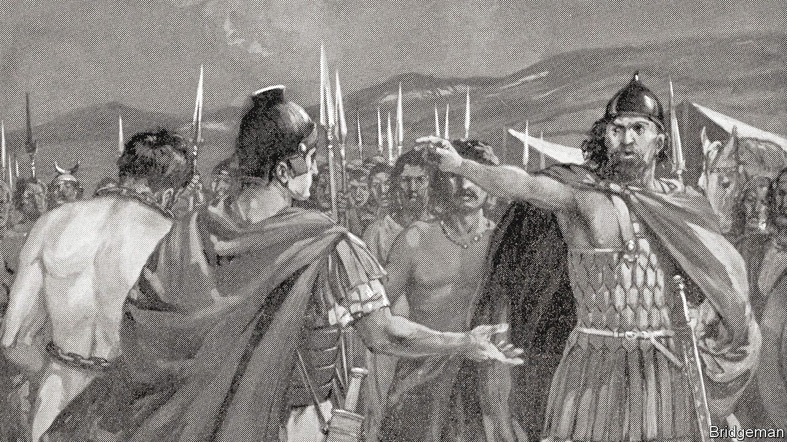

###### Antiquities and the law

# A case in Germany has big implications for the antiquities trade 

##### It involves a hoard of Celtiberian helmets and a conscientious collector 

 

> Sep 11th 2021 

WHEN MEMBERS of the semi-militarised Civil Guard raided the home of Ricardo Granada in Illueca, a village in north-eastern Spain, in 2013, they found coins minted by a Celtiberian tribe that once inhabited the area, stored by Granada in chocolate boxes. Pellets for ancient slings were strewn on top of a television set. There were brooches, ceramics and breastplates—around 4,000 antiquities in total, kept in haphazard fashion. But, remarked the prosecutors who ordered the raid, there was no sign of weapons or helmets which, they wrote, “may already have been sold to third parties”.

Indeed. By then at least 18 bronze Celtiberian helmets in uniquely good condition—and of incalculable historical value—had reached the antiquities market. Seven went to Christian Levett, a British collector. At his Museum of Classical Art in Mougins in southern France, treasures from antiquity are displayed alongside works by modern and contemporary artists including Picasso, Matisse and Damien Hirst.


On September 14th these helmets will be the focus of a court hearing in Munich with far-reaching implications for the often murky trade in antiquities. Debate in the art world has hitherto concentrated on objects seized by colonial and other raiders and held in big museums, some of which are now returning them to their countries of origin. Items originating in Europe, and bought by private collectors like Mr Levett, have received much less attention.

In his case, after he discovered the helmets were looted, he decided to do what few if any individuals had done before: he gave them back to the Spanish authorities without demanding compensation or mounting a legal battle to keep them. “Culturally, ethically and legally,” Mr Levett says, “I didn’t feel that I had any choice but to give them back to the Spanish people.”

Instead, the former hedge-fund manager vowed to recover his money from the sellers. The Spanish government arranged for the helmets to be returned at a ceremony in Paris, at the offices of its mission to UNESCO, the UN’s cultural agency, before being flown to Spain in an air-force jet.

In June last year Spain’s Supreme Court upheld a lower tribunal’s findings that Granada had dug up the helmets between 1989 and 1990. For more than 30 years, the judges wrote, he had “devoted himself systematically and exclusively” to plundering the necropolis of the Celtiberian settlement of Aratis or Arátikos, which was destroyed by the Romans in the first century BC. Only once, when he brought in a mechanical excavator, did the local authorities interrupt his labours. Granada was sentenced to three years in jail. Not that it mattered—he had died four months earlier. An accomplice got 21 months.

Following Mr Levett’s example, two Spanish collectors have since returned the helmets that they bought to the state. Those purchased by Mr Levett went on show to the public in Zaragoza in July. But he is still badly out of pocket.

He bought six of the helmets between 2008 and 2009 from a German auction house, Hermann Historica, which was acting for heirs of a noted collector, Axel Guttmann. At the hearing in Munich next week, Mr Levett will be seeking the return of the €236,136 ($280,000) sale price, including commission and shipping. “Hermann Historica have sold me objects that have been proven in a Spanish court to have been stolen,” he argues. Two experts in the field, he notes, have averred “that these helmets could only have come from the particular site where the looters were operating”.

The auction house protests that it acted in as much good faith as Mr Levett. The helmets came from “one of the best-known and extensively published collections in Europe”, says Stefan Schreyer, Hermann Historica’s managing director. “The results of [court proceedings] con ducted ten years later could understandably not be taken into account.”

Much could depend on who knew what and when. The provenance of the helmets was questioned as early as 1990 when they were offered to the Römisch-Germanisches Zentralmuseum in Mainz. When the artefacts reappeared in Hermann Historica’s catalogue in 2008, one of that museum’s archaeologists succeeded in getting prosecutors in Munich to delay the sale. The German authorities notified the Spanish government, which asked the police to recover the helmets. But a court in Madrid blocked the operation.

“None of the claims raised at the time could be substantiated, the auction was conducted properly [and] the winning bidders, including the plaintiff, became rightful owners based on German law,” says Mr Schreyer. Many dealers and collectors—and their lawyers—will be extremely keen to see if the court in Munich agrees. ■

