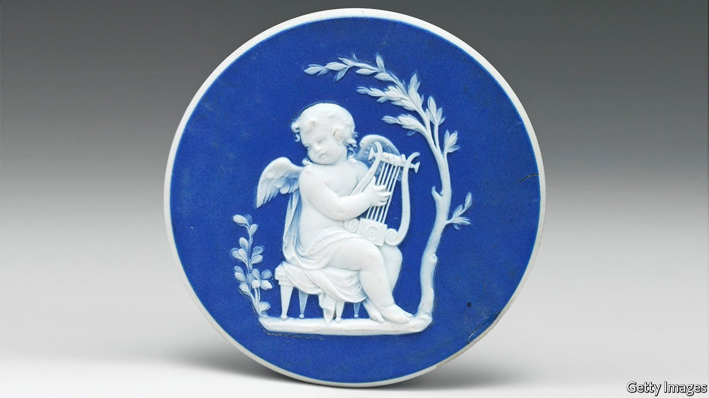

###### Tectonic plates

# The forgotten revolution of Josiah Wedgwood’s pottery 

##### It succeeded so thoroughly, says Tristram Hunt, that people stopped noticing it 

 

> Sep 11th 2021 

The Radical Potter: Josiah Wedgwood and the Transformation of Britain. By Tristram Hunt. Metropolitan Books; 352 pages; $29.99. Allen Lane; £25

ONE HALF of the world, wrote Jane Austen, cannot understand the pleasures of the other. That may be especially true when the other half is inexplicably devoted to pottery. Yet many people, including Austen herself, used to enjoy pottery enormously. Vases, ewers and urns; statues, busts and bas-reliefs; cameos and intaglios—the drawing rooms of 18th-century England were filled with fiddly little thises and charming little thats, with jasperware trinkets and basalt-ware baubles. And those made by Josiah Wedgwood were particularly coveted.


Wedgwood wanted to “astonish the world…for I hate piddling”. And for a time his pottery did. Austen admired it; Edward Gibbon collected it; Empress Catherine II of Russia ordered a job lot of it. Then, suddenly, it fell out of fashion, coming to be seen as piddling, not astonishing. Wedgwood’s own grandson, Charles Darwin, evinced an “insensibility to Wedgwood ware”. When the author J.B. Priestley set out on a round-England trip in the 1930s, he sniffed at the Wedgwood factory in Stoke-on-Trent: so industrial, he considered, and so soulless.

Today, Wedgwood is cherished by the very elderly and the very ironic; an ancient aunt or an east London hipster are likeliest to wear a cameo brooch now. So though it might not seem odd that Tristram Hunt, director of the Victoria and Albert Museum, has written a biography of Wedgwood (the V&amp;A has lots of his stuff), its title may be a surprise. “The Radical Potter”: fancy pottery today feels about as radical as a doily.

That only proves Mr Hunt’s case. The most remarkable revolutions change the world so completely that no one remarks on them any more. And, in a way, Wedgwood did change the world. When he started out in the 1740s, pottery was such a small-scale, rackety industry that some potters got the clay they needed by digging it out of holes in the road—“potholes”.

Ambitious, obsessive and empirical, Wedgwood raged at his “dilatory, drunken, Idle, worthless workmen”, then set about reforming them. Before the Industrial Revolution came the “industrious revolution” in household productivity. Wedgwood wrote that he wanted “to make such Machines of the Men as cannot Err”. He trained and chivvied, tweaked and experimented, building new factories for his pots and a model village for his workers. Vases in their thousands, then in their tens of thousands, began to emerge from the Wedgwood production line.

The history of pots matters because they do. Pick one up and in its lines you can trace trade routes and chronicle empires. The rise and fall of Rome can be charted in the words of its historians, but it is observed more accurately in the rise and fall of the Roman pot trade. At its imperial peak Roman ceramics—cheap, trademarked, perfect—were shipped everywhere from Africa to Iona; after Rome fell it would take centuries for European pottery to recover such excellence. Examine a cup made under China’s Han dynasty, meanwhile, and you will see not just fine design but an advanced bureaucracy. A single piece can be inscribed not just by the six craftsmen who made it, but by the seven officials who inspected it. Pots contain worlds.

In his lifetime some of Wedgwood’s most popular products were his medallions: little ceramic circles embossed with profiles of famous figures, such as Aristotle, John Locke and Voltaire. Peer at a piece of Wedgwood, and you can still be astonished by the brilliance of the individual engravings—by the curl lying on this king’s neck, or the realistic line of that philosopher’s nose. Yet as Mr Hunt’s elegant biography shows, to focus on these exquisite details is slightly to miss the point.

Wedgwood’s genius lay not in the creation of individuality, but in the erasing of it. He wanted to make machines of men, and he did. And then his machine-men churned out umpteen more manufactured men in their turn, Voltaires and Aristotles rolling off the production line in their hundreds, thousands, tens of thousands, until the world was astonished no more. ■

