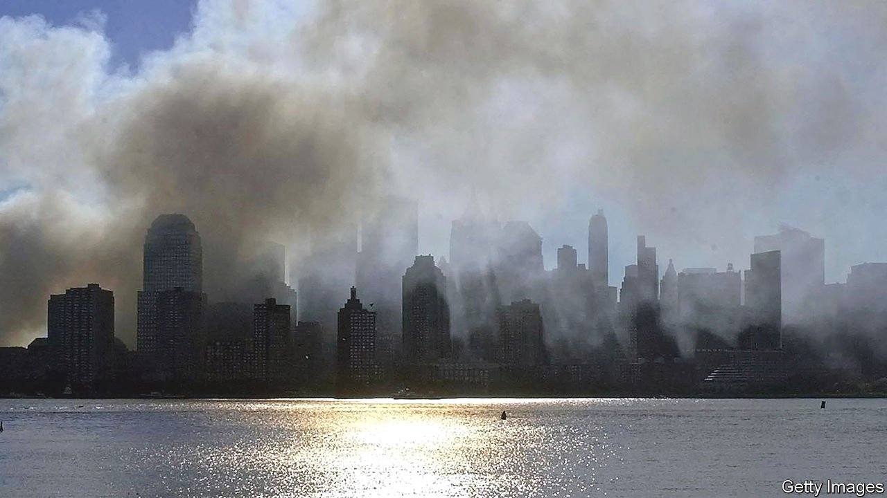

###### The home front

# Two books assess the impact of September 11th on America 

##### The authors agree that it was profound. But their accounts are very different 

 

> Sep 11th 2021 

Wildland: The Making of American Fury. By Evan Osnos. Farrar, Straus and Giroux; 480 pages; $30. Bloomsbury; £20

Reign of Terror. By Spencer Ackerman. Viking; 448 pages; $30


“ON TUESDAY MORNING, September 11th, from my window in lower Manhattan, I watched the 21st century begin,” wrote Tony Judt, who until his death in 2010 was the English-speaking world’s pre-eminent historian of post-war Europe. Judt taught at New York University; from that window he could have seen two hijacked commercial planes, loaded with passengers, flying into the World Trade Centre’s twin towers. Later that morning another plane crashed into the Pentagon; a fourth, probably intended for either the Capitol or the White House, went down in a field in Pennsylvania after a fight between passengers and hijackers. Nearly 3,000 people died in that day’s atrocities. Another 6,000 were injured.

As Judt predicted, the attacks, and their aftermath, defined the new century’s geopolitics. “Every nation in every region now has a decision to make,” President George W. Bush declared. “Either you are with us or you are with the terrorists.” Soon his administration embarked on the war in Afghanistan, America’s longest, which began with jihadis killing Americans in New York and ended, almost 20 years later, with the same thing happening in Kabul, and the Taliban back in power. The intervening decades have changed America as well as the world, as two new books try to explain.

Evan Osnos, a journalist at the New Yorker, calls the September 11th attacks an assault “on the country’s sense of itself”, which, in the words of his subtitle, inaugurated a period of “American fury”. After living in China for some of that period, he returned home to find “fear…reaching into our political life”. In “Wildland” Mr Osnos investigates the causes and manifestations of such fears, as embodied in three cities he knows well.

In swanky Greenwich, Connecticut, where he grew up, he focuses on a white-collar criminal. In struggling Clarksburg, West Virginia, where he landed his first job in journalism, he spotlights an embattled newspaper editor and an array of environmental activists. In Chicago, where he subsequently worked, he evokes an ex-convict and a teacher, both African-American, dealing with poverty and the isolation of their neighbourhoods from the rest of the city. At its best, “Wildland” has an appealing shaggy-dog quality, as Mr Osnos listens to people tell stories of their lives in the two decades since the cataclysm.

But as chapter after chapter derides typical liberal bogeymen—guns, money in politics, fossil fuels—it becomes predictable. He contends that between September 11th 2001 and January 6th 2021, when enraged supporters of Donald Trump stormed the Capitol, “Americans lost their vision for the common good, the capacity to see the union as larger than the sum of its parts”. These oracular, more-in-sorrow-than-anger pronouncements about the country’s fall from grace say more about Mr Osnos’s views and perspective than about America’s trajectory in the 21st century.

Did African-Americans living under Jim Crow, for instance, believe that America then acted on an inclusive “vision for the common good”? America’s nature and purpose have been contested since its founding; lamenting that things would be great if only they went back to how they were before, when citizens cared for each other, is a form of misty-eyed left-wing Trumpism. Those who already agree with Mr Osnos will find confirmation for their beliefs in his book. But, character sketches aside, it will tell most readers very little that they did not already know.

Collateral damage

“Reign of Terror”, by contrast, will make readers see the past 20 years differently. A longtime national-security correspondent, Spencer Ackerman was once a drummer for punk bands, and it shows: his book has a percussive drive that makes it a bracing, infuriating read. His central thesis is simple but counterintuitive. Even though Mr Trump ran against “forever wars” and America’s national-security establishment, they—that is, the country’s response to the September 11th attacks—paved his path to power.

In Mr Ackerman’s telling, three things shaped that response. The first was xenophobia. The “war on terror”, he writes, was “a civilisational counterjihad”; the enemy were “definitely, exclusively, Muslims”, even if “not all Muslims” were included. Military and law-enforcement trainees were told, falsely, that violence was inherent in Islam and that America would need to wage “total war” against a “barbaric ideology”—even though, over the past 25 years, right-wing extremists have been responsible for most terrorist attacks and plots on American soil.

The second defining feature was a legalistic sort of norm-destruction, in which slick political appointees provided meretricious justifications for policies such as torture, detention without trial and surveillance on a previously unimaginable scale. Mr Bush’s administration began such practices, but Barack Obama’s continued many of them.

For example, Mr Obama shut down a registry of Muslim travellers created by John Ashcroft, Mr Bush’s first attorney-general. But rather than being purged, the data were transferred to other systems within the Department of Homeland Security—itself a post-September 11th creation, which put immigration policy in the hands of a bureaucracy devoted to counterterrorism. Mr Obama was conciliatory where Mr Bush’s rhetoric had been Manichean, yet, as the author notes, “the machinery he retained was targeted at Muslims, something elected officials reflexively treated as the responsible thing to do.”

The third factor was America’s conspicuous failure in both Afghanistan and Iraq, which made the “experts” look incompetent. By the time Mr Trump began his presidential campaign, America had been fighting for 14 years. The war’s human cost was borne by a tiny sliver of the population, but the humiliation of defeat—or at least of not winning—was felt more broadly. Mr Trump’s insight, argues Mr Ackerman, “was that the jingoistic politics of the war on terror did not have to be tied to the war on terror itself”.

His campaign revealed “a disgust at waging the war…along with an enthusiasm for voicing its civilisational subtext”. He embodied a determination that “brutality would be defeated by greater brutality”. Mr Trump packed his government with anti-Muslim bigots and presided over rallies at which crowds chanted “Send her back!” at Ilhan Omar, a Muslim congresswoman. He pardoned soldiers convicted of battlefield abuses and sought to use the war on terror’s armoury against his domestic enemies. After George Floyd’s murder in 2020, the Department of Homeland Security created “baseball card” intelligence reports on Black Lives Matter activists in Portland, Oregon—modelled on the set that depicted Saddam Hussein’s henchmen in 2003.

None of these things would have been imaginable, contends Mr Ackerman, without the resentments and ebbing of faith in government that followed September 11th. That reaction was not solely responsible for Mr Trump’s election victory; complex events rarely have single causes. Not least, advances in racial equality, of the sort that Mr Obama’s election represented, have often produced a backlash in America. But Mr Trump skilfully exploited the fear, vulnerability, nativism and sense of humiliation that the war on terror fomented. Hillary Clinton, his opponent in 2016, epitomised the threadbare and easily mockable expert consensus.

Another world

In retrospect the attacks of September 11th can be seen as America’s last unifying moment. Mr Bush’s approval ratings spiked to 90% as the world rallied in sympathy. It is facile to say that the country squandered that moment; after all, emotive responses of this kind never last. But those who were in New York in the days after the horror, and remember the sweet, acrid smell that hung in the air for weeks, and the home-made posters tragically seeking information on the missing; who remember standing on pavements and applauding, teary-eyed, as haggard firemen passed in their trucks; who remember, most of all, the feeling that Americans were all in this together—they remember a different country, in a long-gone century. ■

