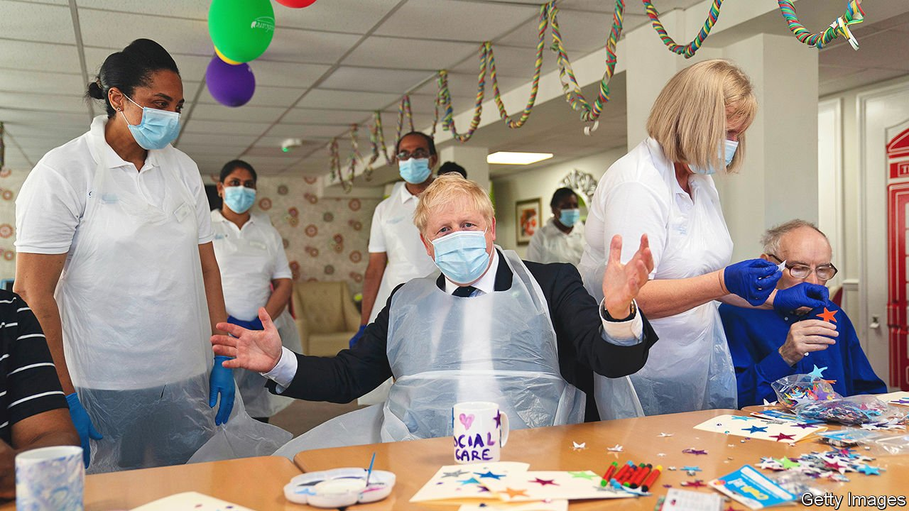
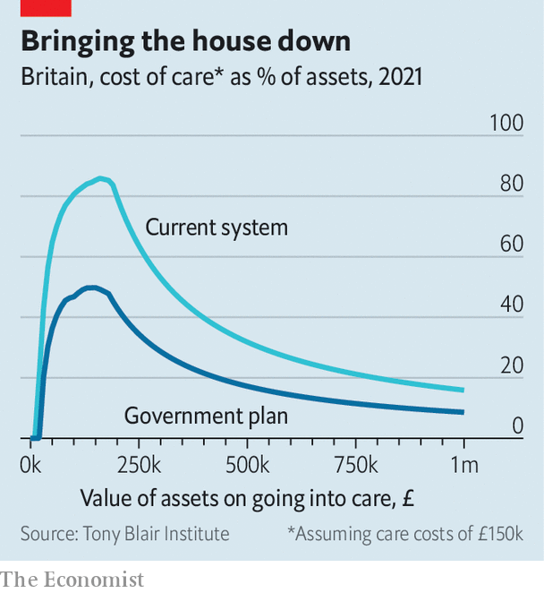

###### Tax and spend

# Boris Johnson at last grasps the nettle of social-care reform 

##### The prime minister raises taxes and breaks a promise 

 

> Sep 7th 2021 

BORIS JOHNSON likes bold promises. When he became leader of the Conservatives in July 2019, he vowed to “fix the crisis in social care once and for all”. At the general election later in the year, his manifesto pledged not to raise a number of taxes. He won in a landslide. Yet there is a problem with making contradictory promises: you can keep only one.

On September 7th Mr Johnson announced that he would raise taxes. He unveiled a new health and social-care levy of 1.25% on both employees’ earnings and employers’ payrolls from April 2022 (at first in the guise of extra national-insurance contributions, or NICs). Taxes on dividends will also rise by 1.25 percentage points. Mr Johnson argued that the pandemic had unexpectedly increased costs for the health service, which is true. Handily, the money can also be used to fund the prime minister’s social-care “fix”.


Conservative ministers spent the weekend before the announcement briefing the media that they did not enter politics to raise taxes. Mr Johnson ignored them. The measures will raise around £12bn ($17bn, or about 0.5% of GDP) a year for the exchequer. They follow a net tax increase of £25bn in the budget in March, mostly through higher corporation tax. This year has therefore witnessed the biggest rise in the tax bill since the mid-1970s, and the highest tax burden, as a percentage of GDP, in 70 years.

Money for social care was expected to come from NICs. As the basic rate of income tax fell from 30% in 1980 to 20% today, NICs almost doubled, from 6.75% on most workers’ earnings to 13.25% including the new levy. Chancellors like the fact that the cost is split between employers and employees, and thus can be partially hidden from workers. But critics argued that funding social care, which mostly benefits older households and their heirs, with a levy only on those below the state-pension age would be profoundly unfair.

The new tax represents a small improvement. It will apply to employees aged over as well as under 66, and the increase in dividend taxes further widens the net. Problems remain, however. Because pensions escape the levy, old folk will still pay just one-seventh of what they would have, had the money been raised through income tax. The levy will also introduce new distortions to the tax system. A firm using a self-employed contractor will be spared the 1.25% charge; one employing someone directly will not. Economists fear that this will encourage bogus self-employment, undermining both the fiscal base and workers’ protections.

Most of the £12bn raised will go to the health service. Delays to treatments during the covid-19 pandemic mean it faces the longest queues since records began. There are 5.5m people awaiting treatment, and Mr Johnson warned that waiting lists could reach 13m as patients who had put off treatment come forward. But there is huge uncertainty about how many actually will. Health-care experts had thought ministers would wait to get a better idea before stumping up the cash.

Instead, funding will rise by around £8bn a year for the next three years, nearly as much as lobby groups had sought. Warning lights, in the form of referral and activity data, are already flashing, says Siva Anandaciva, chief analyst at the King’s Fund, a think-tank. Another reason for the generosity, he suspects, “is that you have three years to deliver before you go into an election. If you keep delaying, and if you don’t press ‘Go’ now, it is going to be inordinately harder to make headway later on.”

Social care will see a smaller boost. According to the Institute for Fiscal Studies (IFS), another think-tank, at an average of £1.8bn a year the increase represents a 9% rise in local-authority spending. That may sound like a lot, but the IFS does not think it will fully reverse cuts in the number of people receiving care during the 2010s—a decade marked by falling budgets, an ageing population and growing numbers of people with learning difficulties.

Yet the package will make a big difference to those who have to pay for care. At the moment, the state contributes to the cost when recipients are down to their last £23,250. This will rise to £100,000, and a cap on care costs will be set at £86,000, meaning people who develop dementia will no longer risk their savings being wiped out (see chart). Successive governments have come close to such a policy. Mr Johnson’s has finally grasped the nettle.

 


The tax rise makes the chancellor’s October spending review considerably easier. So, too, do economic conditions. Growth has been faster than was expected at the budget in March. Borrowing looks set to be more than £20bn lower over this fiscal year. And on September 7th the government confirmed that the “triple lock” on state pensions—a pledge to increase them by the highest of earnings growth, inflation or 2.5% each year—would be suspended owing to a pandemic-related surge in earnings. All this reduces the likelihood of spending cuts in other areas.

According to Savanta-ComRes, a polling firm, the tax rise is even popular. A plurality say it was acceptable to disregard the manifesto in order to fund social care. But that may not tell the full story. As Dominic Cummings, Mr Johnson’s former adviser, has warned: “A core question at the next election would have been: what are the implications for taxes of Labour’s spending plans? The PM’s decision destroys this attack.” Any future promise to limit taxation will carry less weight. It is not often that a Tory prime minister takes such a hit to fund public services. ■

Dig deeper

All our stories relating to the pandemic and the vaccines can be found on our . You can also find trackers showing ,  and the virus’s spread across .

