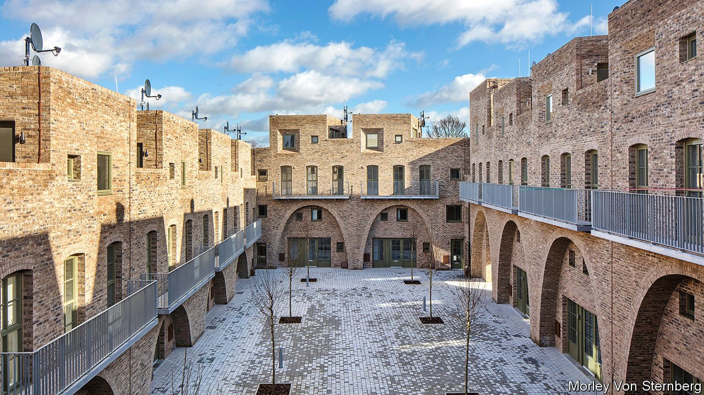

###### Streets and bricks

# How a modernist architect won over traditionalists 

##### Peter Barber’s work offers a chance for a meeting of minds 

 

> Sep 11th 2021 

ON MCGRATH ROAD, a side street in Stratford, east London, a 26-dwelling modernist terrace in mustard-coloured brick surrounds a square. The development (pictured) is hard to pigeonhole. Peter Barber, its architect, drew inspiration from the back-to-back houses built in abundance in working-class urban areas during the industrial era. “I’m a total magpie,” he says. “I’ll steal anybody’s idea.”

Mr Barber is one of Britain’s most acclaimed modernist architects. On September 6th he received a lifetime-achievement award from Architects’ Journal, and ten days earlier his firm won four awards from the Royal Institute of British Architects. His work is animated by his socialism. He mainly builds social housing, where the absence of shareholders can make it easier to innovate. Cutting-edge young architects dream of working for him.


The sort of architect that conservatives usually loathe, then. In fact, says Ben Southwood, until recently the head of housing at Policy Exchange, a right-leaning think-tank, Mr Barber is “the modernist that traditionalists like”. One reason is his magpie tendency: he cites influences as diverse as Francesco Borromini, from the Baroque period, Le Corbusier, a modernist pioneer, and Victorian almshouses. Others are his skill at combining density with low-rise design and preference for bricks over concrete. Traditionalists also share his liking for street-level development, though they and he arrive there by different routes. Traditionalists think that streets look more appealing, and thus help build better places. Mr Barber thinks they “make different groups visible to one another”, thus breaking down class barriers.

This convergence is striking in light of the Conservative government’s plans to boost housebuilding. In 2018 Theresa May, then prime minister, set up a commission to advise her government on how to improve style in the industry. Its final report recommended a planning regime that would “ask for beauty” and “reject ugliness”. In July Mrs May’s successor, Boris Johnson, created an Office for Place to carry on its work. At its launch Robert Jenrick, the housing minister, pointed to polls showing that Britons prefer older homes to those built in the past 70 years.

The government’s design-code guidance features photographs and plans of charming, traditional streets—and Mr Barber’s Donnybrook Quarter, a high-density, tree-lined street in Tower Hamlets completed in 2006. But the meeting of minds is by no means absolute. Mr Barber disagrees with the government’s insistence that prettier homes are the best way to ungum planning. He favours simply building lots more council houses.

Still, it hints at an intriguing possibility: the emergence of an architectural third way. Clients, says another architect, are increasingly asking for “traditional architectural language” with “something overtly modernist”. Samuel Hughes, a research fellow at the University of Oxford, sees parallels with a previous era. He compares Mr Barber’s amalgams to the interwar work of Sir Giles Gilbert Scott, who blended tradition with modernism, notably at Battersea Power Station. Some thought such synthesis would supplant radicalism, says Mr Hughes—though in the event, radicalism took off. Perhaps such hopes were merely a bit early, he muses, and “in the end, modernism will merge back with the traditions”. ■

