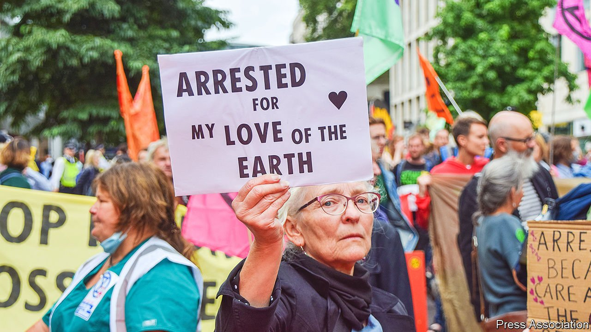

###### Grey radicals

# Older voters help power Britain’s radical movements 

##### Richer, healthier and better-connected, they are ready to cause upheaval 

 

> Sep 11th 2021 

A CROWD DANCES to rave music in a pool of fake blood, as workers of the London Stock Exchange peer from the windows above. They are young; some of the men sport dreadlocks and a woman is topless. It is a protest by Extinction Rebellion, an activist group known for blocking streets and breaking windows, against the City’s investments in fossil fuels.

Looking on are demonstrators cut from a different cloth: older, with waterproof jackets and Tupperware lunch boxes. Sue Lewis, a 68-year-old grandmother-of-five from Denbigh in north Wales, clutches a banner reading “Decolonise the Economy”. During her career as a social worker, her activism consisted of a monthly donation to Greenpeace. As a pensioner, she has more time to campaign. She doesn’t consider it retirement. “I don’t like the R word.”


Britain has been buffeted by radical movements in the past decade. Extinction Rebellion is one. The movement for Scottish independence roused by the referendum of 2014 is another. The Labour Party’s sharp left turn under Jeremy Corbyn in 2015 saw its membership surge. The Brexit referendum of 2016 produced a popular campaign to finalise the divorce, and another to reverse it. Radicalism is seen as the preserve of the young. Yet often it is baby-boomers, a generation roughly encompassing those born between 1946 and 1964, who are these movements’ foot-soldiers.

Some 23% of those who took part in the Extinction Rebellion’s early protests in 2019 were over 56, according to researchers at Aston University. That is a share lower than in the general population, but higher than in previous direct-action movements. These older protesters accounted for a third of those charged by the police.

Scottish independence is much more popular among young Scots than among older ones. But despite a surge in membership after the first referendum in 2014, the Scottish National Party’s ranks remain older. In 2017, 54% of members were over 55, according to research by James Mitchell of the University of Edinburgh. Similarly, Mr Corbyn rode a “youthquake” at the ballot box. Yet just 12% of new Labour Party members during his tenure were under the age of 36, whereas fully half were over 55, according to a study in 2018. Among former members who rejoined the party during the same period, 77% were over 55.

Or consider the crowds that filled Westminster during the Brexit strife. Younger voters had largely voted for Remain and older for Leave, but those who marched on both sides in the years that followed were distinctly grey. A study of the “March for Europe” in March 2017 found that the attendees were “primarily older people”.

Three factors help explain boomer radicalism: health, networks and wealth. Life expectancy rose steadily in the 60 years from 1950, and has continued to tick up for the better-off in the past decade. A woman from the wealthiest 10% of the English population who retires at, say, 61 can expect a further decade in fine fettle. Some head to the golf course; others to rallies.

Such rallies are organised online. Internet usage among older groups has surged in the past decade, to 95% of those aged 55-64 and 86% of those aged 65-74. Online is also where radical ideas are shared: Ms Lewis and her fellow protesters rattle off YouTube recommendations.

And finally, though radicalism is often thought of as a revolt by the poor, a rival theory turns this on its head. In a recent paper Jane Green of Oxford University and Raluca Pahontu of the London School of Economics argue that wealth acts as “insurance”, cushioning voters from the economic dangers of upending the status quo and thus reducing risk aversion. Better pensions and rising house prices mean that pensioners are now much richer, relative to the rest of the population, than they were a generation ago.

Outside the stock exchange Annie Webster, who is 58, says she never tangled with the law until she picked up an Extinction Rebellion leaflet at the Saturday market in Bridport, a pretty town in Dorset, two years ago. Since then she has been arrested twice. She fears a future where food and water are scarce, she says, and wants her grandchildren to inherit a world worth living in. “I’ve had a fantastic life.” ■

