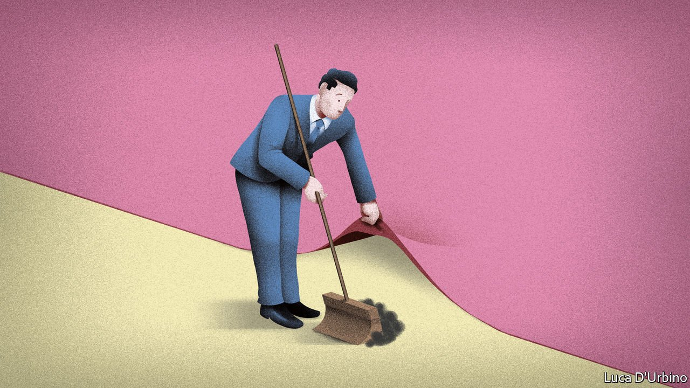

###### Sleazy does it

# Repeated scandals have failed to dent the government’s popularity 

##### Could that be about to change? 

 

> Sep 11th 2021 

A TALLY OF the scandals that have afflicted the government, in office since just mid-2019, comes to an impressive total. Among them Michael Gove, minister for the Cabinet Office, was found to have acted unlawfully in awarding consultancy contracts. Robert Jenrick, the housing secretary, broke the law by rushing through planning permission for a Tory donor’s project. The former health secretary, Matt Hancock, canoodled with one of his advisers, breaking lockdown rules in the process. Boris Johnson, the prime minister, had his flat refurbished with help from party donors. Only Mr Hancock’s affair led to a resignation.

Received wisdom in Westminster links the decline and eventual defeat of the Conservatives in the 1990s to a series of scandals. Yet Labour’s campaigning on sleaze in recent local and national elections has proved ineffective. According to YouGov polling, only a small number of highly politically engaged voters seemed susceptible to vote-switching over Tory sleaze. The government’s polling lead has remained strong. Why has the mud not stuck?


One reason is that the scandals are not cutting through to the politically unengaged. “Standards issues only become political issues if they get into the public consciousness,” says Lord Jonathan Evans, chair of the Committee on Standards in Public Life (CSPL). And a scandal “only gets into the public consciousness if the media puts it there”. Newspapers are generally happy to string out scandals that tickle the public interest. But the pandemic has hogged headlines and readers’ attention. Moreover, most media outlets lean Tory. Labour lacks the consistent polling lead and media savvy that enabled it to win over Fleet Street in the 1990s.

And even when sleaze enters public consciousness, it doesn’t necessarily change votes. The MPs’ expenses scandal in 2009 dominated headlines, but had only a minor effect on the election the next year, according to a study by a pair of political scientists, Andrew Eggers and Alexander Fisher. In Britain’s first-past-the-post electoral system voters have just one chance to express a national preference, and so weigh up priorities. “People do care about ethical standards,” says Mark Philp, the chair of the CSPL’s research board. “But it’s not the only thing they care about”.

What animates many voters, especially those who lean Conservative, is competence. Scandals in the 1990s gained traction after the government’s reputation for economic management was wrecked by Black Wednesday, Britain’s chaotic exit in 1992 from the European exchange-rate mechanism. The Labour government that took office in 1997 brushed off early scandals, when satisfaction with its performance was high. Most voters think the current government has handled the pandemic well, suggesting it may manage to do the same. The two scandals that gained most attention—an odd trip to Barnard Castle by Dominic Cummings, a former adviser to Mr Johnson, and Mr Hancock’s affair—coincided with polls suggesting that confidence in the government’s grasp on pandemic policy was slipping.

And lastly, for a scandal to make a big difference, the opposition must seize the moment. Since poor election results in May, Labour has tried to sharpen its attacks with a new slogan: “One rule for them, another for the rest of us.” It is trying to link sleaze with incompetence, suggesting that money spent on overpriced gear for health workers should have gone on social care. Its strategists hope this will cause some Tory voters to waver.

But banging on about sleaze is a risky strategy. As he prepared for the election that swept New Labour to power, Tony Blair initially hesitated to make an issue of sleaze, for fear that it would taint all politics in the eyes of the public. Today, polls suggest that Labour is seen as incompetent, and barely more trustworthy than the Tories. If voters who distrust politicians turn to fringe parties or give up voting altogether, that would cause harm beyond the government’s ratings. Conversely, rooting out corruption is one of the few things that helps rebuild trust in politics, says Professor Philp. And that is not in Labour’s power, but Mr Johnson’s. ■

