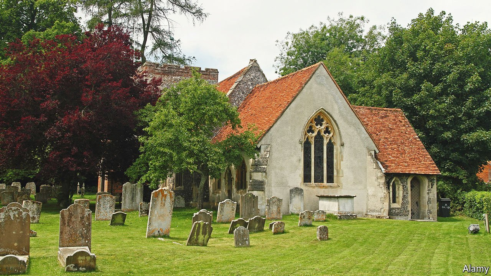

###### Go forth and multiply more

# The Church of England needs new members. How to get them? 

##### A new scheme hopes to create a million new converts in a decade 

 

> Sep 11th 2021 

GO INTO ALL the world and preach the gospel to every creature, said Jesus. Which was an enthusiastic attitude, but not a very English one. The Church of England (C of E) has therefore tended to take a more muted approach to evangelism, winning converts less through bashing Bibles than through offering weddings, funerals, tea and biscuits in the church hall—and a reassuring sense that no one is going to do anything so American as talk too much about God. As Alan Bennett, a playwright and national treasure, once wrote, vicars don’t like to mention Him. They “keep him up their sleeve for as long as they can…They know it puts people off.”

Now the church is displaying evangelising glints that are, for many, alarming. A briefing paper on “Vision and Strategy”, delivered in July at its general synod, called for a church that is “younger and more diverse”—and much bigger. It aims to develop 3,000 “worshipping hubs” for children and young people, and has linked with a movement called “Myriad” (the word is Greek for 10,000), which aims to create 10,000 new churches and a million new worshippers in Britain within a decade.


Myriad does not mean “churches” in the spinsters-and-stained-glass sense. It is not promising 10,000 more pulpits or transepts or tea urns or vicars. It is not promising buildings at all. Myriad groups might meet in churches and work with priests—or they might meet independently, in houses or offices or parks. Followers talk freely about God. As a promotional video explains, this movement is “not just reserved for Bibles and a building”. These churches will be “predominantly” led by lay people—a Myriad boss referred to buildings and theological training as “key limiting factors” in church expansion.

The response has been bitter. Both the church and Myriad later apologised for the “limiting factors” comment, but the damage was done. The plans have been described as “Stalinist” and a “Great Leap Forward”. This, one vicar wrote, is a Christianity that is “randy for converts”. A Save the Parish group has been formed. Diarmaid MacCulloch, an emeritus professor of ecclesiastical history at Oxford University, sees in the scheme a certain “adolescent self-confidence”. Many are very angry. Mr MacCulloch says he is merely “mildly cross in an Anglican sort of way”. Which in Anglicanese means furious.

At times the debate can seem to be as much about old stones as about salvation. But it would be a mistake to underestimate the importance of architecture. The English aesthetic has been shaped by its churches. Thomas Gray elegised them; William Morris toured them; even Philip Larkin, a curmudgeonly atheist, was stilled by them. The English language has been shaped by the King James Bible and the Book of Common Prayer, books that created a land of linguistic milk and honey, and gave English such phrases as “thief in the night” and “ashes to ashes, dust to dust”. Neither mentions “worshipping hubs”.

Yet aesthetic appeal is not enough to put bums on seats. Turville in Buckinghamshire is a perfect English village. The road to it is rolling; its mists are mellow; its trees fruitful. Its church, St Mary’s (pictured), is so perfect that for years it was used to film “The Vicar of Dibley”, a BBC series. And yet on a Sunday morning in early autumn, this perfect church is perfectly empty. Turville has not had its own vicar for decades; instead it shares a priest and an associate priest with a group of five other churches. Services are held in each in rotation. This week it is the turn of nearby Hambleden, so St Mary’s is silent.

Step inside and it offers the usual things: matting, seats and the smell of old stone. “Welcome to our lovely Church”, says one sign; another laments a lost cat; a third advertises the Turville Bell Ringers (“Campanology is a very British tradition.”) There is a tin for the Church Flower Fund. What there are none of is people.

Church attendance in England has been falling for decades. In 1970, according to the church’s own figures, 1.5m went to a service every Sunday. In 2010 only 800,000 did. And attendance is still falling. The “key measures of attendance” fell by 15-20% between 2009 and 2019. Those who do attend are ageing. As the C of E itself points out, “An 80-year-old is eight times more likely to be in church than a 20-year-old!”

Something must be done. Exactly what is disputed. Justin Welby, the Archbishop of Canterbury, has been criticised as too corporate, but Robert Ekelund, an emeritus professor of economics from Auburn University, Alabama, argues that when looking at religion, economics has its place. “When you get down to it, you’re selling a product,” he says. There are customers (the congregation), running costs (churches) and a product (salvation). If the product is not shifting, “these entrepreneurs have to figure out a way to differentiate their product” to maximise attendance.

The C of E is already diversifying. Just as many employers have embraced working from home, so the church has started to embrace praying from home: last year, Archbishop Welby delivered his Easter address from his kitchen. For God, as for Mammon, WFH offers benefits such as lower building costs and greater convenience. And God, like 3G, is everywhere. “If God exists,” says Mr Ekelund, “he exists in your restroom as well as your living room.” But traditionalists dislike this sort of casual approach. “A house is not a very convenient place to worship,” says Mr MacCulloch. “The telly gets in the way. You trip over the sofa.”

In St Mary’s, there is neither sofa nor telly. There is old stone, and there are King James Bibles and prayerbooks by the door. Be fruitful and multiply, their pages say, and ashes to ashes, dust to dust. In the air, there is silence. ■

