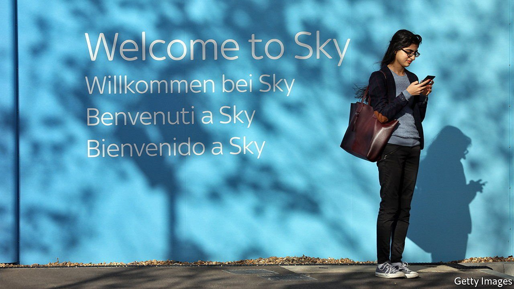
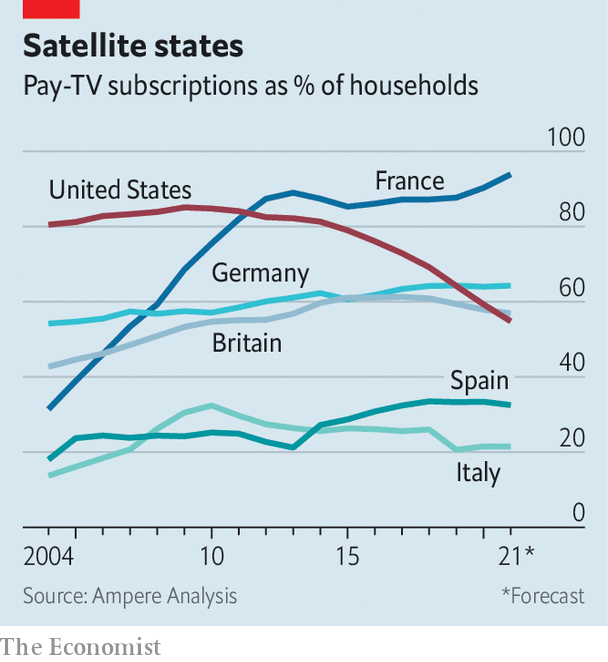

###### Cable ties

# As Americans cut the cord, Europeans sign up for more pay-TV 

##### Satellite and cable are now more popular in France and Germany than in America 

 

> Sep 11th 2021 

THE BIGGEST television drama of the past decade has been the story of how people watch it. Ten years ago nearly nine out of ten American households subscribed to cable or satellite. Today little more than half do. The collapse of pay-TV, amid the advance of online streaming, has upended the television industry and forced Hollywood giants like Disney to rethink their business model. And the pace at which consumers are “cutting the cord” from cable providers is only increasing.

But not everywhere. On the other side of the Atlantic, cord-cutters are outnumbered by cord-knotters. As Americans tear up their contracts, Europeans are signing up for cable and satellite in greater numbers than ever. Pay-TV penetration in Britain will overtake that in America this year, according to Ampere Analysis, a research firm. In France and Germany it already has (see chart).


Why has American media’s mega-trend missed Europe? One reason is price. America’s cable industry may look competitive: the largest player, Comcast, has only a quarter of the market. But it is highly regionalised, so most homes have few options, says Richard Broughton of Ampere. The result is an average monthly cable bill of nearly $100. British homes pay less than half as much. Tax loopholes have made pay-TV an even better deal in parts of Europe. Take-up in France rocketed from 30% to 90% between 2004 and 2014, after the government imposed a lower rate of VAT on television services than on telecoms, unintentionally giving phone firms an incentive to throw in a cheap TV package and pay the lower rate of tax. The loophole has been closed, but subscriptions remain high.

 


A second factor is content. American cable TV is running out of shows as studios move their best ones to their own streaming platforms. In Europe, where some streamers have yet to launch, pay-TV firms retain the rights to many of the most popular titles. Britons seeking the third season of WarnerMedia’s “Succession”, for instance, must go to Sky, a Comcast-owned satellite firm, since Warner’s HBO Max has yet to stream outside the Americas.

The last reason Europe still favours cable is that American streamers have forged partnerships with European pay-TV firms rather than competing with them. In the race for subscribers, the quickest way for streamers to bulk up in Europe has been to join forces with satellite and cable incumbents. They are the ones with access to consumers and the ability to handle local marketing and ad sales. In Spain, Vodafone offers bundled subscriptions to Netflix, Disney+ and others. Next year ViacomCBS’s Paramount+ will launch in six European countries on Sky’s platform.

Will cord-cutting eventually cross the Atlantic? As long as Hollywood studios continue to license their programming to local players, consumers will have every reason to stick with pay-TV. For the studios themselves those deals are lucrative, points out Mr Broughton: “Doing a Disney and cancelling all those contracts, then replacing them with your direct-to-consumer service, leaves you with a bit of a gap in your financials.”

In the long run, though, studios would rather bring viewers onto their own platforms, as in America. In that scenario, pay-TV firms may be left with little to offer but sport, alongside streaming bundles of the sort offered by France’s Orange or Britain’s Virgin Media. Warner plans a gradual European roll-out of HBO Max over the next few years. By the time the fourth season of “Succession” is out, audiences may be watching it online. ■


