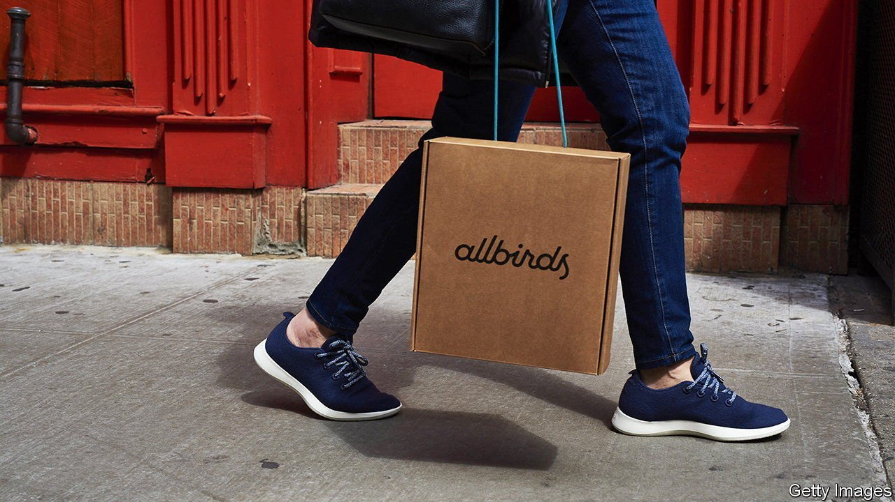

###### The direct approach

# Direct-to-consumer retailers try to bring pizzazz to dull goods 

##### E-merchants also put profitability ahead of growth at all cost 

 

> Sep 9th 2021 

FEW FIRMS have spawned an industry. Warby Parker, a millennial-chic spectacles firm, has a decent claim to be one of them. A decade ago the startup pioneered selling products directly to shoppers online, using the internet to avoid the costs of bricks-and-mortar shops and chip away at clunky consumer-goods incumbents that relied on distributors and retailers. Thousands of direct-to-consumer (DTC) companies followed in its footsteps. Venture-capital (VC) firms threw money at them; Warby Parker’s latest funding round gave it a valuation of $3bn. On August 24th, in the biggest test yet of market appetite for the business model, it opted to go public—appropriately, selling shares directly to investors rather than through intermediaries as in a conventional initial public offering (IPO). A week later Allbirds, an online trainers-seller, said that it, too, will float its shares.

Such apparent successes stand out in a graveyard of casualties. Even the survivors struggle to make money. Warby Parker’s net loss more than doubled from $23m in 2018 to $56m in 2020. Allbirds lost $40m in the past two years. Casper, a mattress-maker, has yet to recover from a lacklustre IPO in 2020. Its market value of $205m is a fifth of its pre-IPO private valuation. Away, which sells suitcases, and Outdoor Voices, a clothing company, have lost a string of bosses. For others, covid-fuelled shopping sprees—e-commerce grew by as much in the first quarter of 2020 as it did in the previous decade—will not last for ever.


The playbook used to be simple. At its inception Warby Parker faced few DTC rivals and enjoyed low costs and readily available capital. The rise of Shopify and Amazon enabled aspiring entrepreneurs to open shops with a few clicks and a few dollars. Operating digitally opened a treasure chest of data on customer behaviour and allowed precise targeting on platforms like Instagram and Facebook. Sans serif fonts, neat designs, millennial lingo and socially conscious mission statements still seemed novel. “It couldn’t have been easier to start a DTC brand,” says Len Schlesinger of Harvard Business School. “You didn’t even need a good idea.”

Life is now harder. Casper faces over 175 online competitors. The cost of an ad on Instagram and Facebook more than doubled between 2018 and 2020. Large retailers have responded by buying or launching their own lines designed to appeal to younger customers. Unilever is said to have acquired 29 DTC firms between 2015 and 2019. Even with plenty of funding, the number of deals has begun to plateau. “It’s now less about innovation and more about execution,” notes Kirsten Green of Forerunner Ventures, a VC firm. Lerer Hippeau, another VC firm, which invested early in Warby Parker, Allbirds and Casper, says its priorities have shifted from growth and fancy logos to profitability from the first purchase.

This has benefited a new set of DTC firms trying to brand the unbranded pockets of consumers’ lives. FIGS, valued at $7bn, built its business by selling snazzy medical scrubs that, it says, “empower” a dedicated following of 1.5m health-care workers. Selling cheap goods at luxury prices is lucrative: FIGS boasts gross operating margins of 27%, compared with 7% for Warby Parker.

Other humdrum products and services are ripe for “decommoditisation”, thinks Trina Spears, co-founder of FIGS. Many such niches are, as Lerer Hippeau puts it, “sleepy total addressable markets” without ruthless competitors. Backdrop offers house paints in cool millennial-friendly colours. Sunday sells pest control packaged in monthly subscriptions for the aspiring classes. Tend sweetens a visit to the dentist with Netflix and aromatherapy. Thrasio has been snapping up hundreds of dull-looking DTC brands among third-party sellers on Amazon with the aim of turning them into “profit-doubling machines”. It has helped a firm that makes a pet-odour eliminator increase sales eightfold in two years by improving marketing and distribution. It claims to be the fastest company in America ever to reach a valuation of $1bn—while also making a profit. ■


