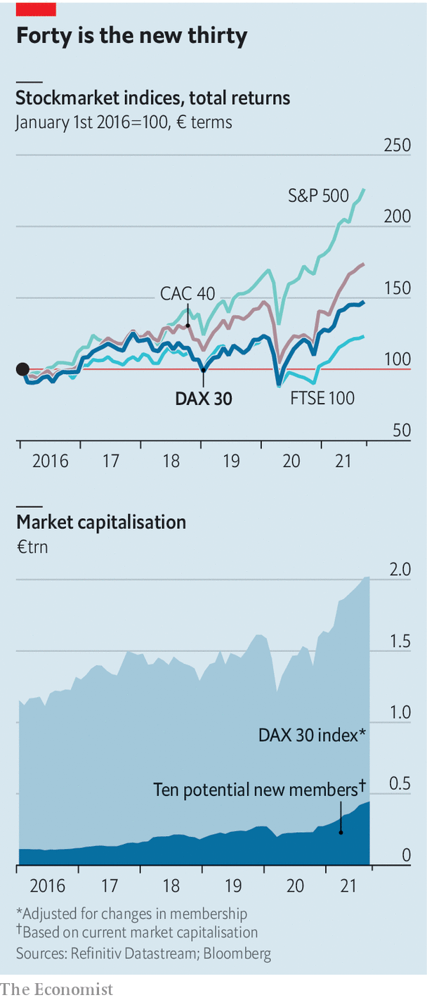

###### DAX redux

# Germany’s DAX blue-chip stockmarket index gets an update 

##### Forty is the new 30 

 

> Sep 11th 2021 

 


THE STOCKMARKET index of Germany’s bluest chips is getting a makeover. Any week now the DAX will gain ten new members, bringing the total to 40. The newcomers will be the most valuable German firms not already in the index (so long as they can show two years of positive earnings before interest, taxes, depreciation and amortisation). The new DAX could reach €2trn ($2.4trn) in market value, from €1.6trn today. A few faster-growing members may boost the index’s mediocre returns. But probably not by much.


