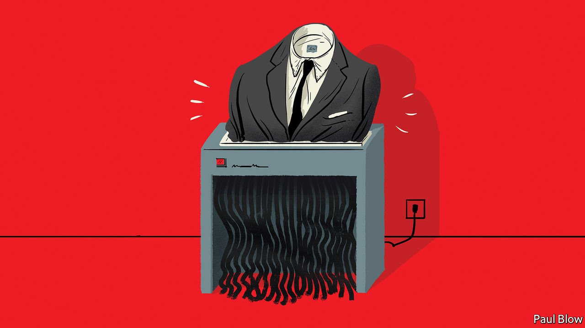

###### Bartleby

# The pandemic has refashioned corporate dress codes 

##### Suits v sweatpants 

 

> Sep 11th 2021 

IN AN INTERNAL memo to staff in 2016 JPMorgan Chase relaxed its dress code. The American bank’s 240,000 employees could hang up their suits and don business-casual attire—once reserved for casual Fridays—all working week. Some garments remained beyond the pale (T-shirts, flip-flops, tank tops, yoga pants). But many—polo shirts, skirts (of appropriate length), dress sandals—became fair game.

JPMorgan was, sartorially speaking, ahead of its time among stuffy corporate giants (turtlenecks and hoodies have long been the fashion choice of Silicon Valley titans). Others followed suit, as it were. Men’s corporate uniform—and the female power suit designed to mirror it—increasingly came to be seen as a vestige of the male-dominated offices of yore and no longer fit for purpose in a world of greater (though still imperfect) workplace equality. As more and more people ran or cycled to work, they found that changing into a full suit was impractical, since jackets folded into rucksacks tend to lose their crispness.


These days ties are no longer de rigueur in client meetings even for pinstriped investment bankers at Goldman Sachs. Purveyors of formal wear have fallen on hard times. Last year Brooks Brothers, which had been sewing button-down shirts since 1818, filed for bankruptcy. Last month Marks &amp; Spencer, a British retailer, announced it would no longer sell men’s suits in more than half of its bigger stores.

As the pandemic completely decoupled work and presence in the office, employees at many companies switched into something even less starchy. Unlike JPMorgan, however, most have not put any guidelines in place as to what is and isn’t appropriate. Although the Delta variant is forcing companies to delay a return to the office, that day will come. When workers are back at their desks, at least some of the time, new sartorial rules may be required.

Much has been written about what people wore on Zoom calls during lockdowns (and what they did not wear: some retailers report that tops significantly outsold trousers in the past year and a half). Fashion designers like Giles Deacon in Britain have launched “work from anywhere” fashion collections, aiming for slightly looser-cut clothing that nevertheless looks smart. Two Japanese companies, Aoki and Whatever Inc, created pyjama suits—a hybrid of a suit and soft, comfy loungewear—perfect for the video conference attended from home. Aoki uses the same fabric as pyjamas but with a suit-like cut. Whatever Inc’s WFH Jammies are “business on the top, loungewear on the bottom”.

That is not to say that business-casual Fridays have given way to athleisure work weeks. Indeed, some workplaces are already experiencing a backlash against informality. In 2017 Britain’s House of Commons decided that male MPs were no longer required to wear ties when attending debates; previously they could go tieless only on hot summer days. But at the beginning of September this year Sir Lindsay Hoyle, the Speaker, announced that he expected all parliamentarians to smarten up. Jeans, chinos and sleeveless tops are out.

Looked at in the aggregate, individuals’ clothes speak to more than just personal preferences. People’s sartorial choices add up to a zeitgeist. It is no accident that the cheerful glitz of the 1920s came right after the despondency of the first world war and the Spanish flu. Today’s tailoring brands hope that when the pandemic recedes at last male and female professionals will feel a renewed desire to dress up.

So does Bartleby. Like Sir Lindsay, she would recommend that employees maintain a degree of formal presentation. Yes, some people can pull off a dishevelled look—but not everyone. Dressing with taste and elegance does not have to involve designer clothes or expensive watches. It signals commitment and seriousness. A freshly laundered, crisp shirt announces to the world that you have made an effort; a tracksuit does not.

And if going to the office is a ritual, styling an outfit can be a pleasure, not a chore. The way one dresses is part of his or her self-expression. It also separates the public and the private. Peeling off formal office clothes and slipping into something cosy marks a daily transition from work to non-work. That line was blurred during lockdowns and could do with some sharpening. A man in a suit and tie is a man loosening his tie at the end of the day.

All our stories relating to the pandemic and the vaccines can be found on our . You can also find trackers showing ,  and the virus’s spread across .

