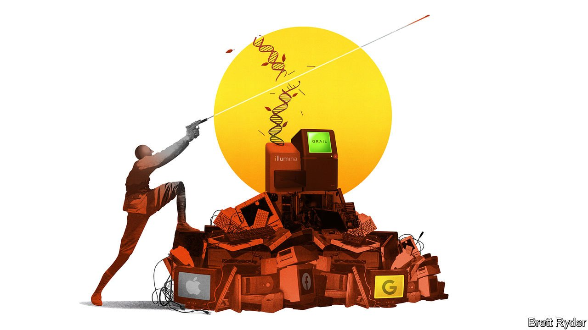

###### Schumpeter

# The “Google of genomics” meets the techbashers of antitrust 

##### Has Illumina found the holy GRAIL? 

 

> Sep 11th 2021 

IN 2013 MEREDITH HALKS MILLER, a laboratory director at Illumina, the world’s biggest gene-sequencing firm, spotted something odd as she examined the blood of expectant mothers, looking for abnormalities in the fetuses they carried. In some cases, the DNA of the unborn children was normal, but that of the mothers was not. Suspecting the women had cancer, she went to her superiors, only to be met with scepticism. She pushed nonetheless. “I was determined to bring this to light. As a doctor, I really wanted to help these women,” she says. Her intuition proved right. “Sure enough, every person I predicted had cancer had cancer.”

Her hunch led to the foundation of GRAIL, a pioneering company focused on detecting cancers using blood tests even before any symptoms have emerged. Illumina spun it out in 2016 (tech tycoons such as Jeff Bezos and Bill Gates were early backers), only to repurchase it again in a $7bn deal last month, shortly after GRAIL released a test in America that screens for up to 50 cancers from a sample of blood. And yet until a recent blog post by her daughter, noting how infrequently female scientists get credit for their work, Dr Halks Miller’s role was mostly airbrushed out of GRAIL’s story. When contacted by your columnist, she says she received no extra bonus or promotion for her efforts. Even today, Francis deSouza, Illumina’s CEO, refers to her simply as Meredith, and when asked about her says only that she has retired.


Nonetheless, her brainchild is now firmly in the spotlight. GRAIL’s return to Illumina is intriguing for three reasons. First, in acquiring it, Illumina, described by its biggest investor, Baillie Gifford, a Scottish asset manager, as the “Google of genomics”, hopes to become a colossus of cancer care. In short, it wants to make screening the new search. Second, like Google, Illumina faces a showdown with trustbusters in America and Europe, irked by how similar early-stage acquisitions gave rise to today’s tech giants. Third, Illumina has defiantly gone ahead with the transaction before regulators have given it the green light. The battle pits an acquisitive company on the technological frontier against trustbusters keen to rewrite the rules of tech competition.

There is no question that Illumina, worth $73bn, rules the world of gene-sequencing. Its machines control 90% of the market in America. Its vast global share is reflected in the fact that Chinese scientists used it for the first sequencing of the SARS-CoV-2 genome at the start of the covid-19 pandemic. Using technology acquired with the purchase in 2007 of Solexa, a British company, it provides gene-sequencing tools to genomics companies, including those developing liquid biopsies or blood tests for cancer. Mr deSouza reckons that the global market for cancer gene-sequencing could be worth $75bn by 2035. That looks promising for a gene-sequencing provider. Even more so if GRAIL can change the efficacy and economics of cancer care. Mr deSouza argues that Illumina’s global heft and ability to convince insurers to cover the cost of genomic testing will help GRAIL do that. Far from stifling competition, the takeover will stimulate it, he says. Money is pouring into startups trying to catch up with GRAIL.

The trustbusters see things differently. Last year the Federal Trade Commission (FTC), America’s antitrust agency, blocked Illumina’s acquisition of another sequencer, Pacific Biosciences, on the grounds that it would be anticompetitive. Now the FTC says that Illumina’s takeover of GRAIL will harm innovation in the nascent market for early detection of cancer. The European Commission (EC) has launched a parallel investigation, alleging Illumina could restrict GRAIL’s rivals from accessing its gene-sequencing technology. On August 18th Illumina defied the Europeans, saying that because an EC decision was not expected until after the deal expires, it would complete the transaction anyway—albeit holding GRAIL separately. It is challenging the EC in a Luxembourg court, claiming that the EU’s executive arm does not have jurisdiction over the merger. Moreover, the commission has contested the deal using an untested and controversial mechanism called Article 22. Illumina’s strategy is a bold one—some would say reckless. Its share price has slumped since the closing of the deal partly because investors fear it may stir up a regulatory hornets’ nest.

The antitrust concerns can be viewed narrowly or broadly. From a narrow perspective, customers of Illumina who hope to compete with GRAIL in testing may worry that Illumina will charge them higher prices for sequencers. That could give GRAIL, if it has lower sequencing costs, an edge. Illumina counters that it has no incentive to harm its clients, because it makes much more money selling sequencers than it does selling tests. It has also pledged to supply sequencers to them on the same terms as it does to GRAIL. More broadly, even if Illumina continues to lower the cost of gene-sequencing, the regulators’ focus on non-cost factors such as innovation may reflect a new approach to antitrust that goes beyond the duty to protect consumers’ pocketbooks. In a case of bad timing, or bad luck, Illumina has thrown down the gauntlet to the trustbusters just as they are determined to show they will not be doormats. It will be up to the courts to decide the outcome.

Stick to your guns

Regulators are not the only concerned parties. According to Doug Schenkel of Cowen, an investment bank, some Illumina shareholders say that uncertainty about the outlook for the GRAIL acquisition and the implication that there could be increased risk to the company’s position as an “arms dealer” to the genomics industry are weighing on shares. So are concerns about whether Illumina is the best option for bringing GRAIL’s blood-based diagnostics to market. Some fear it could be the latest example of a hardware firm that bungles the move into software and services. That said, it is a long-term bet and Dr Halks Miller, for one, is excited. She says GRAIL’s new test is “incredibly powerful”. She relishes its success and has no regrets—even if she reaps few of the rewards. ■


